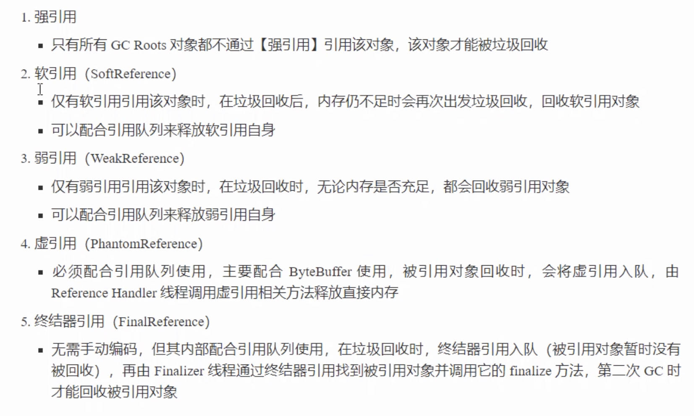

# JVM

学习路线


## JVM 基础概念及调优
### 1. JVM组成
> 类装载子系统 加载字节码文件放入方法区（元空间） （loading(加载) -> linking（链接） ->Intialization（初始化））
> 运行时数据区（方法区、java堆、java栈（线程独享）、本地方法栈、程序计数器（线程独享））
> 字节码执行引擎 执行字节码、写程序计数器、执行垃圾收集线程进行垃圾回收

### 2. 程序计数器
* java的二进制字节码（即JVM指令，所有平台都是一致的）无法被操作系统直接执行，需要经过java的解释器解释成机器码，然后才能由CPU执行
* 作用：程序计数器会记住下一条jvm指令的执行地址，通过寄存器实现
* 特点
  * 线程私有
  * 不会存在内存溢出
* 每个线程都会分配一个程序计数器，存储线程当前执行的位置，当线程出现切换时，程序计数器用于记住当前先线程执行的地址，一旦指令执行，程序计数器将更新到下一条指令，另外在线程恢复执行时指示能当前线程之行的位置，程序计数器的值是由字节码执行引擎来修改的 保存当前线程执行指令的地址

### 2. java栈（先进后出）
存放局部变量数据，分配给线程使用。一个方法对应一块栈帧内存空间
栈帧结构
> 局部变量 方法中的局部变量
> 操作数栈 临时存放JVM指令操作数据的栈
> 动态链接 符号引用转化为直接引用
> 方法出口 方法返回的位置
另外栈中的引用对象的真实地址在堆中
栈大小设置(-Xss 2MB) linux 下默认是1024KB
栈溢出
> 出现没有出口的递归(栈帧过多)，抛出StackOverflowError
> 方法的执行超出了栈的大小（栈帧过大)，抛出StackOverflowError

线程安全问题：
方法内的局部变量如果没有出现逃逸的情况不会有线程安全的问题

线程诊断与排查问题
* 使用top命令定位哪个进程对CPU的占用过高
* ps H -eo pid,tid,%cpu|grep pid 进一步定位哪个线程引起cpu占用过高
* 使用jstack pid 查看线程详情，根据线程id找到有问题的线程，（可能是死锁，可能是死循环等问题），定位到线程行数

### 本地方法栈（native method stacks）
* 为本地方法执行提供内存空间
* 线程私有


### 4. 方法区（jdk1.7之前存在）（hotspot 1.8之后是元空间，使用的是操作系统的本地内存）--存储类相关的信息
线程共享
虚拟机启动时创建
存放类的元数据信息、运行时常量值、静态变量（可能存在对象，在方法中存放的也是变量的引用，真正的变量放在堆中）、字段和方法数据，以及方法和构造函数的代码，包括用于类和实例初始化及接口初始化的特殊方法
* 运行时常量池 Stringtable，不在操作系统本地内存中，在堆（heap）中

* 设置的元空间太小(jdk8，默认没有大小限制) -XX:MaxMetaspaceSize=100M - XX: -UseCompressedOops 抛出OutOfMemoryError:metaspace(jdk1.6是 PermGen space)

* 方法区溢出，OutOfMemoryError

**chatgpt的方法区的回答：**
Java 8 中的方法区（Method Area）主要包含以下内容：
* 已加载的类信息：包括类的全限定名、访问修饰符、父类信息、接口信息等。
* 常量池（Constant Pool）：存放编译期生成的字面量和符号引用，供 JVM 在运行时使用。
* 字段信息：包括字段的名称、类型、访问修饰符等。
* 方法信息：包括方法的名称、参数列表、返回值类型、访问修饰符等。
* 运行时常量池（Runtime Constant Pool）：为每个类和接口创建一个运行时常量池，用于存放运行时生成的常量。
* 动态生成的代理类信息：如通过 Java 动态代理创建的代理类。
* 其他一些与类加载、动态代理、反射等相关的数据结构和信息。
需要注意的是，方法区和堆一样，也是 JVM 运行时数据区的一部分，但它所包含的内容与堆有很大不同。方法区通常是 JVM 进程内存中最小的一块区域，但是如果应用程序中使用了大量反射、动态代理等技术，方法区的空间可能会很快被耗尽。在 Java 8 中，方法区已经被移除，取而代之的是元空间（Metaspace），元空间的实现不再使用固定大小的方法区，而是使用本地内存，可以动态地调整大小

#### 常量池
二进制字节码的组成 ： 类基本信息，常量池，类的方法定义，包含虚拟机的指令
常量池的作用：为指令提供常量服务，以查表的方式查找到类名、方法名、参数类型、字面量等信息
常量池是.class文件中的，当该类被加载时，它的常量池信息会放入运行时常量池，并将里面的符号地址变为真实的地址
使用javap -v HelloWorld.class 查看类反编译后的详细信息

**串池StringTable**
运行时会将字符串常量放入StringTable中，运行时是懒加载的，只有用到时才会将串放入串池

```java
//字符串会放入StringTable串池中，在常量池中
String a = "a";
String b = "b";

String ab = "ab";
//创建c时首先会创建一个StringBuilder类并进行初始化，然后将a、b append到StringBuilder中，然后调用StringBuilder的toString方法，toString方法实际上是又创建了一个新的String对象,这时c是放在堆中的
String c = a +b; 
//返回false，因为c在堆中，而ab在常量池中
c==ab
//会直接使用常量池中的“ab”串，是javac在编译期的优化，结果在编译期确定为“ab”
String d = "a"+ "b";
//返回true，都在常量池中
ab == d;
```
特性：
* 常量池中的字符串仅是符号，第一次用到时才会变为对象
* 利用串池的机制，来避免重复创建字符串对象
* 字符串变量拼接的原理是StringBuilder（jdk1.8）
* 字符串常量拼接的原理是编译期优化
* 可以使用intern方法，主动将串池中还没有的字符串放入常量池中
jdk 1.8 尝试将字符串对象放入串池，如果没有则放入，如果有则不放入，然后将串池中的对象返回
jdk1.6 在串池中不存在串时会将字符串对象复制到串池中，
```java
String s = new String("a") + new String("b");
//返回false，s在堆中，而StringTable中没有“ab”
s == "ab"
//jdk1.8将字符串对象尝试放入串池中，如果有就不放入，没有则放入（不入池则s还是在堆中），同时将串池的对象返回，这是s已经在串池中
//jdk1.6将会拷贝字符串到常量池中，s还是在堆中
s2 = s.intern();
//StringTable中已经存在“ab”，返回true
s2 == "ab"
//StringTable中已经存在“ab”，返回true
s == "ab"
```
* jdk7之前StringTable是放在永久代中，在jdk8中StringTable是放在堆中的，放在堆中是为了保证在垃圾回收时StringTable能及时被垃圾回收，而不需要在full GC时才被回收

* 在jdk8中配置垃圾回收规则： -XX：+UseGCOverheadLimit （默认开启，可以使用-XX：-UseGCOverheadLimit关闭）  当jvm大量的时间花在垃圾回收（98%的时间）而只有少于2%的堆内存被垃圾回收，则jvm认为程序异常，jvm进程退出

* StringTable是可以被垃圾回收的
* StringTable是类似于hashTable的实现
* StringTable调优，调整HashTable的桶的个数， -XX:StringTableSize=20000 -XX:+PrintStringTableStatistics,当字符串数量太多时，可以将StringTable的痛个数调高点
* 将堆内存中的String对象放入到StringTable中避免大量的内存占用 （类似于设计模式中的享元模式）

配置jvm打印垃圾回收的详情：
-Xmx10m -XX:+PrintStringTableStatistics -XX:+PrintGCDetails -verbose:gc

### 直接内存
* 常见于NIO操作，用于数据缓冲区
* 分配回收成本较高，读写性能高
* 不受JVM内存回收管理

* NIO读写（使用直接内存）时效率高的原因：
  * 直接在操作系统的内存中划出一块内存，jvm可以直接访问，磁盘文件读取数据到内存时避免从操作系统内存向jvm内存中进行拷贝的操作，提高读写性能

* 直接内存会有内存溢出异常：OutOfMemoryError:Direct buffer memory
* 直接内存释放回收的原理（不是使用java的gc来进行释放的）：
```java
//分配直接内存，获取到内存分配的地址 
  long base=unsafe.allocateMemory(_1GB)；
  unsafe.setMemory(base,_1GB,(byte)0)；
  //对内存进行释放
  unsafe.freeMemory(base);
```
* ByteBuffer原理：
  * 使用unsafe.allocateMemory(size)方法分配内存
  * 使用unsafe.freeMemory(address);回收内存（当ByteBuffer被垃圾回收收集时，出发unsafe.freeMemory(address)）

显示的禁用GC - XX:DisableExplicitGC ，可以使System.gc()失效，这时由于不会显示出发jvm 的GC，可能导致直接内存的垃圾回收的失效，此时直接内存必须要等到jvm自动的垃圾回收才能回收
如果禁用了显式的垃圾回收，可以使用直接使用unsafe来对直接内存进行垃圾回收


### 6. 使用javap命令（将class文件转译为jvm虚拟机指令），结合jvm虚拟机能查看代码完整的之行流程

### 7. 堆 
* 存放对象的内存区域
* 线程共享的一块内存区域，虚拟机启动时创建，垃圾回收器管理的主要区域
新生代 分为一个eden区、两个survivor区
> eden 区，对象出生的区域
> survivor 经过minior gc之后存活的类会从eden区移动到survivor区
老年代 存放超过某一年龄代的对象，或是大对象直接分配到老年代
设置最小堆 -Xms
设置最大堆 -Xmx
堆内存溢出OutOfMemoryError
> 死循环导致堆内存溢出
> 内存大小不够导致内存溢出

JVM诊断工具(jdk自带的一些常用的诊断工具)
jps 查看java进程 `jps 【选项 】 [hostid]`
jmap -heap pid 检测某一时刻的堆内存使用情况
jmap -dump:format=b,live,file=test1.bin pid --抓取堆内存dump，抓取前进行垃圾回收，堆内存保存格式是二进制，保存文件名为test1.bin
jconsole 图形化工具，查看堆内存占用，线程数量，类加载数量，cpu占用率
jstat 统计jvm内存信息  `jstat 【选项】 【进程ID】 [间隔时间 ] [查询次数]`
jinfo JVM参数查看和修改 `jinfo 【选项】【具体选项参数名】【进程ID】`
jstack JVM线程信息监控 `jstack [ 选项 ] [进程ID]远程IP`

VisualVM 通过安装各种插件实现对jvm的各种运行状态的实时监控
可以通过dump内存快照（堆转储）查看大对象占用内存的情况
arthas 阿里提供的jdk诊断工具，涵盖了几乎所有的jdk自带的诊断工具，同时可以很方便的查看死锁线程、修改应用中的某个类代码并动态编译和加载类到JVM
 * 启动： java -jar arthas-boot.jar
 * 查看全局信息（实时刷新）： dashboard
 * 查看线程状态： thread
 * 查看某一线程信息： tread  14 


## 垃圾回收
如何判定对象可以回收  -- 引用计数法、可达性分析

### 引用计数
当出现A、B两个对象相互之间引用，则A、B的引用计数无法归0，则A、B两个对象都无法回收

### 8.可达性分析
* GC Root根节点 --肯定无法被垃圾回收的对象，线程本地变量、静态变量本地方法栈变量
* 从GC root开始搜索，搜索到的对象为非垃圾对象、未搜索到的为垃圾对象，全部回收
堆分析工具 MAT （eclipise提供的堆内存分析工具）
* 四类GC root对象
  * System Class 系统类
  * Native Stack jvm调用操作系统方法时引用的一些java对象
  * Busy monitor 被加锁的对象
  * Thread 活动线程中引用的局部变量

### 四种引用

* 强引用 一般通过new 的方式创建的对象是强引用对象，不可被回收
* 软引用（SoftReference） - 没有被强引用对象引用的对象，可能在发生gc时如果回收后内存还是不够则会将软引用对象回收 
  * 软引用对象（这里指SoftReference本身）的清理，需要配合使用引用队列ReferenceQueue来回收
  * 当软引用所引用的对象被回收时，软引用对象会被放入ReferenceQueue，从queue中取出软引用然后置空移除
* 弱引用(WeakReference) - 没有被强引用对象引用的对象，在发生gc时直接将弱引用对象回收   
  * 和软引用对象类似，需要使用ReferenceQueue来回收WeakReference本身
* 虚引用 - 创建ByteBuffer时会使用Cleaner分配直接内存地址 --配合引用队列使用
* 终结器引用 - 对象重写finalize（）方法时，在进行垃圾回收时会自动调用finalize（）方法
  * 通过引用队列的配合使用可以将软引用、弱引用、虚引用、终结器引用对象进行回收


### 回收算法

**标记清除**
* 先标记无用对象，然后清除
* 回收速度快
* 会产生内存碎片

**标记整理**
* 先标记无用对象，将可用对象整理移动到内存的一端，将垃圾对象移除
* 不会产生内存碎片
* 需要移动对象，效率较低

**复制算法**
* 将内存区域划分为大小相等的from，to两个区域，首先标记from中没有被引用的对象，然后将from中的有用对象复制到to区域，然后清除from空间，交换from、to区域
* 在存活对象较少时效率高
* 需要占用双倍的内存
* 不会有内存碎片

在jvm中三种回收算法都有使用

垃圾回收测试
```java
/**
 * @Description: 垃圾回收测试
 * @CreateDate: Created in 2023/5/8 18:53
 * @Author: lijie3
 */
public class TestDemo1 {

    private static final int _7MB = 7*1024*1024;
    private static final int _8MB = 8*1024*1024;
    private static final int _512k = 512*1024;

    //-Xms20M -Xmx20M -Xmn10M -XX:+UseSerialGC -XX:+PrintGCDetails -verbose:gc
    public static void main(String[] args) {
        ArrayList<byte[]> list = new ArrayList<>();
//        list.add(new byte[_7MB]);
//        list.add(new byte[_512k]);
//        list.add(new byte[_512k]);
        //直接进入老年代
        list.add(new byte[_8MB]);
        //heap内存溢出
        list.add(new byte[_8MB]);
    }
}
```


### 分代垃圾回收
* 将堆内存划分为新生代、老年代
* 新生代：存放朝生夕死的对象，对象的创建大多发生在新生代
  * 分为Eden、from、to区域
  * 一般对象都会在Eden中创建
  * 当Eden内存不够用，就会触发minor GC，使用复制算法将eden中的存活对象复制到to区域，并将存活对象的年龄加1，清空Eden，并交换from、to
  * 当触发了第二次Minor GC，会将eden、from中存活对象复制到to区域，交换from和to
  * 当from、to中的对象年龄超过某个值（默认15，记录在对象头中，使用4bit记录，最大为15），则将对象移动到老年代
  * 在minor gc时，会触发stop the world，暂停其他用户线程
* 老年代：长时间存活的对象
  * 当新生代from、to区域在进行垃圾回收to区域无法完全存放存活对象时，会将对象移动到老年代
  * 当老年代空间不足，先尝试进行minor GC，如果minor GC后空间仍然不足，则触发FUll GC
  * full gc也会引发stop the world，minor gc的stop the world会比full gc更长

**大对象直接晋升到老年代**
当新生代的内存已经不足的情况下，大对象创建时会直接放入老年代

### 一些参数配置解释
| 参数                                                       | 含义                                      |
| ---------------------------------------------------------- | ----------------------------------------- |
| -Xms                                                       | 初始堆大小                                |
| -Xmx                                                       | 堆最大大小                                |
| -Xmn                                                       | 新生代大小                                |
| -XX:InitialSurvivorRatio=ratio  -XX:+UseAdaptiveSizePolicy | eden、from、to大小比例                    |
| -XX:SurvivorRatio                                          | 幸存区比例,默认8，指的是eden的占比，8:1:1 |
| -XX:MaxTenuringThreshold=threshold                         | 晋升阈值                                  |
| -XX:+PrintTenuringDistribution                             | 打印晋升详情                              |
| -XX:PrintGCDetails -verbose:gc                             | gc详情                                    |
| -XX:+ScavengeBeforeFullGC                                  | FullGC 前minor GC                         |


### 9. 一个对象在堆中的生命流转周期（一般情况下）
> 1. 对象创建以后放在新生代的eden区
> 2. 当eden区的空间无法再分配内存给新的对象时，触发一次minior GC，通过可达性分析判断eden区的对象是否被引用，如果不被引用，则直接回收，如果被引用，放入survivor区，对象的分代年龄加1，eden区再次分配空间给新的对象
> 3. 当eden区再次无法分配内存给新的对象，再次触发minior GC，通过可达性分析判断eden区和已经分配了对象的一个survivor区的可回收对象，对非垃圾对象的分代年龄再次加1，放入到另一个空闲的survivor区
> 4. 当内存不足时重复步骤3
> 5. 当某次minior gc 回收垃圾后空闲的survivor无法存放下存活的对象，则需要进行senior GC ，将对象放入老年代
> 6. 动态年龄判断：当某次minior GC之后，存活对象的总大小大于一块survivor 区域大小的50%，则直接将这次minior GC存活下来的对象直接放入老年代中
分代GC的理论基础：大多数的对象都是朝生夕死
> 7. 当老年代无法存放更多的对象时，会进行一次full gc
> 8. 当进行了full gc后任然无法存放新产生的对象，则JVM会抛出OOM异常

### 16.垃圾收集器
分类：
* 串行：单线程、适合堆内存小的场景
* 吞吐量优先：多线程，适合堆内存较大的场景，需要多核心cpu支持，让单位时间内stop the world的时间最短
* 响应时间优先：多线程，适合堆内存较大的场景，需要多核心cpu支持，尽可能降低单次垃圾回收暂停时间（stop the world）

#### 串行垃圾回收器
开启： -XX:UseSerialGC = Serial(复制算法) + SerialOld（标记整理算法）
单线程回收，当垃圾回收线程执行时，要求用户线程阻塞

#### 吞吐量优先的垃圾回收器
* 并行垃圾回收器
* 开启 ：-XX:+UseParallelGC (新生代，复制算法)    -XX:+UseParallelOldGC （老年代，标记整理算法）
* 其他配置
  * -XX:ParallelGCThreads=10,指定垃圾回收的线程数量
  * -XX:+UseAdaptiveSizePolicy 自适应的调整新生代的比例大小
  * -XX:GCTimeRatio= ratio 调整吞吐量 ， 1/1+ratio，如ratio=99，则单位时间100分钟内内只有1/99+1 = 0.01 1分钟的垃圾回收的时间
  * -XX:MaxGCPauseMills=50ms 调整每次垃圾回收stop world time的时间

#### 响应时间优先垃圾回收器
* 并发的垃圾回收器，垃圾回收时用户线程允许与垃圾回收线程并发运行
* 开启： -XX:+UseConcMarkSweepGC（标记清除） +XX:+UseParNewGC（新生代、复制算法）/+UseSerialOld
* 其他配置
  * -XX:ParallelGCTHreads=n(并行垃圾回收线程数) -XX:ConcGCThreads=threads（并发垃圾回收线程数，一般设置为并行线程数的1/4）
  * -XX:CMSintialingOccupancyFraction=percent（80），例如老年代的使用百分比达到80%时进行垃圾回收 执行cms垃圾回收的内存占比，主要是为了避免在并发清理过程中产生的新的垃圾导致的内存溢出问题
  * -XX:+CMSScavengeBeforeRemark  重新标记之前首先对新生代进行一次垃圾回收，减少重新标记阶段的压力
* 由于使用标记清除算法，可能会导致内存碎片过多，当碎片过多时，会退化为SerialOld垃圾回收，会导致垃圾回收的时间大大增加


### 32.CMS垃圾收集器收集过程
* cms是老年代的垃圾收集器
> 并发的垃圾收集器
> 实现了让垃圾收集器与用户线程基本上能同时工作
> 使用标记-清除算法

步骤：
* 初始标记：暂停所有其他线程，记录GC roots直接引用的对象（速度很快）
* 并发标记：从GC roots直接关联的对象开始遍历整个对象的过程，耗时较长，用户线程不需要停止，可能导致已标记对象发生变化
* 重新标记：修正并发标记期间因为用户程序继续运行导致标记变动的一部分对象标记记录，停止用户线程（解决少标记的问题，即产生了新的对象（不能被回收）没有被标记的问题）
* 并发清理：开启用户线程，GC线程开始对未标记区域清理，这一阶段新增的对象会被标记为不做任何处理的对象
* 并发重置：重置本次GC过程的标记数据

#### G1垃圾回收器 --优先收集垃圾最多的区域
* 同时注重吞吐量和低延迟，默认暂停目标是200ms
* 超大堆内存，将堆划分为多个大小相等的region，每个region都可以作为eden、from、to以及老年代区域
* 整体上是标记+整理算法，两个区域之间是复制算法
* 启动： -XX:+UseG1GC
* 配置region大小  -XX:G1HeapRegionSize=size 1,2,4,8等值
* 最大暂停时间 -XX:MaxGCPauseMills=200ms

**回收阶段，从上到下依次循环**
* young collection 新生代收集，会stop the world
* young collection + concurrent mark，新生代垃圾回收、初始标记（young GC会进行）、并发标记（老年代占用堆内存的比例达到阈值进行并发标记，不会stop the world）
* Mixed collection，对eden，from、to，老年代进行全面的垃圾回收，最终标记会stop the world，拷贝存活 也会stop the world，根据MaxGCPauseMills配置从老年代中选择回收价值最高的区域进行回收，达到小于最大暂停时间的目标

**跨代引用**
新生代回收的跨代引用，当老年代引用了新生代的对象，在老年代使用卡表记录哪些对象引用了新生带

**jdk8字符串去重**
* 让两个字符串引用同一个char数组（与String.intern不同，intern使用的是StringTable实现节省内存）
* 开启 -XX:UseStringDeduplication （默认是打开的）
* 优点：节省大量内存
* 缺点：略多占用cpu时间，新生代回收时间略微增加

**jdk8并发标记类卸载**
在并发标记后，能知道哪些类不再被使用，当一个类加载器的所有类都不在使用，则卸载它所加载的所有类
开启（默认是开启的）-XX:+ClassUnloadingWithConcurrentMark

**jdk8巨型对象**
* 一个对象大于Region的一半时，称为巨型对象
* G1不会对巨型对象进行拷贝
* 回收时会优先考虑

**jdk9并发标记起始时间调整**
* 并发标记必须在堆空间占满之前完成，否则会退化为FULLGC
* jdk9之前使用 -XX:InitiatingHeapOccupancyPercent = 45 配置
* jdk9可以动态调整：
    * XX:InitiatingHeapOccupancyPercent = 45 设置初始值
    * jvm动态调整垃圾回收的时机

**windows下查看虚拟机运行参数 -XX:PrintFlagsFinal -version|findstr GC**

#### 关于full gc的说明
* SerialGC、parallel GC、CMS、GC 新生代不足发生的垃圾收集叫minor gc
* SerialGC、parallel GC 老年代内存不足发生的垃圾回收称为full gc
* CMS、G1 老年代垃圾回收不足，由于存在并发垃圾收集，当垃圾产生速度小于垃圾收集速度，暂停时间较短，不能称为fullGC，当垃圾产生速度大于收集速度，会退化为SerialOld，会出现full GC

## GC调优
考虑的方向
* 内存
* 锁竞争
* cpu占用
* IO占用

是要求低延迟（互联网项目，CMS、G1、ZGC）、还是高吞吐量（科学计算，ParallelGC）

* 查看fullgc后前后内存占用，考虑以下的问题：
  - 数据是否太多
  - 数据是否太过臃肿
  - 是否存在内存泄漏

**新生代的垃圾回收时间比老年代更小，回收价值更高**

新生代调优
*适当的调大新生代的空间，oracle官方推荐新生代的空间控制在25%～50%（设置-Xmn指定新生代大小）
设置参考： -Xmn = 并发量*（请求/响应）的数据
survivor设置参考：
  - 长时间存活的对象尽快晋升： -XX:MaxTenuringThreshold=threshold
  - 打印survior晋升信息： -XX:PrintTenuringDistribution

* 老年代调优
  * CMS的老年代内存越大越好
  * 先尝试不做调优，如果没有FullGC，则不需要对老年代调优
  * 观察查发生FUll GC的老年代占用，将老年代内存预设调大1/4～1/3
  * 参数设置(老年代占用多少时进行垃圾回收) -XX:CMSInitiatingOccupancyFraction=percent


### 10. arthas 阿里开源的jvm调优工具

### 11. Java虚拟机调优 -- 减少full gc的次数，减少STW（stop the world）
为什么会有stop the world：如果不停止用户线程，线程之行过程中可能会不断的出现引用的变化，类似于现实中你妈打扫垃圾的过程中你还在不断的丢垃圾


### 12. jvm参数设置 针对jdk8的版本，主要是对堆空间分代大小进行设置，对元空间大小进行设置，分代年龄进行设置等等

## 类加载模块

### 类文件结构（class文件）
javac 编译成class
javac -parameters -d . TestDemo1.java
查看字节码文件
od -t xC com/steven/gc/TestDemo1.class 

class结构：
* 魔数(0-3字节)：标识文件类型：cafebabe
* 版本（4-7字节）：00  00  00  34  00  20  0a  00  07  00  19  07
* 常量池
  * 8-9字节：常量池中有多少项
  * 后面的包含方法引用信息、返回返回值类型、构造方法
* 访问修饰与继承信息
* 成员变量数量、成员变量信息
* method信息
* 附加属性

### 字节码指令
* aload_0 将局部变量表中slot 0 加载（加载this）
* invokespecial 预备调用构造方法
* getstatic 加载静态变量到操作数栈
* ldc 加载参数
* invokevirtual 执行普通成员方法
* b1 返回

**反编译字节码信息：**
javap -v com/steven/gc/TestDemo1.class

### 方法字节码执行流程
栈帧中的内容：操作数栈、局部变量表
<cinit> 静态代码块的执行方法,类的构造方法
<init> 实例的构造方法

### 多态原理
invokevirtual指令调用的方法，使用vtable（虚方法表）查找多态时具体要执行的方法地址，使用缓存加快多态执行方法的效率
HSDB：查看内存分布工具
java -cp ./lib/sa-jdi.jar sun.jvm.hotspot.HSDB

### 异常处理
使用exception table监测异常代码，当代码出现异常时，查表进行异常捕获（try catch等处理）
示例：
Exception table:
         from    to  target type
            13    20    23   Class java/io/IOException
finally的字节码：
将finally中的代码对应的字节码放在try块和catch块的后面，保证finally块代码的执行
**在finally中不要写return指令，如果出现了异常，则异常会被吞掉（与实际代码相符合，finally中不会捕获异常）**
```java
public class TestTryCatch {

    public static void main(String[] args) {
        System.out.println(test1());
    }

    public static int test1(){
        int a = 10;
        int b = 0;
        try{
            int c = a/b;
            return a;
        }finally {
            //不会抛出异常
            return b;
        }
    }
}
```
关于finally的面试题（）：在try中return 之前，执行finally语句之前，会将a的当前值10进行暂存，然后执行finally，最后将暂存的10返回
```java
public class TestTryCatch2 {

    public static void main(String[] args) {
        System.out.println(test1());
    }

    public static int test1(){
        int a = 10;

        try{
            return a;
        }finally {
            //不会抛出异常
            a = 20;
        }
    }
}
```
### synchrinozed原理
使用monitorenter、monitorexit进行加锁解锁

### 编译期处理
* 默认构造起：当无构造器时，使用的是super的构造方法
* 自动拆装箱： jdk5之后的版本支持，在编译期自动生成对应的字节码
* 泛型集合取值：自动进行了泛型擦除，添加list.add（Object） ，获取，list.get()返回object，然后将object转化为泛型指定的类型
* 局部变量的泛型信息没有被擦除，方法的返回值、参数泛型类型是可以获取到的
* 可变参数列表
* hashcode：提高比较效率，equals和hashcode组合在HashMap中进行等值判断
* 枚举类字节码实现
* try-with-resources
* 子类重写父类方法重写允许子类方法返回值类型是父类返回值类型的子类
* 内部类的实现，匿名内部类引用外部变量必须是final类型

## 类加载
### 加载阶段
* 加载：将类的字节码载入方法区中，在堆中创建对应的class对象
* 链接：与加载交替运行
  * 验证：验证类是否符合jvm规范，安全性检查
  * 准备：为static变量分配空间，设置默认值（与class对象存储在一起，存储在堆中），static变量是在初始化阶段进行赋值，而static final变量的基本类型（不是通过new方式进行创建）即常量会在准备进行赋值
 ```java
static int a = 10;//准备节点仅分配空间
final static int b = 20; //准备阶段分配空间并赋值
static final Object o = new Object() //准备阶段分配空间不进行赋值
```
  * 解析：将常量池中的符号引用解析为直接引用 ClassLoader.loadClass（）会导致类的加载和链接，不会导致类的解析和初始化,使用new()会导致类的解析和初始化
* 初始化：调用<cinit>() V,虚拟机会保证这个类的构造方法的线程安全，初始化的时机包括以下几点：
  * main方法所在的类会先初始化
  * 首次访问类的静态变量或静态方法会导致初始化
  * 子类初始化，如果父类还未初始化，则先初始化父类
  * 自类访问父类静态变量，只会触发父类的初始化，子类不会初始化
  * Class.forName会导致初始化
  * new会导致初始化 
不会导致初始化的情况： 类独享的.class不会触发初始化，访问static final静态常量不会出发初始化，创建类的数组不会出发初始化，调用ClassLoader.loadClass方法不会触发初始化，Class.forName的参数2为false不会触发初始化

* 懒汉式的单例模式就是是利用类的加载中初始化条件及线程安全性进行懒惰加载

### 类加载器
jdk8中类加载的层级：
Bootstrap ClassLoader 加载java_home/jre/lib，打印出来的类加载器是null
Extension ClassLoader 加载java_home/jre/lib/ext
Application ClassLoader 加载classpath路径下的类加载器
自定义类加载器 自定义要加载类的路径
使用双亲委托机制来加载

**Bootstrap ClassLoader**
可以指定虚拟机参数来让Bootstrap ClassLoader来加载指定的类
指定要加载的类路径
java -Xbootclasspath/a:. com.steven.Test 
-Xbootclasspath bootclasspath
/a:.  将当前路径追加到类加载路径中

**Extension ClassLoader** 

**双亲委派模式**
调用类加载器的loadClass方法时，首先由上级类加载器来加载，如果上级类加载器没有加载成功，则才向下查找类加载器来加载
类加载器之间并没有继承关系
类加载源码
```java
 protected Class<?> loadClass(String name, boolean resolve)
        throws ClassNotFoundException
    {
        synchronized (getClassLoadingLock(name)) {
            // First, check if the class has already been loaded
            Class<?> c = findLoadedClass(name);
            if (c == null) {
                long t0 = System.nanoTime();
                try {
                    if (parent != null) {
                        c = parent.loadClass(name, false);
                    } else {
                        c = findBootstrapClassOrNull(name);
                    }
                } catch (ClassNotFoundException e) {
                    // ClassNotFoundException thrown if class not found
                    // from the non-null parent class loader
                }

                if (c == null) {
                    // If still not found, then invoke findClass in order
                    // to find the class.
                    long t1 = System.nanoTime();
                    c = findClass(name);

                    // this is the defining class loader; record the stats
                    sun.misc.PerfCounter.getParentDelegationTime().addTime(t1 - t0);
                    sun.misc.PerfCounter.getFindClassTime().addElapsedTimeFrom(t1);
                    sun.misc.PerfCounter.getFindClasses().increment();
                }
            }
            if (resolve) {
                resolveClass(c);
            }
            return c;
        }
    }
```

**线程上下文类加载器**
jdbc的驱动加载
Class.forName("com.mysql.jdbc.Driver");
jdbc的驱动使用的是spi的方式来对驱动类进行加载: service provider interface
获取线程上下文类加载器：在线程启动时将应用程序类加载器赋值给线程上下文类加载器
Thread.currentThread().getContextClassLoader()

**自定义类加载器**
使用场景：
* 想加载人意路径下的类文件
* 通过接口实现软件解耦
* 希望对类进行隔离，避免同名同包的类的冲突（tomcat中有使用）

示例：
```java
public class MyClassLoader extends ClassLoader{

    @SneakyThrows
    @Override
    protected Class<?> findClass(String name) throws ClassNotFoundException {
        String path = "/Users/lijie3/Documents/code/javaBasicKnowledge/target/classes/com/steven/jdk8/classloader/" + name+".class";
        ByteArrayOutputStream os = new ByteArrayOutputStream();
        Files.copy(Paths.get(path),os);
        final byte[] bytes = os.toByteArray();
        return defineClass(name,bytes,0,bytes.length);
    }

    public static void main(String[] args) throws ClassNotFoundException {
        MyClassLoader myClassLoader = new MyClassLoader();
        final Class<?> testClass = myClassLoader.loadClass("com.steven.jdk8.classloader.TestClass");
        final Class<?> testClass2 = myClassLoader.loadClass("com.steven.jdk8.classloader.TestClass");
        System.out.println(testClass2 == testClass);
    }
}
```
**判断两个类完全相等的条件**
包名类名相同，且类加载器对象是同一个


## 运行期优化
**热点代码**
在运行期，jvm会对java代码进行优化
jvm将执行状态分为5层：
* 解释执行
* C1即时编译执行（不带profilling）
* C1即时编译执行（带基本profilling）
* C1即时编译执行（带完整profilling）
* 使用C2即时编译器

对将热点代码（hotspot）编译成机器码，提升执行效率

**方法内联**
当方法较短时，将方法内代码放入到调用的方法中
打印内联信息
-XX:+PrintInlining -X:+UnlockDiagnosticVMOptions

**字段优化**
将静态变量和常量进行优化

**反射优化**
循环调用方法达到膨胀阈值（默认15次）后，会触发生成动态MethodAccessor，然后接下来的调用是走普通的方法调用而不走反射调用

## java内存模型 JMM java memory Model
定义了一套在多线程读写共享数据时，对数据可见性，有序性和原子性规则保证

**synchronized**
保证代码的原子性、有序性和可见性
**代码原子性**
内存模型
* jvm中将内存分为主内存和工作内存
* 共享的变量信息放在主内存中
* 线程数据信息放在工作内存中，共享变量需要先从主内存中读取到线程工作内存中，操作完成之后再写入主内存中，由于多线程下的指令重排可能导致数据的读写不安全的问题
**代码可见性**
观察下面这段代码：
这段代码执行后无法退出，原因：
线程从主内存中读取flag的值到工作内存后，由于jit即时编译器的优化，会导致线程不会再while判断时每次从主内存中获取flag，因此检测不到flag在主内存中由true变false ，因此无法退出
```java
public class ThreadWhile {

    static boolean flag = true;
    public static void main(String[] args) throws InterruptedException {
        new Thread(()->{
            while (flag){
            }
        }).start();

        Thread.sleep(1000);
        flag = false;
    }
}
```
解决上面的问题，
1. 使用volatile，保证变量对主内存中共享数据的可见性
```java
volatile static boolean flag = true;
```
volatile无法保证原子性，只适用于一个线程写，多个线程读
2. 在循环体中使用打印,System.out.println使用了synchronized
```java
  static boolean flag = true;
    public static void main(String[] args) throws InterruptedException {
        new Thread(()->{
            while (flag){
                System.out.println(1);
            }
        }).start();

        Thread.sleep(1000);
        flag = false;
    }
```
**有序性**
下面的代码由于jit即时编译可能导致指令重拍

```java
public class CodeSort {

    int num = 0;
    boolean ready = false;

    public void actor1(Result r){
        if(ready){
            r.r1 = num +num;
        }else{
            r.r1 = 1;
        }
    }

    public void actor2(Result r){
        num = 2;
        ready = true;
    }

    public static void main(String[] args) throws InterruptedException {
        CodeSort c = new CodeSort();
        Result result = new Result();
        new Thread(() -> c.actor1(result)).start();
        new Thread(() -> c.actor2(result)).start();
        Thread.sleep(100);
        //由于指令重排可能导致出现 值为0的情况
        System.out.println(result.r1);
    }
}

class Result{
    int r1;
}
```
* 使用volatile可以解决指令重排的问题 

创建Singleton5的对象的指令对应了四个步骤：
0  new   #2//分配空间
3  dup    //复制栈顶
4  invkespecial #3  执行invokespecial
7  putstatic   #4 对静态变量instance进行赋值
4和7可能出现指令重排，可能将instance首先分配了空间，引用不为空，则某个线程正在执行构造方法（invokespecial），而另一个线程可能已经将instance进行了返回

```java
volatile boolean ready = false;
```
DCL（double checked locking）单例子模式必须使用volatile来保证线程安全
```java
public class Singleton5 {
    private Singleton5() {
    }

    private static volatile Singleton5 instance;

    public static Singleton5 getInstance(){
        //第一次判断，如果instance不为null
        if(instance == null){
            synchronized (Singleton5.class){
                if(instance == null){
                    instance = new Singleton5();
                }
            }
        }
        return instance;
    }
}
```

**happends-before**

**CAS与原子类**
* 乐观锁
* 使用cas和volatile可以实现无锁并发
* 适于竞争不激烈、多核CPU的场景
* 竞争激烈的情况下会导致重试频繁发生，反而影响效率

底层实现：
使用Unsafe直接调用操作系统底层的CAS指令
java中的锁
乐观锁：cas
悲观锁：synchronized

原子类操作：
利用cas+volatile实现无锁并发

**synchronize的优化**
jvm中对象的组成
>对象头
    * 对象的hashcode
    * markword
      * 对象的锁状态
      * 对象当前使用的线程id
      * gc标志
    * 对象元数据指针（指向方法区（元空间））
    * 数组长度（数组对象才有）

> 对象数据
> 对齐填充  

**轻量级锁**
如果一个对象虽然有很多线程访问，但线程访问的时间是错开的（没有竞争），那么可以使用轻量级锁来优化，使用CAS来获取锁记录，会将锁的标志位从01（无锁）变成00（轻量级锁）
**锁膨胀**
在轻量级锁在进行CAS时经常失败（产生了竞争导致获取锁记录失败），则锁会升级成重量级锁，锁标志位从00 变成10（重量级锁）
**重量级锁**
> 重量级锁通过monitorenter、monitorexit实现
> 重量级锁通过锁自旋实现优化，当线程获取锁失败时，首先进行自旋尝试，当一段时间后如果能获取到锁，则线程不需要进行阻塞
> 多核cpu才能使用闲置的核心进行自旋，单核自旋没有意义

**偏向锁**
轻量级锁在没有竞争时，每次重入还是得执行cas操作，jdk6进一步优化只有第一次使用cas将线程id设置到对象的mark word头，之后发现这个id是自己的就表示没有竞争，不用重新进行cas操作
撤销偏向锁需要将持有锁的线程升级为轻量级锁，需要暂停所有线程STW


## 其他


### 13. 对象的创建过程 jvm类加载子模块加载完类后对对象进行初始化，给对象的属性赋初始值--->执行底层的`<init>`方法，实际上是对对象的属性赋真实的值，和执行指定的类构造器方法 


### 14.visualVM jvm虚拟机诊断的图形化工具

### 15.阿里开源的JVM诊断工具 Arthas
> 使用java -jar arthas-boot.jar 启动
> dashboard查看全局的线程、内存占用信息、rumtime信息等


### 17.垃圾回收算法

### 18.对象的完整创建过程
> 类加载检查
> 类加载
> 分配内存（堆内存）
> 初始化属性的默认值（0值）
> 设置对象头（对象分代年龄、锁信息、gc标志等信息）
> 执行`<init>`方法（先对属性的真实值进行赋值，然后执行对象的构造方法）

### 19.对象的组成部分


### 20.jvm中的类加载器
* 引导类加载器，负责加载支持JVM运行的位于JRE的lib目录下的核心类库，比如rt.jar,charsets.jar等
* 扩展类加载器：负责加载支撑JVM运行的位于jre的lib目录下的ext扩展目录中的jar包
* 应用程序类加载器：负责加载ClassPath路径下的类包，主要是加载自己编写的应用程序类
* 自定义加载器：负责加载用户自定义路径下的类包
  
```java
//jdk 8下的运行结果如注释
public class ClassLoaderTest {

    public static void main(String[] args) {
        //引导类加载器，返回null
        System.out.println(String.class.getClassLoader());
        //应用程序类加载器，jdk.internal.loader.ClassLoaders$AppClassLoader@251a69d7
        System.out.println(ClassLoaderTest.class.getClassLoader());
        //扩展类加载器 sun.misc.Launcher$ExtClassLoader@6d1e7682
        System.out.println(ClassLoaderTest.class.getClassLoader().getParent());
        //引导类加载器  null
        System.out.println(ClassLoaderTest.class.getClassLoader().getParent().getParent());
    }
}
```
```java
//jdk 17下的运行结果如注释
public class ClassLoaderTest {

    public static void main(String[] args) {
        //引导类加载器，返回null
        System.out.println(String.class.getClassLoader());
        //应用程序类加载器，jdk.internal.loader.ClassLoaders$AppClassLoader@251a69d7
        System.out.println(ClassLoaderTest.class.getClassLoader());
        //扩展类加载器 jdk.internal.loader.ClassLoaders$PlatformClassLoader@16b98e56
        System.out.println(ClassLoaderTest.class.getClassLoader().getParent());
        //引导类加载器  null
        System.out.println(ClassLoaderTest.class.getClassLoader().getParent().getParent());
    }
}
```

### 21.双亲委派机制
类加载器的亲子层级结构 
> 顶层父类 引导类加载器
> 扩展类加载器
> 应用程序类加载器
> 自定义类加载器

程序员自己写了一个类，会首先找到应用程序类加载器，应用程序类加载器会委托给扩展类加载器，而扩展类加载器会继续向上委托给引导类加载器，如果引导类加载器能加载，则加载该类，如果不能加载，扩展类加载器尝试加载，如果扩展类加载器无法加载，则应用程序类加载器尝试自己加载

这样做原因
保证jre的核心jar包加载的安全性，防止jre核心的被篡改
避免类的重复加载

### 22.tomcat的类加载机制
> 因为tomcat中会部署不同的web应用，如果A应用里使用了spring3，而B应用里用了spring4，则两个应用中可能存在大量的spring重复类，而且重复类之间可能存在不同的逻辑，如果使用双亲委派机制，则由于同一classpath路径下的类不会被重复加载，这样可能导致了应用中类加载存在问题
> tomcat自定义了WebAppClassLoader打破了双亲委派机制解决了上面的问题

### 23.指针碰撞与空闲列表
指针碰撞：这种情况将java堆的内存化为绝对规整的一块区域，所有用过的内存放在一边，空闲内存放在另一边，中间的指针作为分界点的指示器，分配内存就仅仅是吧指针指向空闲空间的那一边挪动一段与对象大小相等的距离
空闲列表：java堆内存不是绝对规整的，已经使用的内存与未使用的内存空间相互交错，虚拟机维护一个列表，记录那些内存时可以用的，在分配内存时从列表中找到一块足够大的空间划分给对象实例，并更新列表上的记录

### 24.对象分配内存时的兵法问题解决CAS与TLAB
在并发情况下，可能出现正在给对象A分配内存，指针还没来得及修改，对象B又同时使用了原来的指针来分配内存的情况
解决办法：
* CAS （比较并交换）虚拟机采用cas配上失败重试的方式保证更新操作的原子性来对分配内存空间的动作进行同步处理
* TLAB（thread local allocation buffer）本地线程分配缓冲，把内存分配的动作按照线程划分在不同的空间中进行，每个线程在java堆中预先分配一小块内存，通过-XX:+/-UserTLAB参数来设定，- XX:TLABSize 指定分配内存的大小

### 25. 对象占用内存的大小
> 使用jol-core包来分析对象的占用内存以及各个字节的含义
* 对象头（markword（32位4字节，64位8字节） + klass poniter（开启指针压缩占4字节，关闭指针压缩占8字节）+数组长度4字节（数组对象有值））
* 实例数据
* 对齐填充，保证对象的总的字节数是8的整数倍

### 26. 对象指针压缩
将对象的内存地址从8个字节压缩到4个字节
在jdk8下指针压缩默认开启
-XX:UseCompressedOops

### 27. 对象逃逸分析
分析对象的作用域，当一个对象在方法中被定义后，可能被外部方法所引用，例如作为调用参数传递到其他地方
```java
//返回了方法内部使用的对象导致逃逸  
 public ClassLoaderTest test(){
        return new ClassLoaderTest();
    }
```
开启逃逸分析
-XX:+DoEscapeAnalysis jdk7之后默认开启（-表示关闭）
开启逃逸分析+标量替换可以避免将局部变量分配在堆上，避免大量的gc

### 28.判断对象是否是垃圾的引用计数法有什么问题
当对象创建后每出现对对象的一次引用，引用计数加一，没失去一个引用，引用计数器减一，当计数器值为0时被判定为垃圾对象
> 出现了循环引用，导致引用计数引用永远都不会为0，出现内存泄露

### 29. GC可达性分析
将GC roots作为起点，从这些节点开始向下搜索引用的对象，找到的对象都被标记为非垃圾对象，其他对象都是垃圾对象
GC roots根节点：
> 线程栈的本地变量
> 静态变量
> 本地方法栈变量

### 30.什么样类能被回收
> 该类的所有对象实例都已经被回收，java堆中不存在该类的任何实例
> 加载该类的Classloader已经被回收
> 该类对应的java.lang.class对象没有任何地方被引用，无法在任何地方通过反射访问该类的方法

### jvm内部的各种垃圾回收算法
**标记清除算法**
将内存中的垃圾对象（或非垃圾对象）做标记，然后清除垃圾对象
> 造成大量的空间碎片
**标记-复制算法**
将内存分为两块，其中一块作为备用的复制算法，一块作为当前使用的算法，当需要垃圾回收时，标记当前使用的内存中的垃圾对象，将非垃圾对象复制到备用内存中，然后将已经使用的内存清空，备用内存切换当前成使用内存
> 空间利用率变低
> 当存在大量存活对象时，需要进行大量的内存复制操作，效率比较低下

**标记-整理算法**
标记存活对象，将剩余的垃圾对象清除，再将存活对象移动到内存空间的一端

### 31.分代收集理论
大部分对象都是朝生夕死


### 34.CMS存在的问题
并发收集阶段再次触发full gc
> 在并发标记、并发清理的阶段如果用户线程产生了大量的对象，可能会触发full gc，则并发失败
> 此时会进入用户线程停止阶段，收集器切换到serial old垃圾收集器来回收垃圾

### 35.三色标记算法
黑色：垃圾收集器访问过的对象，它是安全存活的，如果有其他对象引用只想了黑色对象，无需重新扫描一遍.黑色对象不可能直接指向某个白色对象
灰色：表示对象已经被垃圾收集器访问，但这个对象上至少还有一个引用没有被扫描过
白色: 对象尚未被垃圾收集器访问过，可达性分析刚开始剪短，所有对象都是白色对象

### 36.G1垃圾回收器回收垃圾的过程
* 初始标记：暂停锁哟前台新城，并记录下gc roots直接能引用的对象，速度很快
* 并发标记：同cms的并发标记（不暂停用户线程）
* 最终标记：同cms，需要暂停用户线程
* 筛选回收：首先对各个region的回收价值成本进行排序，根据用户所期望的GC停顿STW时间（-XX:MaxGcPauseMills指定）来制定回收计划
回收使用的上方是标记复制算法，将一个region中存货的对象复制到另一个region中，不会像cms那样回收完因为很多内存碎片还需要整理一次，G1采用复制算法回收几乎不会有内存碎片

### 37.G1垃圾回收器最大停顿时间的实现
G1收集器后台维护一个有限列表，根据允许的收集时间，优先选择回收价值最大的region。这种使用region划分内存空间及有优先级的区域回收方式，保证g1在有限时间内可以尽可能提高收集效率

### 38.什么是内存泄漏，怎么快速排查
举例：在jvm中使用map进行缓存，当map越来越大，一直占用老年代空间，时间长了就导致full gc频繁，甚至导致OOM
使用jvm自带的jmap，jconsole、jstack等工具来排查
可以使用redis等缓存工具将jvm的缓存移动到redis数据库中

### 39。GC是什么时候做的
GC是需要代码运行到安全点或安全区域才能做
安全点指代码中的特定位置，线程运行到这些位置时他的状态是确定的，有以下几种安全点：
1. 方法执行返回之前
2. 调用某个方法之后
3. 抛出异常的位置
4. 循环的末尾
安全点是对正在执行的线程设定的，如果一个线程处于sleep状态或中断状态，它不能响应JVM的终端请求，再运行到安全点上。
安全区域：一段代码片段中，引用关系不会发生变化，这个区域内的任何地方开始GC都是安全的

### 40.字符串常量池
jdk7之后字符串常量池重永久代的运行时常量池分离到堆里
jdk8中，永久带被移除，运行时常量池在元空间，字符串常量池依然在堆里


### JMX
JMX(Java Management Extensions),Java管理扩展,是一个为应用程序植入管理功能的框架 

Notification
MBean之间的通信是必不可少的，Notification起到了在MBean之间沟通桥梁的作用。JMX 的通知由四部分组成：
1、Notification这个相当于一个信息包，封装了需要传递的信息
2、Notification broadcaster这个相当于一个广播器，把消息广播出。
3、Notification listener 这是一个监听器，用于监听广播出来的通知信息。
4、Notification filiter 这个一个过滤器，过滤掉不需要的通知。这个一般很少使用


### 正则表达式
简单的正则表达式匹配
```java
    public static void main(String[] args) {
        String input = "include      script.`57054`; select * from a; " +
                "include      script.`57080`;";
        String pattern = "include\\s+script\\.\\`(\\d+)\\`";
        Pattern r = Pattern.compile(pattern);
        Matcher matcher = r.matcher(input);
        while (matcher.find()){

            String values = matcher.group(1).replaceAll("\\s", "");
            System.out.println("Values: " + values);

        }
         String input2 = "valueMode = \"scriptId\"\n" +
                "    and values = \"61574\"";
//        String input2 = "values = \"61574\"\n" +
//                "    and valueMode = \"scriptId\"";
        //valueMode\s*=\s*"scriptId"\s+and\s+values\s*=\s*"(\d+)"
        String pattern2 = "valueMode\\s*=\\s*\"scriptId\"\\s+.*and\\s+values\\s*=\\s*\"(\\d+)|values\\s*=\\s*\"(\\d+)\"\\s+.*and\\s+valueMode\\s*=\\s*\"scriptId\"";
        Pattern r2 = Pattern.compile(pattern2);
        Matcher matcher2 = r2.matcher(input2);
        while (matcher2.find()) {
            String values = matcher2.group(1);
            if(StringUtils.isEmpty(values)){
                values = matcher2.group(2);
            }
            System.out.println("Values: " + values);
        }
    }

```