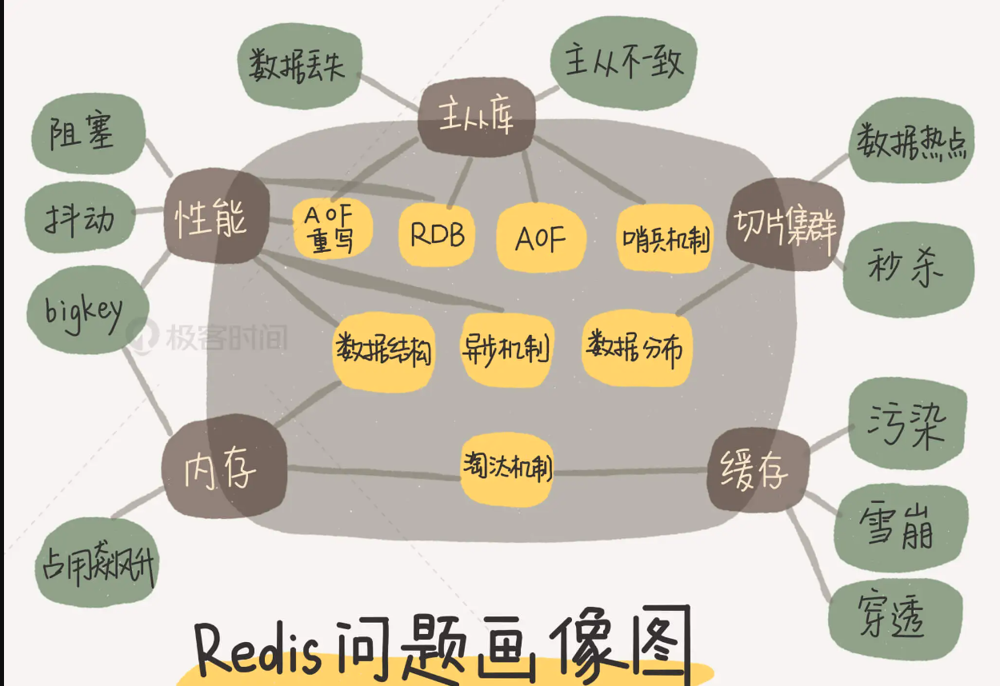

# redis100问

redis学习拓扑图


## redis 知识点
* redis提供给使用者的数据结构以及redis底层使用的数据结构
* redis中的慢操作，如何避免慢操作 
* redis的单线程模型，为什么使用单线程模型还能很快
* redis的两种持久化方式AOF和RDB快照
* 如何选择持久化备份方式，如何保证redis的数据不丢失
* redis的可靠性、高可用性、可扩展性依赖什么机制来实现（可靠性依赖于AOF、RDB持久化、高可用性哨兵集群+主从模式，可扩展性切片集群）
* redis的主从模式
* redis的哨兵机制，哨兵集群的搭建及实现原理，哨兵实现自动主从切换的条件（认为客观下线--认为下线的哨兵大于等于配置中的quorum，需要有一半以上的哨兵同意主从切换）
* redis的切片集群
* 使用redis实现消息队列，如何合理的设计与实现
* 如何解决redis缓存与关系型数据库数据不一致的问题
* redis服务器内存占满，redis是如何采取什么策略淘汰缓存的
* redis的缓存雪崩、缓存击穿、缓存穿透指的是什么，如何解决这些问题
* redis是如何应对并发访问的，如何保证数据的正确性
* 使用redis设计一个分布式锁
* redis的事务机制，redis事务和关系型数据库的事物有什么区别
* 在切片集群中，redis的数据倾斜问题如何解决


## 一个简单的键值对数据库应该有哪些模块
* 数据访问模块，提供数据的set、get 、delete操作，支持通过网络访问（socket server）
* 索引模块，提供数据的快速访问功能，hash表、B+树、字典树等实现索引
* 操作模块，执行访问模块提交过来的数据操作请求
* 存储模块，数据的存储、持久化

## 1. redis的特性
高性能、高可用的NOSQL数据库，以键值对的方式存储数据
> 键值对类型数据库
> 数据保存在内存中
> 单线程，每个命令具有原子性
  * 由于单线程执行，曜尽量避免慢查询命令，比如keys/flushall/flushdb/slow lua script/mutil exec/operate
> 低延迟，速度快（基于内存，基于linux的epoll模型，使用IO多路复用）
> 支持数据持久化（快照全量备份和AOF连续增量备份）
> 支持主从集群、哨兵集群、分片集群（数据拆分，水平扩展）

## 实现一个键值对数据库需要考虑哪些因素
* 键值对的外部访问框架（访问模块）
* 键值对支持的操作（操作模块）
* 键值对的快速索引（索引模块）
* 键值对的存储、安全性支持，在服务重启后能快速恢复数据（存储模块） 

## redis的快是依赖于哪些方面
* 高效合理的底层数据结构
* 单线程模型下epoll模型的高效
* 使用IO多路复用实现对客户端事件的快速响应

## redis的键和值的组织方式
redis的键值通过Hash表来实现的，hash表中中的值实际上是存储的指向具体的值的指针
使用hash表可以在O（1）的时间复杂度来快速查找键值对
当出现冲突时，redis使用链式哈希存储冲突的键值对信息
当链的长度过大时，redis会对hash表进行rehash，采用渐进式的rehash（在处理请求时，从原hash表中第一个索引的位置开始，将索引位置上的所有entries拷贝到新的hash表），避免线程的阻塞

## redis底层的数据结构实现

String --> 简单动态字符串
List -->    双向链表（数据量较多时使用，将多个压缩列表使用指针连接起来，避免大量的空间碎片）、压缩列表（数据量较少时使用，避免内存碎片化，节省内存空间）
Hash -->    压缩列表（数据量较少时，压缩列表可以占用较小的存储空间）、哈希表（冲突时使用链表解决）），数据量过大时，使用渐进式hash进行rehash  
Sorted Set -->  压缩列表（数据量少时）、跳表（数据量多时）
Set --> 压缩列表、整数数组


Hash 表
使用hash桶+链表作为底层数据存储、通过rehash实现hash表的扩容、使用渐进式的rehash

跳表
是一种可以替代平衡树的数据结构，它通过在多个层级上添加额外的前向指针来提高查找效率。跳表的实现原理基于链表，通过增加多级索引来提高搜索的速度，同时保持较高的插入和删除效率。
跳表是有序的
跳表有多个层级的索引。每一层的索引都是下一层索引的“子集”。最顶层的索引有最少的节点，而每往下一层，节点数量就增加，直到底层的普通有序链表。
使用跳表避免了平衡树的插入删除大量的调整操作，进行范围查找时跳表更加高效

## redis的速度为什么这么快
* redis基于内存，结合cpu的高速缓存，实现数据的快速读写
* redis使用了高效的底层数据结构，如hash表和跳表，能有效的提升内存的使用率和读写速率
* redis使用IO多路复用模型，使其在网络IO操作中能并发处理大量客户端请求，实现高吞吐量
* redis的单线程读写避免了线程切换以及原语同步操作的开销

## redis为什么采用单线程模型
* redis的网络IO和键值对的读写时由单个线程，而其他功能，如持久化、异步删除、集群数据同步等，是由额外的线程执行的
* 多线程访问数据时，由于cpu核心数的限制，存在线程上下文切换的开销，另外多个线程在操作同一个key时，需要额外的同步操作为了保证数据的正确性，因此redis的数据操作使用了单线程来完成
* redis 采用多路复用机制，在兵法处理大量客户端请求时实现了高吞吐率


## redis中的慢操作
* 由于redis的键值对的组织方式使用hash，所以在对redis的数据进行范围操作会比较低效，比如
```
keys *
hgetall
smembers
```
* 不要让redis一次性返回大量数据，对big key应该采取细粒度的访问
* 对set集合使用差集、并集、交集等计算时复杂度较高，这种情况下可能会导致redis实例阻塞，可以使用一个从库负责聚合计算，或是在客户端进行聚合计算
* bigkey的删除操作

## 如何解决redis的缓存和数据库数据不一致问题
当需要同时对数据库和redis缓存进行更新时，可以使用重试机制，将要修改的数据暂存到消息队列中，当应用没能成功更新缓存或数据库的值时，可以从消息队列中重新读取消息再次进行更新

在上面重试的机制中没有办法保证原子性，更新redis缓存和更新数据库缓存还是两个单独的操作，可以采用以下策略避免数据不一致：
应用程序先删除redis缓存，然后再更新数据库，然后再次删除redis缓存
或是应用程序先删除数据库数据，再删除redis缓存

## 缓存雪崩、缓存击穿、缓存穿透
* 雪崩： redis缓存中大量的数据同时过期（或redis实例发生故障宕机），导致大量请求直接打到数据库
  * 避免大量数据设置相同的过期时间
  * 对于非核心业务进行服务降级
  * 在业务系统中进行限流
* 击穿： 某一个访问非常频繁的热点数据失效，导致针对该缓存的请求全部打到数据库
  * 热点数据设置过期时间
* 穿透：要访问的数据不在redis和数据库中，导致请求直接打到数据库，缓存穿透一般是业务层操作失误或事恶意攻击
  * 设置缓存空值或缺省值
  * 使用布隆过滤器快速判断数据是否存在，减轻数据库压力
  * 请求入口进行请求检测

## redis的数据淘汰策略
redis一共有8种策略
noeviction ：不进行数据淘汰
对设置过期了时间的缓存的淘汰策略：
volatile-random： 随机删除
volatile-ttl： 根据过期时间的先后进行删除，过期越早越先被删除
volatile-lru： 使用LRU（Least Recently Used 最近最少使用）算法删除
volatile-lfu：（Least Frequently Used算法，最不常用缓存）删除
对所有数据范围内的淘汰策略：
allkeys-lru： 使用LRU算法对所有数据进行删除
allkeys-random： 随机删除
allkeys-lfu：使用PFU算法删除

## 如何在redis中实现无锁的原子操作
  * 使用lua脚本，通过redis-cli --eval lua.script keys, args执行
  * 使用lua脚本实现分布式锁的功能
    * 加锁 set lock_key unique_value nx px 10000  --设置10s过期
    * 释放锁使用lua脚本
    * 执行lua脚本 redis-cli --eval lua.script loc_key, unique_value
```lua
//释放锁 比较unique_value是否相等，避免误释放
if redis.call("get",KEYS[1]) == ARGV[1] then
    return redis.call("del",KEYS[1])
else
    return 0
end
```
    


## 优雅停机
如果是用apt-get或者yum install安装的redis，可以直接通过下面的命令停止/启动/重启redis
/etc/init.d/redis-server stop
/etc/init.d/redis-server start
/etc/init.d/redis-server restart

如果是通过源码安装的redis，则可以通过redis的客户端程序redis-cli的shutdown命令来重启redis
1.redis关闭
```
redis-cli -p 6379 shutdwon
```

## redis 配置文件
redis.conf:
```conf
    ##是否开启保护模式
    protected-mode yes
    ## 是否开启后台守护进程，开启守护进程后redis的启动会在后台运行
    daemonize yes
    #允许连接的客户端ip
    bind 0.0.0.0
    # redis数据目录
    dir /tmp/redis
    ## redis日志目录
    logfile /tmp/redis
    ## redis dump文件名称，和dir组成完整的数据存储路径
    dbfilename dump.rdb
    ## redis连接密码设置
    requirepass dsdfs
    ## 设置数据库的数量
    databases 16
```
## redis启动命令
```shell
    ## 启动
    redis-server redis.conf
    ## 客户端连接
    redis-cli -h 127.0.0.1 -p 6379  -a dsdfs(密码)
    auth [username] password
```


## 通用命令
###  `help keys` -- 查看keys名 
支持模式匹配
`key *` 查询所有key
`key view_page*` 进行模式匹配
注意，该命令效率较低，时间复杂度为O（n）,可能会导致redis主线程阻塞，不建议在生产环境中使用,如果需要扫描db中的所有key，建议使用scan/sscan/hscan命令

### dbsize 返回当前库的key的数量,时间复杂度O(1)
```
select 1
dbsize
```

### `help @Generic` 查看通用命令
### `keys pattern`  查看key列表
###  `del key` 删除键值对,返回删除的键值对数量
### `exists key` 判断一个key是否存在
`exists user_info`

### `EXPIRE key seconds` 设置key的存活时间

### `TTL key` 查看key的有效期
```
set test1 aaa
expire test1 60
ttl test1 //过期后返回 -2
```

### persist key 设置key永不过期
```
persist test1
ttl test1 //返回-1
```

### type key 查询key的类型
```shell
type abc1234 //不存在的数据类型返回none
set abc 123
type abc //string
sadd pat 'dog'
type pat //set
zadd page_rank 1 baidu.com 2 bing.com
type page_rank //zset
hmset user:info name 'dxy' location 'tc'
type user:info //hash
lpush ltime a b c
type ltime //list
pfadd pf4 'a' 'b' 'c'
type pf4 //string
geoadd cities:locations 116.09 23.09 un
type cities:locations //zset
```
从上面可以看出redis的geo底层使用zset数据类型（sorted set的集合有序，适合作范围查询，所以GEO数据类型使用了sorted set来实现）、HyperLogLog底层使用string数据类型

### scan/sscan（遍历set的key）/zscan（遍历zset的key）/hscan（遍历set的key）
```
scan 0 match keyabc* count 1000 //从cursor 0 处开始遍历模式为keyabc*的key，每次取出count为1000的数量，会返回下一个cursor的位置以及符合条件的key 
```
在生产环境中同样不建议使用scan命令进行扫描，因为scan命令虽然对keys命令进行的改进，使用了类似于分页查询key列表的功能，但其时间复杂度还是O(n),如果count参数设置过大还是可能导致慢查询


## redis的数据类型
### String
底层使用简单动态字符串实现
> 字符串、整数或浮点
> 编码使用raw、int、embstr
> 对字符串或字符串的一部分执行操作（GET、SET、DEL）
> 对整数或浮点数执行自增或自减操作
> 支持位运算

**命令**
> `SET key value [EX seconds|PX milliseconds|EXAT timestamp|PXAT milliseconds-timestamp|KEEPTTL] [NX|XX] [GET] ` 添加或修改
> `GET key` 获取
>  `MSET key value [key value ...]` 批量设置修改，
> `MGET key [key ...]` 批量获取
> `INCR key` 自增
> `INCRBY key increment` 指定步长自增
> `INCRBYFLOAT key increment` 对浮点数指定步长自增
> `append key value` 在原有value的基础上追加
> `SETNX key value` 存在则新增
> `SETEX key second value` 新增并设置有效期
> `SET key value EX second` 设置有效期，秒时间
> `SET key value PX milliseconds` 设置过期时间为毫秒时间
> `PSETEX key milliseconds value` 设置过期时间为毫秒时间
> `strlen key` key存储的字符串长度

应用场景：

1. 使用setex的原子操作可实现带超时时间的分布式锁功能
思想：使用setex命令在redis中占用一个位置，当别的进程也来占用该key时，发现位置被占用，就治好放弃或稍后重试
注意使用redis实现分布式锁功能要尽量避免临界区代码操作逻辑执行时间过长超出所得超时限制
2. 使用incr命令记录某一篇博文的访问量，由于是原子操作，不存在线程安全问题
3. 使用incr实现分布式id生成器，保证id唯一
4. 作为热点数据缓存，降低数据库压力


### list
> 链表--双向链表,支持正向检索和反向检索
> 编码实现使用linkedlist、ziplist
> 有序
> 允许元素重复
> 插入删除快
> 查询速度一般
> 从链的两端推入或弹出（RPUSH、LRANGE、LINDEX、LPOP），根据偏移量进行修剪（trim）
> 读取单个或多个元素，根据值查找或移除元素

**命令**
> `LPUSH key element [element ...]` 从左侧插入
> `LPOP key [count]` 从左边取元素，移除元素并返回移除的元素
> `RPUSH key element [element ...]` 从右侧插入元素
> `RPOP key [count]` 从右边取元素，移除元素并返回移除的元素，没有则返回nil
> `LRANGE key start stop` 返回一段角标范围内的所有元素,`lrange dxy:user:test 0 -1` 取所有元素,这个命令不会移除key中的数据
> `BLPOP key [key ...] timeout` 阻塞一定时间取数据,没有元素时等待指定时间，超时后返回nil
> `BRPOP key [key ...] timeout` 阻塞一定时间取数据,没有元素时等待指定时间，超时后返回nil,timeout 是second

使用场景
使用list的命令可以模拟栈（先进后出（lpop/lpush）），队列（先进先出（lpush/rpop））
使用list可以模拟阻塞延时队列（使用BLPOP/BRPOP），在brpop命令中设置超时时间避免异步消息队列在没有消息数据是的不断循环pop
使用list可以实现时间线上事件节点的功能


### set
> 包含无重复字符串的无需收集器
> 与java的HashSet类似
> 编码实现使用hashtable、intset
> 无序
> 元素不可重复
> 查找快
> 支持交集、并集、差集等功能（实现好友列表，共同好友等功能）
> 添加、获取、移除单个元素，检查元素是否在集合中（SADD、SMEMBERS、SREM、SISMEMBER），计算交、并、差集，从集合中随机获取元素

**命令**
> `SADD key member [member ...]` 数据插入
> `SREM key member [member ...]` 数据移除
> `SCARD key` 返回集合中的元素个数
> `SISMEMBER key member` 如果是集合中的元素，返回1，否则返回0
> `SMEMBERS key` 返回集合中的所有元素 (无序返回)
> `SINTER key [key ...]` 多个集合的交集
> `SDIFF key [key ...]` 差集，第一个key中有而其他key中没有的元素
> `SUNION key [key ...]`  求多个元素的并集

使用场景：
* 可以使用set实现对某一篇文章的点赞数量的统计，将点赞的用户放入set中
* 可以使用set实现文档板块分类标签，将标签名称存储在set中
* 可以使用set的交集、差集、并集实现微信统计两个用户之间的共同好友，共同群聊等功能

### hash --无序字典，与java中的hashmap类似
> 包含键值对的无序散列
> 编码实现使用hashtable、ziplist
> 添加、获取、移除单个键值对，获取所有键值对

**命令**
> `HSET key field value [field value ...]` 存储、修改hash
> `HGET key field` 获取hash中的值
> `HMSET key field value [field value ...]` 与hset类似
> `HMGET key field [field ...]`获取多个hash字段
> `HGETALL key` 返回key下的所有键值
> `HKEYS key` hash中的所有键
> `HVALS key` hash中的所有值
> `HINCRBY key field increment` 自增hash中指定的字段值
> `HSETNX key field value` hash中的字段不存在时添加
> `hincrbyfloat key field increment` 

应用场景：
记录微博、qq空间等用户个人主页的访问两，可以使用 hincrby user homePageCount pageviewCount
缓存个人用户信息

### zset
> 与java中的TreeSet(实现方式不同，TreeSet用红黑树实现)类似
> 编码实现使用skiplist、ziplist
> 通过score进行排序
> 底层实现的是一个跳跃表加hash
> 能方便的实现数据统计功能
> 字符串成员与浮点数分值之间的有序映射，元素的排序顺序由分值大小决定
> 添加、获取、删除耽搁元素，根据分值范围或成员来获取元素

**命令**
> `ZADD key [NX|XX] [GT|LT] [CH] [INCR] score member [score member ...]` 插入数据到集合中，并设置排序score 
> `ZREM key member [member ...]` 移除元素
> `ZSCORE key member` 返回集合中指定元素的分值
> `ZRANK key member`  返回集合中
> `ZRANK key member` 返回集合中指定元素的排名(index)
> `ZCARD key` 返回集合中元素个数
> `ZINCRBY key increment member` 让集合中指定元素分值自增，返回自增后的分值 zincrby dxy:user:zset1 2 wangwu
> `ZCOUNT key min max` 返回集合中指定分值范围内的元素个数 zcount dxy:user:zset1 70 100
> `ZRANGE key min max [BYSCORE|BYLEX] [REV] [LIMIT offset count] [WITHSCORES]` 按分值返回index在min和max之间的元素 zrange dxy:user:zset1 0 1   --从分值最小端返回最小的两个元素
> `ZRANGEBYSCORE key min max [WITHSCORES] [LIMIT offset count]` 按score排序后获取score范围内的元素,zrangebyscore dxy:user:zset1 70 80 --返回分值在70-80之间的元素
> `ZDIFF numkeys key [key ...] [WITHSCORES]` numkeys为后面指定的key的数量 ，返回第一个中存在其他key中不存在的元素
> `ZUNION numkeys key [key ...] [WEIGHTS weight] [AGGREGATE SUM|MIN|MAX] [WITHSCORES]` 查询集合的交集，并将集合中的相同元素分值进行(相加|取最大值｜取最小值）后排序：`zunion 2 dxy:user:zset1 dxy:user:zset2 withscores`
> `ZDIFF numkeys key [key ...] [WITHSCORES]` 在第一个key中不在其他key中的元素
> `ZINTER numkeys key [key ...] [WEIGHTS weight] [AGGREGATE SUM|MIN|MAX] [WITHSCORES` 返回集合中的交集，并将相同的元素分值相加
*排序命令如果需要反转排序则需要在命令前面加上rev ，例如`zrevrank dxy:user:zset1 zhaoliu`*

应用场景：
* 利用zset的排序功能实现取文章、视频浏览量topn的功能


## 其他三种数据类型
### geo 地理坐标 
支持地理坐标的存储、距离计算、半径范围内的点位计算等
底层使用zset实现
使用场景：实现地理位置计算，半径内的点位计算等
```
geoadd cities:locations 116.28 39.55 beijing //创建地理位置信息
geopos cities:locations beijing //获取位置信息
geodist cities:locations beijing tianjin km //计算北京到天津有多少km
georadiusbymember cities:locations beijing 100 km asc count 10 //计算北京100公里内的相邻点位
```

### bitmap （位图）
实际上是对string类型的位进行操作
操作命令
```
setbit user_visit 1000 1    //将user_visit的string的1000二进制位设置1
getbit user_visit 1000      //获取user_visit的String的1000位的二进制值
bitcount user_visit   //查询user_visit被设置为1的比特位的数量
bitop and destkey k1 k2 //将多个key按位求并将结果存储在destkey中
bitop or destkey k1 k2  //将多个key按位求或将结果存储在destkey中
bitop xor destkey k1 k2  //将多个key按位求异或将结果存储在destkey中
bitop not destkey k1   //将key按位求异或将结果存储在destkey中
bitpos user_visit 0/1 [start] [end]  //求位图中第一个值为0（或者为1）的二进制位的位置
```
应用场景
可以使用位图结合用户的唯一id来标识网站每天的用户访问，用用户的id 结合setbit命令设置1来标识用户访问过网站，使用这种方式可以大大节省存储空间


### hyperLogLog --基数统计工具
用于统计集合中的基数（不重复元素的个数，类似于统计set中的元素个数）
底层使用string数据结构
操作命令
```
pfadd pf1 'u1' 'u2' 'u3' 'u1' //将任意元素放入hyperLogLog中,
pfcount pf1 //3，重复元素u1只会被记一次
pfmerge destpf pf1 pf2 //将pf1、fp2等多个 hyperLogLog合并到destpf中
```
注意pf占用空间很小，其中并不存储add在其中的真实数据，无法pfadd在其中的数据，统计的数据不一定是准确的

## redis的持久化
### RDB redis database backup file 对整个内存做快照
* 使用数据快照方式存储在磁盘文件
* 使用save命令执行备份操作  -- save命令会阻塞所有的命令，不推荐，在redis停机时使用
* 使用bgsave ，fork额外的进程执行rdb，避免主进程受到影响
  * 使用bgsave操作时，redis使用了写时复制（copy on write），在执行快照的同时，redis读写可正常执行
适用场景：需要定期备份数据、可以接受一定数据丢失的场景，适用于数据集较大的情况，可以在后台生成快照文件，用于恢复
生成快照文件紧凑，适合备份和恢复，在恢复大数据集时rdb的加载速度快
服务器崩溃，可能导致最后一次生成快照到崩溃之间的数据可能会丢失

###  rdb 的触发机制
```
# 900秒内有一次修改则触发一次bgsave
save 900 1 
# 300秒内有10次修改则触发一次bgsave
save 300 10
# 60秒内10000次修改则触发一次bgsave
seve 60 10000 
是否开启redis持久化的压缩
rdbcompression yes
dir /data
dbfilename dump.rdb
# 关闭rdb
save "" 
```
redis-cli 关闭rdb
config set save ""

 **rdb实现原理**
 bgsave 开始时会fork主进程得到子进程，子进程共享主进程的内存数据，完成fork后读取内存数据并写入rdb文件
 > fork 采用copy-on-write技术
 > 当主进程执行读操作时，访问共享内存
 > 当主进程执行写操作时，则会拷贝一份数据，执行写操作

bgsave基本流程：
* fork主进程得到一个子进程，共享内存空间
* 子进程读取内存数据并写入新的rdb文件
* 用新rdb文件替换旧rdb文件

rdb的缺点
持久化的间隔时间内如果出现宕机则会出现写入数据丢失的风险
fork子进程、压缩、写出rdb文件都比较耗时

#### AOF（append only file）追加文件
* 它是写后日志，省去了错误语法检查
* 不会阻塞写操作
* 开启aof 
  * appendonly  yes
  * appnendfilename "appendonly.aof"
* AOF的appendfsync配置(磁盘同步策略)
  * always，写回同步，每个写命令执行完立即同步磁盘
  * everysec，每秒写回，先把日志写到文件的内存缓冲区，每隔1s写回
  * NO，每个写命令执行完先把日志写到aof 文件缓冲区，由操作系统决定何时将内容写入磁盘
* 当apf文件过大时，继续追加写命令会导致写入效率较低，如果发生宕机，aof中记录的命令要一个个被重新执行，恢复起来慢
* redis使用aof重写机制避免aof日志文件过大的问题
  * aof重写根据键值对的最新状态生成对应的写命令，能将多个写操作合并为一个写操作
  * auto-aof-rewrite-percentage 100 自动触发aof重写机制
  * auto-aof-rewrite-miin-size 64mb 自动触发重写的最低文件体积
* redis处理的每个写命令都会记录在AOF文件，可以看作时命令日志文件
* AOF默认关闭
* 适用于强调数据的安全性和可靠性，不能容忍数据丢失的场景，适用于数据一致性要求较高的情况
* 每个写操作都会记录到AOF文件中，可以提供更精细化的数据恢复点，避免丢失较多数据
* AOF文件相对较大，写入性能可能相对较低，在某些情况下AOF可能会因为文件过大儿导致恢复变得较慢

开启：
```
#开启aof功能
appendonly yes

#aof文件名称
appendfilename 'appendonly.aof'

# 记录命令的频率
appendfsync always  每执行一次命令就进行写入
appendfsync everysec  写命令执行完毕先放入aof缓冲区，然后每隔一秒将缓冲区数据写入到aof文件（默认方案，最多丢失1秒内的数据）
appendfsync no 写命令执行完放入aof缓冲区，由操作系统决定何时将缓冲区内容写入到aof文件中
```
> aof 记录的是写命令，当redis重启从aof文件读取数据时，会重新执行命令，重新执行的命令会再次写入aof文件进行记录，这样会导致aof文件过大
> 为了解决aof文件过的问题，可以执行bgrewriteaof命令，让aof执行重写命令
可以通过配置文件让bgrewriteaof命令自动执行
```shell
# aof 文件大小翻倍（100%）触发一次bgrewriteaof
auto-aof-rewrite-percentage 100
# aof 文件体积大小大于64MB触发一次 bgrewriteaof
auto-aof-rewrite-min-size 64mb

no-appendfsync-on-rewrite no
#no-appendfsync-on-rewrite会影响Redis事务的持久性。因为在服务器停止对AOF文件的同步期间，事务结果可能会因为停机而丢失。因此，如果服务器打开了no-appendfsync-on-rewrite选项，那么即使服务器运行在always模式的AOF持久化之下，事务也不具有持久性。
#在默认配置下，no-appendfsync-on-rewrite处于关闭状态。
```


### 对比
redis优先以aof做恢复数据的方式
rdb的恢复速度快，aof慢
在实际使用中可以同时使用rdb和aof来进行数据的安全备份
如果要求数据安全性高，则选择aof，如果要求更快的启动速度，则可以使用rdb

**选择持久化的方式**
* 根据数据重要性： 如果你的数据不允许丢失，AOF能更好的保证数据完整性，如果可以容忍数据丢失，RDB持久化备份功能更适合
* 根据读写模式，如果有大量的写操作，AOF更合适，保证每个写操作都能被持久化，如果写操作较少，RDB持久化快照的方式更加高效
* 根据数据大小：对于大数据集，可能更适合RDB持久化，恢复数据是速度更快
* 结合使用：某些情况下，同时使用两种持久化方案，可以使用AOF持久化以确保数据的完整性，同时使用rdb持久化作为备份方案
* 定期备份：无论哪种方式，都应该定期备份持久化文件，防止数据丢失或损坏
* 可以使用两种持久化方式的结合，开启配置`aof-use-rdb-preamble yes` 混合使用AOF日志和内存快照，快照以一定的频率执行，在两次快照之间使用AOF日志

## 使用redis实现消息队列
由于redis读写的高性能，可以考虑将redis作为消息队列中间件来使用
消息队列要实现的三个要求：消息保序性、重复消息正确处理、消息的可靠性
###  List作为消息队列的数据结构
redis的list是一个先进先出的队列，可以直接用来做为消息队列，可以保证以上三个要求
但是客户端在使用list获取消息数据时需要不断的进行轮询，查询list中是否还有消息，这会给客户端的cpu带来一定的消耗
使用list的BRPOP进行消息阻塞式读取可以避免消费者的轮询
使用list的BRPOPLPUSH 将读取到的消息放入一个新的队列，避免因为消费者宕机导致的消息丢失问题
使用list存在的问题：当消费者处理速度不够快，可能导致消息的堆积，占用大量内存

###  使用stream实现消息队列
redis 5.0 提供了streams可实现消费者分组的功能
基本操作：
* XADD：插入消息，保证有序，可以自动生成全局唯一 ID；
XADD mqstream * repo 5
* XREAD：用于读取消息，可以按 ID 读取数据； (block表示无消息时阻塞)
XREAD BLOCK 100 STREAMS mqstream 1599203861727-0 
XREAD block 10000 streams mqstream $  （$表示从最新的消息开始读取）
* XREADGROUP：按消费组形式读取消息；
创建组
XGROUP create mqstream group1 0
指定消费者1，2读取消息, > 表示从第一条消息开始读取
XREADGROUP group group1 consumer1 streams mqstream >
XREADGROUP group group1 consumer2 streams mqstream >

* XPENDING 和 XACK：XPENDING 命令可以用来查询每个消费组内所有消费者已读取但尚未确认的消息，而 XACK 命令用于向消息队列确认消息处理已完成。
group1 中各个消费者已读取、但尚未确认的消息个数
XPENDING mqstream group1
查看某条消息是否已经被处理
XACK mqstream group1 1599274912765-0


## java客户端

### jedis java redis 
> 以命令作为方法名称
> jedis实例线程不安全，在多线程环境下必须使用线程池进行管理保证线程安全

示例
```java
    private static volatile Jedis jedis;

    public static void main(String[] args) {
        String result = getJedis().set("test-java","java hello redis");
    }

    public static Jedis getJedis(){
        if(jedis == null){
            synchronized (Jedis.class){
                if(jedis == null){
                    jedis = new Jedis("localhost",6379);
                    jedis.auth("dxy123456");
                }
            }
        }
        return jedis;
    }
```

```java
//使用连接池
    private static final JedisPool jedisPool;
    static {
        JedisPoolConfig jedisPoolConfig = new JedisPoolConfig();
        jedisPoolConfig.setMaxIdle(8);
        jedisPoolConfig.setMaxTotal(8);
        jedisPoolConfig.setMinIdle(1);
        //获取时最多等待1000ms
        jedisPoolConfig.setMaxWaitMillis(1000);
        jedisPool  = new JedisPool(jedisPoolConfig,"localhost",6379,1000,"dxy123456");
    }

    public static Jedis getJedis(){
        return jedisPool.getResource();
    }
```

### letuce
> 基于netty实现，支持同步、异步和响应式编程，支持redis的哨兵模式，集群模式和管道模式

### redisson
基于redis实现的分布式的可伸缩的java数据结构集合，包含了如map、queue、lock、semaphore、atomicLong等强大的原子类和锁

### 使用springDataRedis操作
使用RedistTemplate简化输入对象的序列化操作
配置（注意springboot默认使用的是lettuce）
```yml
spring:
  redis:
    host: localhost
    port: 6379
    database: 0
    lettuce:
      pool:
        enabled: true
        max-idle: 8
        min-idle: 1
        max-wait: 1000ms
        max-active: 8
    password: dxy123456
```
使用
```java
   public static void main(String[] args) {
        ConfigurableApplicationContext applicationContext = SpringApplication.run(Application.class, args);
        RedisTemplate redisTemplate = (RedisTemplate) applicationContext.getBean("stringRedisTemplate");
        redisTemplate.opsForValue().set("spring-redis","spring    hello world");
        log.info(redisTemplate.opsForValue().get("spring-redis").toString());
    }
```
RedisTemplate 接收的参数是对象，而不是字符串，默认使用的是jdk的序列化器，默认使用的ObjectOuptutStream，会导致存入redis中的键值对不是预期的键值对

```java
//自定义序列化和反序列化的工具
 @Bean
    public  RedisTemplate<String,Object> redisTemplate(RedisConnectionFactory factory){
        //设置redisTempalate对象
        RedisTemplate<String, Object> redisTemplate = new RedisTemplate<>();
        //设置连接工厂
        redisTemplate.setConnectionFactory(factory);
        //设置json序列化工具
        GenericJackson2JsonRedisSerializer jsonRedisSerializer = new GenericJackson2JsonRedisSerializer();
        //设置key序列化
        redisTemplate.setKeySerializer(RedisSerializer.string());
        redisTemplate.setHashKeySerializer(RedisSerializer.string());
        //设置value序列化
        redisTemplate.setValueSerializer(jsonRedisSerializer);
        redisTemplate.setHashValueSerializer(jsonRedisSerializer);

        return redisTemplate;
    }

    RedisTemplate redisTemplate = (RedisTemplate) applicationContext.getBean("redisTemplate");
     User user = new User(1,"steven");
          User user2  = new User(2,"lld");
          redisTemplate.opsForValue().set("dxy:user:1",user);
         User o = (User) redisTemplate.opsForValue().get("dxy:user:1");
        System.out.println(o);
        redisTemplate.opsForHash().put("dxy:user",user.getId().toString(),user);
          redisTemplate.opsForHash().put("dxy:user",user2.getId().toString(),user2);
          User user3 = (User) redisTemplate.opsForHash().get("dxy:user","2");
          log.info(user3.toString());

          //存入的数据，存入了字节码信息，在反序列化的时候拿到类的信息
          {
            "@class": "com.steven.pojo.User",
            "id": 1,
            "username": "steven"
            }
```
*在开发中为了节省redis的内存空间，统一使用String序列化器的来存储redis的数据*
```java
    User user = new User(1,"steven");   
    StringRedisTemplate redisTemplate1 = applicationContext.getBean(StringRedisTemplate.class);
    redisTemplate1.opsForValue().set("spring-redis-3", new ObjectMapper().writeValueAsString(user));
    String jsonuser = redisTemplate1.opsForValue().get("spring-redis-3");
    User user4 = new ObjectMapper().readValue(jsonuser,User.class);
    log.info("user4:{}",user4);
     //存入的数据
     {
    "id": 1,
    "username": "steven"
    }     
```


## 分布式缓存
### 单节点redis存在的问题
* 数据丢失问题      --利用redis持久化
* 并发压力问题      --利用主从集群，实现读写分离
* 单点故障的问题    -- 利用哨兵机制实现故障恢复，解决单点故障
* 存储能力上限问题   --利用插槽 slot实现动态扩容


## redis集群安装
由于redis的使用场景都是读多写少的场景，redis集群一般采取主从结构，读写分离
三种模式
> 主从模式
> 哨兵模式
> 分片集群模式

单节点安装
```shell
yum -y install gcc
make distclean
make && make install PREFIX=/export/server/redis
```

### 主从模式
启动主从复制模式后，从服务器只提供给读的功能，不提供写的功能
主服务提供读写功能
修改配置从服务器配置文件 (可以临时在从节点使用`replicaof 192.168.10.101 6379`命令来指定主节点)
```
# 5.0之前使用slaveof
sloveof 192.168.10.102 6379 
# 5.0之后使用下面的命令
replicaof 192.168.10.101 6379
masterauth steven  #主服务器密码
requeirepass steven #主服务器密码
```
指定redis服务器 ip(当服务器存在多个ip时)
```
 replica-announce-ip 5.5.5.5
```
* 主服务宕机后从服务器不会提升成为主服务器，导致整个系统数据不可写入
* 无法提供自动故障转移功能

*数据同步原理*
* 主从第一次同步是全量同步 （全量同步需要读取磁盘文件，效率会较低）
    > 第一次同步时，主服务器执行basave，发送rdb文件到从节点，主节点继续执行写操作
    > 在rdb期间收到的所有的命令放入repl_baklog的缓冲区中，
    > rdb发送完成之后，主节点将缓冲区中的命令发送给从节点,
* 随后只要主节点有数据写入，就会从repl_baklog缓冲区发送给从节点。
* master根据replication id(master判断是否与replication id与自己的id一致，不一致则认为是从节点)和offset来判断slave的数据是否需要更新   

* 当slave重启后会与master进行增量同步
* master根据replication id和offset从repl_baklog（环形缓冲区）缓冲区拿到需要同步的数据，发送给重启的slave
* 当repl_baklog出现了尚未同步的数据被重新覆盖了，则slave无法从repl_baklo根据offset进行增量同步，这是需要进行全量同步

主从优化：
* 在master中开启 `repl-diskless-sync yes` 避免磁盘io的读写，将数据写入到网络中
* redis单节点上的内存占用不用太大，减少rdb导致的过多的磁盘io
* 提高repl_baklog的大小，发现slave宕机时尽快实现故障恢复，避免全量同步
* 可以限制一个master上的从节点数量，可以采取主从从的链式结构减少master的压力

### 哨兵模式
哨兵模式是一种特殊的模式，首先Redis提供了哨兵的命令，哨兵是一个独立的进程，作为进程，它会独立运行。其原理是哨兵通过发送命令，等待Redis服务器响应，从而监控运行的多个Redis实例。
哨兵的作用
* 监控：服务状态监控，通过发送命令，让Redis服务器返回监控其运行状态，包括主服务器和从服务器。
    > 当超过指定数量（quorum）的sentinel认为实例下线了，则认为该实例在集群中下线
* 选举：选举新master并故障转移：当哨兵监测到master宕机，会自动将slave切换成master，然后通过发布订阅模式通知其他的从服务器，修改配置文件，让它们切换主机。
    > 判断slave节点与master节点断开时间长短，如果超过指定的值，则排除该slave节点
    > 然后判断其他slave节点的slave-priority值，越小优先级越高，如果是0，则永不参加选举
    > 若slave—prioprity值一样，判断slave节点的offset值，值越大说明数据越新，被选为master优先级越高
    > 最后判断slave的运行id大小，越小优先级越高
* 故障转移：
    > sentinel给备选节点发送`slaveof no one`命令，让节点成为master
    > sentinel 给其他slave发送slaveof 192.168.10.101 6379 命令，让slave成为新master的从节点，开始从新的master上同步数据。
    > 最后修改下线的master的redis.conf，将其设置为新master节点的slave
* 通知：sentinel充当redis客户端的服务发现来源，当集群发生故障转移时，将最新的消息推送给redis客户端（主节点发生切换时，通知客户端切换写数据的主节点）
  * 哨兵提供了sub/pub机制来通知客户端集群中的实例的变更

> redis.conf 从服务器配置
``` shell
sloveof 192.168.10.102 6379 
masterauth steven
requirepass steven
```
> sentinel.conf 配置 
```shell
# mymaster主节点名称
# 192.168.10.102 6379 主节点ip及端口号
# 2 选举master时的quorum值，多少个sentinel认为master下线才在集群中被认定为下线
sentinel monitor mymaster 192.168.10.102 6379 2
sentinel auth-pass mymaster steven
```
> 先启动 redis-server，再启动redis-sentinel
```
./bin/redis-server redis.conf
./bin/redis-sentinel sentinel.conf
```
启动后可以通过redis log查看数据同步信息
也可以通过主从服务上运行下面的命令查看主从信息
```
info replication
```
关闭主服务器进程，这是会重新选举新的主服务。
如果主服务器重新上线，此时并不会重新进行主服务器的选举。
此时观察redis.conf文件，发现文件内的slaveof 主从配置被修改掉（主服务器被配置了一个slaveof属性）

spring boot对sentinel的支持
```yml
spring:
  redis:
    database: 0
    lettuce:
      pool:
        enabled: true
        max-idle: 8
        min-idle: 1
        max-wait: 1000ms
        max-active: 8
    password: dxy123456
    ## sentinel集群配置
    sentinel:
      master: mymaster
      nodes:
        - 192.168.10.101:26379
        - 192.168.10.102:26379
        - 192.168.10.109:26379
```
```java
    //读写分离配置
    @Bean
    public LettuceClientConfigurationBuilderCustomizer clientConfigurationBuilderCustomizer(){
        return clientConfigurationBuilder -> {
            //优先从replica中读取数据，replica不可读才从master读
            clientConfigurationBuilder.readFrom(ReadFrom.REPLICA_PREFERRED);
        };
    }
    //使用
    @Autowired
    private StringRedisTemplate redisTemplate;

    @GetMapping("/user/{id}")
    public String getUser(@PathVariable("id") Long id){
        return redisTemplate.opsForValue().get("dxy:user:"+id);
    }
```


**分片集群模式**

> 集群中存在多个master，每个master保存不同的数据
> 每个master上有多个slave节点
> master之间通过ping监测彼此之间的健康状态
> 客户端请求可以访问集群中的任意节点，最终都会被转发到正确的节点

搭建分片集群

依据 Redis Cluster 内部故障转移实现原理，Redis 集群至少需要 3 个主节点，而每个主节点至少有 1 从节点，因此搭建一个集群至少包含 6 个节点，三主三从，并且分别部署在不同机器上。
这里采用在三台centos7虚拟机上使用不同的端口号进行部署
每台机器部署两个redis进程
参考地址：https://zhuanlan.zhihu.com/p/320510950
1. 修改redis配置文件：
```
# 开启集群
cluster-enabled yes
#集群配置文件
cluster-config-file nodes-6379.conf
#集群心跳超时时间
cluster-node-timeout 15000
```
2. 分别启动六台redis服务器
./bin/redis-server redis.conf

3. 设置集群
```shell
redis-cli --cluster help --查看redis 集群的所有命令
##设置集群， 每个主节点一个从节点cluster-replica为1，前三个为主节点，后三个为从节点
./bin/redis-cli --cluster create --cluster-replicas 1 [-a password] 192.168.10.101:6379 192.168.10.102:6379 192.168.10.109:6379 192.168.10.101:6380 192.168.10.102:6380 192.168.10.109:6380
# 查看集群状态
redis-cli -p 6379 cluster nodes

#根据key计算hash值找到插槽放入
set numdfsdf 123
 Redirected to slot [7027] located at 192.168.10.102:6379
```
**slot散列插槽**
redis数据不与节点绑定，而是与插槽绑定，redis根据key的有效部分计算插槽值：
* 当key中包含‘{}’，且{}中至少包含一个字符，‘{}’中的部分是有效部分
* key中不包含{}，整个key都是有效部分，
* redis利用crc16算法计算有效部分得到一个hash值，然后对16384取余，得到的结果就是slot值

* 同一类数据可以使用‘{}’包含相同的key的有效部分，计算插槽时能同类数据放入相同的插槽内

**集群伸缩**
```shell
#需要新node的ip端口号，和集群中已经存在的ip和端口号
redis-cli --cluster  add-node       new_host:new_port existing_host:existing_port --cluster-slave --cluster-master-id
## 重新对slot进行分片，
redis-cli --cluster reshard        <host:port> or <host> <port> - separated by either colon or space

```

```shell
# 添加节点
./bin/redis-cli --cluster add-node 192.168.10.101:6390 192.168.10.101:6379
>>> Adding node 192.168.10.101:6390 to cluster 192.168.10.101:6379
>>> Performing Cluster Check (using node 192.168.10.101:6379)
M: b8ebbaca3fa30777b9ba7de21ea9b9b900475ad7 192.168.10.101:6379
   slots:[0-5460] (5461 slots) master
   1 additional replica(s)
M: ec784c9abd671fc6013f7679f2fab280d17a9530 192.168.10.109:6379
   slots:[10923-16383] (5461 slots) master
   1 additional replica(s)
S: a0b2579357a31a1518a897aa19eb817cf213b3c8 192.168.10.101:6380
   slots: (0 slots) slave
   replicates ec784c9abd671fc6013f7679f2fab280d17a9530
S: f51846d48de4f7cd5ca9e6a71d37f552fe120c1e 192.168.10.102:6380
   slots: (0 slots) slave
   replicates b8ebbaca3fa30777b9ba7de21ea9b9b900475ad7
S: 4bf6a83fa27cb0e54e9a7711b01f998d013536a9 192.168.10.109:6380
   slots: (0 slots) slave
   replicates 5f7f1e87e3dc35e4b0ca535991e358e666af1c52
M: 5f7f1e87e3dc35e4b0ca535991e358e666af1c52 192.168.10.102:6379
   slots:[5461-10922] (5462 slots) master
   1 additional replica(s)
[OK] All nodes agree about slots configuration.
>>> Check for open slots...
>>> Check slots coverage...
[OK] All 16384 slots covered.
>>> Getting functions from cluster
>>> Send FUNCTION LIST to 192.168.10.101:6390 to verify there is no functions in it
>>> Send FUNCTION RESTORE to 192.168.10.101:6390
>>> Send CLUSTER MEET to node 192.168.10.101:6390 to make it join the cluster.
[OK] New node added correctly.
#加入的节点默认没有插槽，需要手动分配插槽
## slot插槽移动
#指定集群内的一个ip和端口进入reshard
./bin/redis-cli --cluster reshard 192.168.10.101:6379
>>> Performing Cluster Check (using node 192.168.10.101:6379)
M: b8ebbaca3fa30777b9ba7de21ea9b9b900475ad7 192.168.10.101:6379
   slots:[0-5460] (5461 slots) master
   1 additional replica(s)
M: ec784c9abd671fc6013f7679f2fab280d17a9530 192.168.10.109:6379
   slots:[10923-16383] (5461 slots) master
   1 additional replica(s)
S: a0b2579357a31a1518a897aa19eb817cf213b3c8 192.168.10.101:6380
   slots: (0 slots) slave
   replicates ec784c9abd671fc6013f7679f2fab280d17a9530
S: f51846d48de4f7cd5ca9e6a71d37f552fe120c1e 192.168.10.102:6380
   slots: (0 slots) slave
   replicates b8ebbaca3fa30777b9ba7de21ea9b9b900475ad7
S: 4bf6a83fa27cb0e54e9a7711b01f998d013536a9 192.168.10.109:6380
   slots: (0 slots) slave
   replicates 5f7f1e87e3dc35e4b0ca535991e358e666af1c52
M: 5f7f1e87e3dc35e4b0ca535991e358e666af1c52 192.168.10.102:6379
   slots:[5461-10922] (5462 slots) master
   1 additional replica(s)
M: 755c2cc9432306cc5eed1048174918c48090ae0e 192.168.10.101:6390
   slots: (0 slots) master
[OK] All nodes agree about slots configuration.
>>> Check for open slots...
>>> Check slots coverage...
[OK] All 16384 slots covered.
## 指定要移动多少个插槽
How many slots do you want to move (from 1 to 16384)? 2000
What is the receiving node ID? 755c2cc9432306cc5eed1048174918c48090ae0e
Please enter all the source node IDs.
  Type 'all' to use all the nodes as source nodes for the hash slots.
  Type 'done' once you entered all the source nodes IDs.
## 指定要移动插槽的源节点  ，从上面的节点列表中找到节点的hash值
Source node #1: b8ebbaca3fa30777b9ba7de21ea9b9b900475ad7
##可以指定多个源节点，如果要结束，指定done
Source node #2: done

Ready to move 2000 slots.
  Source nodes:
    M: b8ebbaca3fa30777b9ba7de21ea9b9b900475ad7 192.168.10.101:6379
       slots:[0-5460] (5461 slots) master
       1 additional replica(s)
  Destination node:
    M: 755c2cc9432306cc5eed1048174918c48090ae0e 192.168.10.101:6390
       slots: (0 slots) master
  # 开始移动     
  Resharding plan:
    Moving slot 0 from b8ebbaca3fa30777b9ba7de21ea9b9b900475ad7
.......
```

**故障转移**
分片集群模式下依然支持自动故障转移,当集群内的主节点出现故障宕机时会自动切换故障主节点到其他slave节点

手动故障转移
利用cluster failover命令手动让集群中的某个master宕机，切换到执行cluster failover命令的这个slave节点，实现无感知的数据迁移
* cluster failover 缺省情况下会检查数据的一致性，并保证当前执行的slave节点的数据与要切换为slave的master节点数据一致，随后会将当前slave升级为master，原来的master变成slave

**redisTemplate中使用分片**
配置
```yaml
spring:
  redis:
    database: 0
    password: steven
#    sentinel:
#      master: mymaster
#      nodes:
#        - 192.168.10.101:26379
#        - 192.168.10.102:26379
#        - 192.168.10.109:26379
    cluster:
      nodes:
        - 192.168.10.101:6379
        - 192.168.10.102:6379
        - 192.168.10.109:6379
        - 192.168.10.101:6380
        - 192.168.10.102:6380
        - 192.168.10.109:6380

```
读写分离
```java
    @Bean
    public LettuceClientConfigurationBuilderCustomizer clientConfigurationBuilderCustomizer(){
        return clientConfigurationBuilder -> {
            //优先从replica中读取数据，replica不可读才从master读
            clientConfigurationBuilder.readFrom(ReadFrom.REPLICA_PREFERRED);
        };
    }
```


## 关于redis的密码配置 (一般是写在配置文件中的)
> requirepass作用：对登录权限做限制，redis每个节点的requirepass可以是独立、不同的，用来验证客户端
> masterauth作用：主要是针对master对应的slave节点设置的，在slave节点数据同步的时候用到，用来主从同步是对从节点进行校验

配置的更新：
> 可以在redis.conf中配置，不过要重启服务才能生效
> 在redis命令进行更新，不过要注意rewrite到配置中，不然重启之后就会失效
> CONFIG REWRITE requirepass/masterauth

## redis实现分布式锁
在集群模式下，多个jvm使用不同的synchronized锁，导致无法预料的问题
解决方案：
使用jvm外部的锁监视器，实现多进程之间的线程互斥
分布式锁：**满足分布式系统或集群模式下多进程可见并互斥的锁**，另外分布式锁必须满足高可用，高并发的特征，并能保证获取锁过程中的安全性问题，避免死锁

分布式锁的实现
|        | mysql                     | redis                    | zookeeper                        |
| ------ | ------------------------- | ------------------------ | -------------------------------- |
| 互斥   | 利用mysql本身的互斥锁机制 | 利用setnx这样的互斥命令  | 利用节点的唯一性和有序性实现互斥 |
| 高可用 | 好                        | 好                       | 好                               |
| 高性能 | 一般                      | 好                       | 一般                             |
| 安全性 | 断开链接，自动释放锁      | 利用锁超时时间，到期释放 | 临时节点，断开自动释放链接       |

基于redis实现分布式锁
**获取锁**
互斥：保证只有一个线程能获取锁
1. 利用`setnx lock thread1` 的返回值（设置成功返回1 否则返回0）
2. 设置超时时间保证锁的释放：`expire lock 10 ` 

以上两个步骤要保证原子性,可以在一个set命令中同时设置nx和过期时间
`set lock thread1 ex 10 nx` --同时设置过期时间和检查锁是否存在，设置成功返回ok，设置失败返回nil

> 阻塞获取锁：
> 非阻塞获取锁：尝试一次成功返回true，失败返回false，不再等待转而处理其他逻辑
**释放锁**
手动释放 ： `del key`

**实现分布式锁**
```java
public interface ILock {
    /**
     * 尝试锁定
     * @param timeSec
     * @return
     */
    boolean tryLock(long timeSec);

    /**
     * 解锁
     */
    void unlock();
}
public class SimpleRedisLock implements ILock{

    private StringRedisTemplate redisTemplate;

    /**
     * 锁的名称
     */
    private String name;

    private final static String KEY_PREFIX = "lock:";

    public SimpleRedisLock(StringRedisTemplate redisTemplate, String name) {
        this.redisTemplate = redisTemplate;
        this.name = name;
    }

    @Override
    public boolean tryLock(long timeSec) {
        //获取线程标识
        long id = Thread.currentThread().getId();
        //设置锁，利用redis的原子性
        Boolean result = redisTemplate.opsForValue().setIfAbsent(KEY_PREFIX + name, id + "", timeSec, TimeUnit.SECONDS);
        //避免空指针问题
        return Boolean.TRUE.equals(result);
    }

    @Override
    public void unlock() {
        redisTemplate.delete(KEY_PREFIX + name);
    }
}
```
* 以上锁存在问题：当线程1持有redis锁超时时（业务执行时间太长，超过超时时间），新的线程2过来又能重新获取到锁开始执行逻辑，如果原来的线程1的业务逻辑执行完毕，线程1释放锁（实际上释放了线程2的锁），则还是会出现并发的安全性问题
* 解决方案：在释放锁时判断释放锁的标识（线程id）是否是和当前线程匹配

修改释放锁的逻辑
```java
        @Override
        public void unlock() {
            //判断线程标识是否一致
            String threadId = ID_PREFIX + Thread.currentThread().getId();
            String id = redisTemplate.opsForValue().get(KEY_PREFIX+ name);
            //当线程id相同时采取才释放锁
            if (id.equals(threadId)) {
                redisTemplate.delete(KEY_PREFIX + name);
            }
        }
```
* 以上锁存在的问题：释放锁时，判断锁和释放锁两个操作不具有原子性，可能出现线程1由于jvm的垃圾回收导致判断锁和释放锁之间发生阻塞，导致锁的超时释放（不是由线程1正常释放），而线程2而可能在锁超时之后写入，线程1执行锁释放之前又写入了新的锁放，此时线程被cpu调度，线程1继续删除锁，则会导致线程2的锁被异常释放，进而导致线程安全问题
* 使用lua脚本解决以上问题

lua脚本：在一个脚本中编写多条redis命令，确保多条命令执行的原子性
使用redis提供的call函数
```java
    redis.call('命令名称'，'key','otherparams');
    //执行set name steven
    redis.call('set','name' 'steven')
```
使用EVAL命令执行lua脚本
```
# numkeys :参数数量，也是键的数量
EVAL script numkeys key [key ...] arg [arg ...]
eval "return redis.call('set','name1234','steven')" 0
eval "return redis.call('set',KEYS[1],ARGV[1])" 1 'name' 'rose'
```
```lua
    --当前线程标识,ARGV[]从1开始索引
    --local threadId = ARGV[1];
    -- 锁的key,KEYS[]从1开始索引
    --local key = KEYS[1] 
    -- 获取锁中线程标识
    local id = redis.call('get',KEYS[1])
    --比较两者是否一致
    if(id == ARGV[1])
       return redis.call('del' KEYS[1])
    end
    return 0
```
ResisTemplate提供了execute方法来执行lua脚本
```java
	@Override
	public <T> T execute(RedisScript<T> script, List<K> keys, Object... args) {
		return scriptExecutor.execute(script, keys, args);
	}
```
lua脚本释放锁实现
```java
    private static final DefaultRedisScript<Long> UNLOCK_SCRIPT;
    static {
        UNLOCK_SCRIPT = new DefaultRedisScript<>();
        UNLOCK_SCRIPT.setLocation(new ClassPathResource("unlock.lua"));
        UNLOCK_SCRIPT.setResultType(Long.class);
    }
    //使用lua脚本实现锁释放的原子性
    @Override
    public void unlock() {
        redisTemplate.execute(UNLOCK_SCRIPT, Arrays.asList(KEY_PREFIX + name),
                ID_PREFIX+Thread.currentThread().getId());
    }
```
以上实现的分布式锁还存在的问题：
> 不可重入，一个线程无法多次获得相同的一把锁
> 不可重试，获取锁只尝试一次就返回false，没有重试机制
> 超时释放，业务时间过长导致超时释放，存在安全隐患
> 主从一致性问题，当主宕机时，由于主从复制的延迟可能出现锁判断异常的问题

使用Redisson实现分布式锁
在redis基础上实现的java驻内存的数据网格，提供了一系列java分布式对象，提供各种分布式锁的实现
**推荐使用redisson框架来实现分布式锁**
```java
@Configuration
public class RedissonConfig {
    @Bean
        public RedissonClient redissonClient(){
            Config config = new Config();
            config.useSingleServer().setAddress("redis://localhost:6379").setPassword("dxy");
            return Redisson.create(config);
        }
        //获取锁
       redissonClient.tryLock(.....) 
}

```
redisson可重入锁原理：参考jdk中的ReentrantLock实现原理
redisson的可重试锁 ：使用watchdog

针对大量写redis的操作同时要保证redis读操作的正确性的场景如何优化：
综合考虑数据一致性、并发性能和可用性，使用如下的优化策略：
1. 使用事务： redis支持事务操作，将一组写操作放在一个事务中，保证操作要么全部成功，要么全部失败，使用multi、exec、watch命令来实现事务
2. 使用乐观锁控制并发写操作，首先检查某个值是否满足预期，然后再更新
3. 使用数据分片：将数据分散到多个redis实例上，每个实例负责一部分数据的写操作，减少耽搁实例的写入压力，提供并发性能
4. 队列和后台处理：对于大量写操作，将写操作放入队列，使用后台的工作线程或一步任务来处理写操作，可以将读写操作分离，提高读操作的性能和可用性
5. 持久化：根据应用要求，选择适当的持久化方式，如rdb快照、aof日志保证数据的持久性和可靠性
6. 选择合理的数据模型：根据数据访问模式，设计合理的数据模型，避免不必要的写操作
7. 合理设置数据过期时间：对于一些临时性的数据，设置合理的过期时间，避免数据长时间占用内存
8. 定期监测和优化：定期监测系统性能和数据一致性，根据情况进行优化调整，使用性能检测工具追踪读写操作的性能指标

### redis的事务
redis的事务是非原子性的，只能保证一致性和隔离性
**事务命令**
* MULTI ：开启事务，redis会将后续的命令逐个放入队列中，然后使用EXEC命令来原子化执行这个命令系列。
* EXEC：执行事务中的所有操作命令。
* DISCARD：取消事务，放弃执行事务块中的所有命令。
* WATCH：监视一个或多个key,如果事务在执行前，这个key(或多个key)被其他命令修改，则事务被中断，不会执行事务中的任何命令。
* UNWATCH：取消WATCH对所有key的监视。

**事务失败处理**
1. 语法错误（编译器错误,保证原子性），在开启事务后，修改k1值为11，k2值为22，但k2语法错误，最终导致事务提交失败，k1、k2保留原值。
127.0.0.1:6379> set k1 v1
OK
127.0.0.1:6379> set k2 v2
OK
127.0.0.1:6379> MULTI
OK
127.0.0.1:6379> set k1 11
QUEUED
127.0.0.1:6379> sets k2 22
(error) ERR unknown command `sets`, with args beginning with: `k2`, `22`, 
127.0.0.1:6379> exec
(error) EXECABORT Transaction discarded because of previous errors.
127.0.0.1:6379> get k1
"v1"
127.0.0.1:6379> get k2
"v2"
127.0.0.1:6379>

2. Redis类型错误（运行时错误，不保证原子性），在开启事务后，修改k1值为11，k2值为22，但将k2的类型作为List，在运行时检测类型错误，最终导致事务提交失败，此时事务并没有回滚，而是跳过错误命令继续执行， 结果k1值改变、k2保留原值。
127.0.0.1:6379> set k1 v1
OK
127.0.0.1:6379> set k1 v2
OK
127.0.0.1:6379> MULTI
OK
127.0.0.1:6379> set k1 11
QUEUED
127.0.0.1:6379> lpush k2 22
QUEUED
127.0.0.1:6379> EXEC
1) OK
2) (error) WRONGTYPE Operation against a key holding the wrong kind of value
127.0.0.1:6379> get k1
"11"
127.0.0.1:6379> get k2
"v2"
127.0.0.1:6379>
**redis不支持事务回滚**
多数事务失败是由语法错误或者数据结构类型错误导致的，语法错误说明在命令入队前就进行检测的，而类型错误是在执行时检测的，Redis为提升性能而采用这种简单的事务，这是不同于关系型数据库的

**使用watch命令监视key可以让redis的事务具有回滚的能力**
Redis使用WATCH命令来决定事务是继续执行还是回滚，那就需要在MULTI之前使用WATCH来监控某些键值对，然后使用MULTI命令来开启事务，执行对数据结构操作的各种命令，此时这些命令入队列。
当使用EXEC执行事务时，首先会比对WATCH所监控的键值对，如果没发生改变，它会执行事务队列中的命令，提交事务；如果发生变化，将不会执行事务中的任何命令，同时事务回滚。当然无论是否回滚，Redis都会取消执行事务前的WATCH命令。

在事务开始前用WATCH监控k1，之后修改k1为11，说明事务开始前k1值被改变，MULTI开始事务，修改k1值为12，k2为22，执行EXEC，发回nil，说明事务回滚；查看下k1、k2的值都没有被事务中的命令所改变。
127.0.0.1:6379> set k1 v1
OK
127.0.0.1:6379> set k2 v2
OK
127.0.0.1:6379> WATCH k1
OK
127.0.0.1:6379> set k1 11
OK
127.0.0.1:6379> MULTI
OK
127.0.0.1:6379> set k1 12
QUEUED
127.0.0.1:6379> set k2 22
QUEUED
127.0.0.1:6379> EXEC
(nil)
127.0.0.1:6379> get k1
"11"
127.0.0.1:6379> get k2
"v2"
127.0.0.1:6379>

UNWATCH取消监视所有key
### 缓存穿透
查询一个一定不存在的数据，存储层查询不到数据则不会写入缓存，这会导致每次都要去数据库中查询db，
解决方案，使用redis的布隆过滤器（可以使用redisson的布隆过滤器实现）
### 缓存击穿
对于设置了过期时间的key，缓存在某个时间点过期的时候，恰好这个时间对这个key有大量的并发请求，导致请求都打到了数据库上
解决方案：
使用分布式互斥锁，当发现缓存失效时，使用setnx设置一个互斥锁，当操作成功返回时将db数据写回缓存，否则进行get缓存重试
### 缓存雪崩
一段时间内缓存大量key同时失效或过期，导致访问请求直接打到数据库或后端系统，引发系统负载急剧增加的情况。这种现象又可能导致系统崩溃。
引发原因：
1. 大规模缓存失效：大量数据在相同时间段内过期，如果没有及时更新缓存，大量请求会直接访问后端系统，导致系统压力骤增
2. 缓存服务器故障：缓存服务器发生故障或重启，导致缓存中的数据一时无法访问
3. 高并发访问：在某些活动、促销或高峰时段，大量用户请求涌入，由于缓存未命中，请求都需要访问后端系统，造成负载激增
解决方案：
1. 设置合理的过期时间：对数据过期时间做好随机货分散，避免大量数据同时过期
2. 热点数据用不过期：热点数据可以设置为用不过期，确保核心数据始终可以用
3. 缓存预加载：在低峰期预加载到缓存，避免高峰期大量请求导致缓存不命中
4. 多级缓存：使用多级缓存架构，本地缓存和分布式缓存结合，避免单一缓存失效
5. 限流和熔断：在缓存失效时，使用限流和熔断机制，控制请求的流量，防止过多的请求访问后端系统
6. 缓存监控和报警：设置缓存监控和报警系统，及时发现缓存失效或异常情况
7. 容灾备份：使用冗余服务器，确保一个服务器故障时其他服务器能够继续提供服务

### redis的脑裂问题
在分布式系统中，"脑裂"（Brain Split）是一种严重的问题，指的是在一个分布式系统中，节点之间的通信中断，导致系统的分裂成多个不同的部分，每个部分都认为自己是系统的有效部分。这种情况可能会导致数据不一致、冲突、服务故障等严重后果。
Redis是一种流行的内存数据库和缓存系统，也可以以分布式方式部署。在Redis分布式部署中，脑裂问题可能会出现在主从复制模式或哨兵模式下。以下是与Redis脑裂问题相关的两种情况：
* 主从复制模式下的脑裂问题：
在Redis主从复制中，一个主节点（Master）可以有多个从节点（Slaves）。主节点负责写入操作，从节点复制主节点的数据。如果网络分区（网络故障）导致主节点与部分从节点无法通信，而另一部分从节点仍然可以与主节点通信，就会出现脑裂问题。这将导致主节点和不同组从节点之间数据的不一致，可能会产生数据丢失或冲突。

* 哨兵模式下的脑裂问题：
在Redis哨兵模式中，哨兵负责监控主节点的健康状态，并在主节点故障时选择一个从节点升级为新的主节点。如果网络分区发生，导致哨兵之间的通信中断，不同组的哨兵可能会认为主节点不同步，从而分别选择不同的从节点升级为主节点。这将导致不同的主节点被选出，系统会出现脑裂，造成数据不一致和服务故障。

为了解决Redis脑裂问题，可以考虑以下方法：
使用多数据中心架构：将Redis节点部署在不同的数据中心，避免单一网络故障导致整个系统分区。
使用专门的工具和配置：Redis的哨兵模式或者Cluster模式都提供了一些配置和机制，如Quorum配置，用于避免脑裂问题。
定期检查健康状态：使用监控工具定期检查Redis节点的健康状态，发现问题并及时采取措施。
网络隔离和容错策略：在网络故障时，可以考虑使用隔离机制，防止不同部分之间的通信，从而减少脑裂的可能性。
总之，Redis的脑裂问题是在分布式部署中需要注意的一个重要问题，需要合理的架构设计和应对策略来最小化脑裂可能带来的影响。

### 使用redis实现5分钟内多次输入密码错误锁定登陆用户的逻辑（gpt）
定义键和时间窗口： 为每个用户定义两个Redis键。一个用于存储密码错误次数，另一个用于记录锁定状态和锁定剩余时间。

login_attempts:<username>：用于存储在特定时间窗口内的密码错误次数，可以使用有序集合（sorted set）。
login_locked:<username>：用于标记用户是否已被锁定，以及锁定的剩余时间，可以使用字符串键，并设置一个过期时间。
登录尝试逻辑： 在用户每次登录尝试之前，执行以下操作：
a. 检查用户是否已被锁定，如果已经锁定，拒绝登录。
b. 获取当前时间戳。
c. 使用zcount命令计算在时间窗口内的错误次数。
d. 如果错误次数超过了设定的阈值，锁定用户。将用户锁定的状态存储到login_locked:<username>键中，并设置合适的过期时间（5分钟）。
e. 如果错误次数未超过阈值，记录本次登录尝试。使用zadd命令将当前时间戳作为分数添加到login_attempts:<username>有序集合中。
解锁用户逻辑： 在用户成功登录或等待锁定时间过期后，解锁用户。
a. 使用del命令删除login_locked:<username>键，表示用户已解锁。
定时清理： 可以定期清理过期的错误次数记录，以减小存储开销。可以使用zremrangebyscore命令来删除在时间窗口之外的记录。


redis的key过期是如何实现的
Redis中的Key过期是通过设置TTL（Time To Live）来实现的，它是一个与Key相关的时间值，表示Key在一定时间内有效。一旦Key过期，它将被自动删除，释放内存空间。

以下是Redis中Key过期的工作原理：

设置过期时间： 当你向Redis中存储一个Key-Value对时，可以使用EXPIRE命令或SET命令的EX选项来设置Key的过期时间。过期时间可以以秒为单位指定，也可以使用EXPIREAT命令以Unix时间戳的形式指定过期时间。

```
SET mykey "Hello, Redis!" EX 3600  # 将Key设置为1小时后过期
```
定期检查： Redis会以一种内部的、定期的方式检查Key是否已过期。它不会在Key每次被访问时都检查，而是根据一定的策略（如LRU算法）来选择一些Key进行检查。这些Key中已经过期的将会被删除。

惰性删除： 当对一个Key进行读写操作时，Redis会首先检查这个Key是否已过期。如果已经过期，Redis会在读写操作之前删除它，以确保不会返回已过期的数据。

定期删除： Redis还会定期执行主动的过期Key删除操作，以处理那些因为某些原因没有被惰性删除的过期Key。这个过程是由Redis的Eviction模块负责的，它会按照一定的策略来删除过期Key，以释放内存空间。

需要注意的是，虽然Redis会自动删除过期的Key，但在实际应用中，你也可以使用DEL命令手动删除Key，不论它是否已经过期。另外，Redis的过期时间是以秒为单位计算的，如果需要更细粒度的过期时间，可以使用毫秒单位的TTL。

总之，Redis的Key过期机制是一种非常有用的功能，可以帮助管理缓存数据和资源，以及在一些特定场景中自动清理不再需要的数据。


### redis的布隆过滤器
是一种基于内存的数据结构，用于检测一个元素是否属于一个集合。它的主要优点是占用空间小且查询速度快，但缺点是存在一定的误判率（false positive）。
redis原生并不自带布隆过滤器, 需要专门下载并自行编译和加载
两个布隆过滤器的操作：
读方: BF.EXISTS KEY element
写方: BF.ADD KEY element
布隆过滤器只有增和查，没有删和改

与bitmap（位图）的对比：
位图，是一串连续的二进制数组（0和1），可以通过偏移量（offset）定位元素。BitMap通过最小的单位bit来进行0|1的设置，表示某个元素的值或者状态，时间复杂度为O(1)。
Bitmap不属于Redis的基本数据类型，而是基于String类型进行的位操作。
Redis中字符串的最大长度是 512M，所以 BitMap 的 offset 值也是有上限的，最大值为2的32次方
使用方式：
SETBIT key offset value
SETBIT bitmapsarestrings 2 1 

在 Redis 中实现布隆过滤器，你可以使用 Redisson，它是一个用于 Java 的 Redis 客户端，并提供了布隆过滤器的支持。Redisson 不需要额外的 Redis 插件，而是通过 Redis 的原生数据结构 HyperLogLog 来实现布隆过滤器。

### 8对应的ASCII码为：0011 1000
127.0.0.1:6379> set mykey "8"
OK

### 8对应的ASCII码为：0011 1000
127.0.0.1:6379> getbit mykey 0
(integer) 0
127.0.0.1:6379> getbit mykey 1
(integer) 0
127.0.0.1:6379> getbit mykey 2
(integer) 1
127.0.0.1:6379> getbit mykey 3
(integer) 1
127.0.0.1:6379> getbit mykey 4
(integer) 1
127.0.0.1:6379> getbit mykey 5
(integer) 0
127.0.0.1:6379> getbit mykey 6
(integer) 0
127.0.0.1:6379> getbit mykey 7
(integer) 0

### 将第8位（索引为7）的位设置为1
127.0.0.1:6379> setbit mykey 7 1
(integer) 0
127.0.0.1:6379> getbit mykey 7
(integer) 1


## redis能实现高性能的原因
* 数据存储在内存中，存取效率远高于关系数据库
* 使用单线程避免线程的切换带来的性能开销
* 高效的数据结构
* 多路复用IO模型（非阻塞IO）
* 事件机制

## redistimeseries 模块--处理时间序列数据

## redis 实现消息队列的数据结构--List（先进先出的队列，无法实现消费者分组）、Streams（redis 5.0提供的数据结构，支持消费者分组）


## redis的缓存淘汰策略

## redis解决缓存雪崩、缓存击穿、缓存穿透、缓存不一致的问题

## redis缓存污染的概念，如何使用缓存淘汰策略解决缓存污染的问题（volatile-LFU策略，redis4.0开始提供）

## 大内存的redis实例存在的问题及解决代替方案（使用360开发的pika，结合ssd硬盘）

## redis无锁的原子操作 ---单命令集成多个操作、使用lua脚本

## 使用redis实现秒杀场景中的库存查询和扣减（使用lua脚本实现查询和扣减的原子性，也可以使用redis的分布式锁实现查询和扣减的原子性）