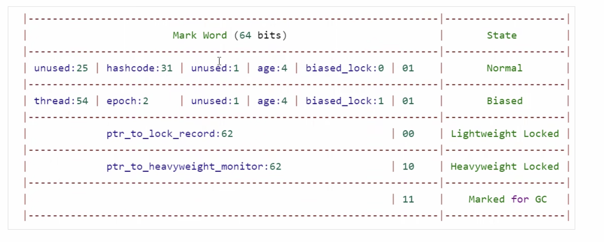

# 并发编程
## JMM java内存模型与内存屏障 Java memory model
### 主内存、工作线程
主内存：存放共享变量
工作线程：线程所属的内存，是主内存的副本


### JMM的原子操作
> read 读取 从主内存中读取数据
> load 载入 将主内存数据写入到工作内存数据
> use 使用 从工作内存读取数据计算
> assin 赋值 将计算好的值重新赋值到工作内存中
> store 存储 将工作内存数据写入主内存
> write 写入 将store过去的变量值赋值给主内存中的变量
> lock 锁定 将主内存变量加锁，标识为线程独占
> unlock 解锁 将主内存变量解锁，解锁后其他线程可以锁定该对象

### 缓存一致性协议（MESI，硬件层面的协议）：
解决多线程访问共享变量，当某一线程对变量进行修改，其他线程能马上感知到变量的修改（其他线程在使用该变量时，该变量在线程的工作内存中会被置为无效状态，这时线程会需要重新从主内存中将变量值拷贝到工作线程进行计算）

### cpu总线嗅探机制

### volatile：保证变量对线程的可见性，保证代码执行的有序性
实现原理：使用缓存一致性协议，在多个线程读取并修改主内存中的共享变量时，如果某一线程对变量进行了修改，修改后的数据会立即从该线程的工作内存 store、write到主内存。而其他使用该变量的线程在使用该变量时，该变量在工作内存中会被置为无效的状态，每次使用前必须从主内存中read、load到工作内存才能使用
在汇编层面，使用lock前缀指令保证变量对线程的可见性
jvm中使用内存屏障保证指令不重排序（storeload）


### 并发编程的三大特性
可见性
有序性
原子性

### 指令重排：
cpu在不影响单线程程序执行结果的前提下，对代码的执行顺序进行调整，最大限度的发挥机器的性能（as-if-serial）
指令重排会遵循 as-if-serial以及happens-before原则

happens-before: 前一个操作的结果对后续操作时可见

java 的<init> 和 <cinit>
<init>（实例初始化方法）：
<init>是用来表示类的构造方法，也就是创建类的实例时调用的方法。
对于每个构造方法，都会生成一个对应的<init>方法。构造方法可以有不同的参数，所以对应的<init>方法也会有不同的签名。
在字节码中，构造方法的<init>标识符会被用来定义构造方法的实现。

<cinit>（类初始化方法）：
<cinit>是用来表示类的静态初始化块，也称为类的静态构造方法。这个块在类加载时执行，用于初始化类的静态字段。
一个类可以有零个或一个<cinit>方法。
在字节码中，<cinit>标识符会被用来定义类的静态初始化块的实现。

### 双重检测锁DCL存在的问题
在实现单例时，可能有些代码会使用双重检测锁的方式实现，这种方式可能由于指令重排导致存在安全漏洞（对象半初始化，对象已创建，但是没有进行属性的赋值）,需要在目标对象上加上一个volatile关键字避免指令重排序
一个类在使用new关键字生成对象时涉及到三个步骤：
* 加载类的字节码到内存中
* 为对象分配内存，分配内存后对象中的各个属性都是各种类型的默认值，产生一个引用
* 调用<init>方法为对象属性分配在类中指定的值（```java private String a = "hello";```这种方式设置的成员变量值）,然后调用对象的construct构造器执行构造器方法
* 将对象引用进行赋值
**在第三步可能会出现指令的重排序，先将已经创建的对象的引用地址赋值给变量instance，然后再调用构造方法（instance = new Singleton5()的赋值和构造发生重排序），导致不在同步代码块最外层的 if(instance == null)会判断为已经不为空，但实际上获取到的对象构造方法还没执行**
instance = new Singleton5() 这句代码在字节码指令层面分为三个步骤
1. 为对象分配内存
2. 初始化对象
3. 将引用指向初始化好的对象内存地址
由于java虚拟机的优化，可能出现2和3步骤之间的指令重排，也就是引用指向的地址中的对象没有完全初始化完成从而导致线程安全问题

* sychronized中的代码能保证原子性和可见性，可能会出现临界区指令重排的问题

```java
public class Singleton5 {
    private Singleton5() {
    }

    private static volatile Singleton5 instance;

    public static Singleton5 getInstance(){
        //第一次判断，如果instance不为null
        if(instance == null){
            synchronized (Singleton5.class){
                if(instance == null){
                    instance = new Singleton5();
                }
            }
        }
        return instance;
    }
}
```

### 内存屏障：添加内存屏障避免指令重排


## java 锁

乐观锁
悲观锁
偏向锁
轻量级锁
重量级锁
CAS自旋锁


###  synchronized与lock的区别
synchronized 是悲观锁、互斥锁、同步锁，jdk1.6之前synchronized性能很差，是重量级锁
使用原子操作类可以很大程度上提高代码的执行效率
> 使用层面： synchronized 是java关键字，而Lock是java的一个接口
> 锁的释放条件： synchronized代码块或方法在执行完同步代码后，会自动释放锁，如果线程发生异常，jvm会让线程释放锁；Lock中需要自己手动在finally块中自己手动释放锁，否则会造成线程死锁
> 锁的状态： synchronized无法判断锁的状态，Lock可以通过相关的api判断锁状态
> 锁的获取： 对synchronized来说，如果线程A获得锁，线程B需要等待，如果这是线程A发生阻塞，B会一直等待；对Lock来说，可以使用tryLock尝试获得锁，能直接判断锁状态，不需要一直等待
> 类型：synchronized是可重入锁，不可中断，非公平锁
> 性能： synchronized适用于少量同步的情况，性能开销较大；Lock适用于大量同步的情况
> synchronized 是可重入锁，不可中断，非公平锁，Lock锁根据其子类实现，可以有以下分类：

* 允许多个线程进行读的锁ReadWriteLock（维护一对读写锁，写锁独占，允许多个线程同时访问读锁）
* 可重入锁ReentrantLock，可通过参数指定是公平锁或非公平锁，在并发不是很大的情况下，Synchronized的性能优于ReetrantLock,在并发激烈的情况下，ReentrantLock性能能平缓恶化
* ReentrantLock提供的同步比较多样化，比如有时间限制的同步，可被中断的同步，而sychronized做不到


### cas自旋锁 
CAS compare and swap 比较并交换
CAS可以成为称为无锁，乐观锁，自旋锁
原子性问题 在比较并交换时，在汇编层面将这个操作变成了一个原子操作，实际上还是加了锁

### ABA问题
两个线程在cas变量a操作过程中，线程A首先拿到了a的原始值v1，进行cas，这时线程B也拿到了变量a的原始值v1，进行cas，当B的执行速度比A快时，B将a的值改成v2，随后又改成v1，然后A在进行cas的时候发现a当前的值和原来的值时相同的，则认为没有其他线程修改a，而实际上B已经对A的值进行了修改操作
解决ABA 是在引入变量的版本号，当变量值修改时，同时修改版本号信息

### 锁优化（膨胀升级）（synchronized）
jdk1.6以后针对synchronized的性能问题进行优化，引入锁状态进行锁膨胀升级： 
> 无状态（0(是否偏向，默认不开启偏向) 01（状态值））（没有加锁的情况） 
> 偏向锁 (1（启用偏向锁）01（偏向锁） )（在对象内部存储线程id，当线程id相同时，无需加锁）
> 自旋锁 （0 00（轻量级锁））（当新访问对象的线程id和对象存储的线程id不一致，则将锁升级到自旋锁，cas开始进行自旋，这种情况下是多个线程加锁CAS轻度竞争）
> 重量级锁（jdk1.6之前的锁，通过monitor对象+线程访问队列来实现） （0 10（重量级锁） ）（当有大量的线程并发时，cas多次（可能是10次，也可能是自适应自旋）自旋不成功，将锁升级成重量级锁）

### 分段CAS优化（LongAdder）: 使用cell数组将cas自旋分给cell数组中的值

### 轻量级（自旋）锁与重量级锁的比较
当并发的线程较少时，轻量级锁只会少量自旋，性能不重量级锁性能好
当并发的线程很多时，轻量级锁的自旋会造成大量的性能消耗

### 对象内部的存储结构
对象头：mark word 、metaData元数据指针、数据长度（数组对象有）
实例数据：
对齐填充：对象的大小必须是8个字节的倍数，是为了提高对象的寻址性能


### 什么叫AQS机制
AQS（AbstractQueuedSynchronizer）是一种提供了原子式管理同步状态、阻塞和唤醒线程功能以及队列模型的简单框架。

## 并发juc原理

### 进程与线程
  **进程**
当一个程序被运行，从磁盘加载这个程序的代码到内存，这时就开启了一个进程
进程可以视为程序的一个实例
进程之间相互独立
**线程**
* 一个进程内可以分为多个线程
* 一个线程就是一个指令流，将指令流中的一条条指令以一定的顺序交给cpu执行
* Java中线程作为最小的调度单位，进程作为资源分配的最小单位，在windows中进程是不活动的，只是作为线程的容器
* 一个进程内的线程共享进程内的资源
* 线程上下文切换成本比进程低

 ### 并行与并发
 > concurrent（并发）： 单核心cpu下，线程实际上还是串行执行的，cpu的时间片分给不同的线程使用，只是由于cpu时间片很短的切换时非常快的，给人的感觉时同时运行的，这种情况下叫并发（微观串行，宏观并发，单核cpu下多线程并不能提高程序的效率） ---同一时间应对多件事情的能力
 >  parallel（并行） 多核心cpu下，线程能实现同时执行 --同一时间动手做多件事情的能力

 ### 异步调用
 如果方法的调用不需要等待返回结果就能继续运行，则是异步调用（异步的调用在java中需要使用多线程）
 > tomcat中的异步servlet

 ### Thread 源码 （静态代理模式）
```java
//实现runnable接口
class Thread implements Runnable {
    //持有runnable接口
    /* What will be run. */
    private Runnable target;
    //构造器中初始化runnable
    Thread(Runnable target, AccessControlContext acc) {
        init(null, target, "Thread-" + nextThreadNum(), 0, acc, false);
    }
    //实现runnable的run方法，实现对runnable的代理
     @Override
    public void run() {
        if (target != null) {
            target.run();
        }
    }
}
```

### 创建线程的三种方式
1. 继承thread 重写run方法
2. 实现runnable接口重写其run方法，并作为参数传递给thread的构造器
3. 使用FutureTask+callable（带结果的任务）
```java
public class FutureTaskTest {

    public static void main(String[] args) throws ExecutionException, InterruptedException {
        FutureTask<Integer> task = new FutureTask<>(()->{
            System.out.println("这是一个任务");
            return 100;
        });
        Thread t = new Thread(task);
        t.start();
        //阻塞调用
        System.out.println(task.get());;
    }
}
```

### linux 下top命令查看java进程id下的线程信息列表
* top  -pid 3445
* 或使用jstack查看线程快照详细信息
* jstack 3445

### jconsole

### 栈与栈桢
栈桢：代表方法在栈中占用的内存，其中包含的内容：
  * 局部变量表（局部变量和方法参数）
  * 返回地址
  * 参数列表
  * 操作数栈
当main栈桢中调用了其他方法，则会产生针对其他方法的栈桢

### 上下文切换 thread context switch
线程上下文切换的原因：
> 线程的cpu时间片用完
> 垃圾回收
> 有更高优先级的线程需要运行
> 线程自己调用了sleep、yield、wait、park、synchronized、lock等

当有线程上下文切换时，需要保存系统当前的状态，并恢复另一个线程的状态，这个操作由程序计数器来完成，记住下一条jvm指令的执行地址，是线程私有的
**频繁的上下文切换会影响性能**

### Thread线程中的方法

> start 线程进入就绪状态，线程只能执行一次start方法，多次调用出现IllegalThreaStateException
> run 新线程启动后会调用的方法
> join/join（Long n）等待其他线程执行结束，两个线程之间的通信时使用，合并两个线程的执行，进行串行执行
> getPriority/setPriority() 获取设置线程优先级
> getState() 获取线程状态
> isIntrerrupted() 判断线程是否被中断
> isAlive 线程是否存活
> currentThread 当前正在执行的线程
> static sleep 当前线程睡眠，执行sleep方法会让线程从running状态变成timed_waiting（阻塞状态）,其他线程可以使用interrupt方法对线程进行打断，sleep方法结束后线程未必会直接运行，需要等待cpu分配时间片
> sleep执行时不会释放锁，sleep适用于无需同步的场景
> jdk1.5之后添加了TimeUnit类的sleep可以代理sleep方法，比Thread.sleep的可读性更好
> yield 线程调度器让出当前线程对cpu的使用,线程从running进入runnable状态
> 线程的调用需要依赖系统的调度器，不能依赖于yield和优先级完全确定
> **interrupted: 打断处于阻塞（wait、sleep、yield打断后抛出InterruptedException，打断后线程的isInterrupted方法返回false）或处于运行状态的线程（运行状态的线程并不能真正打断，而是将被打断线程的isInterrupted方法返回值设置为true，是否结束线程，由线程自己决定）**
> **处于睡眠状态下的线程如果被打断，其打断标志会再次被设置为false，所以对于使用打断标识进行判断逻辑可能会出现问题**
> stop 强制杀死线程
```java
//线程优雅的退出方式
public class InterruptTest {
    public static void main(String[] args) throws InterruptedException {
        Thread t1 = new Thread(()->{
            while (true){
                boolean interrupted = Thread.currentThread().isInterrupted();
                if(interrupted){
                    System.out.println("线程被打断");
                    break;
                }
            }
        },"t1");
        t1.start();
        Thread.sleep(1000);
        System.out.println("interrupt");
        t1.interrupt();
    }
}
```

### 两阶段终止模式--在一个线程中优雅的终止另一个线程
1. 监控线程使用while（true）循环
2. 判断线程是否被打断，没有被打断，则睡眠2s再进行下一次轮询是否被打断
3. 如果在睡眠中被打断，则捕获异常进行打断
```java
public class ThreadInterruptTest2 {

    public static void main(String[] args) throws InterruptedException {
        TwoPhaseTermination twoPhaseTermination = new TwoPhaseTermination();
        twoPhaseTermination.start();
        Thread.sleep(3000);
        twoPhaseTermination.stop();
    }
}

class TwoPhaseTermination {
    private Thread monitor;

    public void start() {
        monitor = new Thread(() -> {
            while (true) {
                Thread current = Thread.currentThread();
                if (current.isInterrupted()) {
                    System.out.println("-----打断后的处理逻辑-----");
                    break;
                }
                try {
                    Thread.sleep(1000);
                    System.out.println("执行监控记录");
                } catch (InterruptedException e) {
                    e.printStackTrace();
                    //sleep被打断后会清除打断标志为false，这里需要重新进行打断
                    current.interrupt();
                }

            }
        });
        monitor.start();
    }
    public void stop() {
        //调用打断设置打断标志
        monitor.interrupt();
    }
}
```
**使用volatile进行优化，设置打断标志位，使用线程的interrupt方法**
```java
class TwoPhaseTerminationVolatile{
    private volatile boolean stop = false;

    private Thread monitor;

    public void start() {
        monitor = new Thread(() -> {
            while (true) {
                Thread current = Thread.currentThread();
                if (stop) {
                    System.out.println("-----打断后的处理逻辑-----");
                    break;
                }
                try {
                    Thread.sleep(1000);
                    System.out.println("执行监控记录");
                } catch (InterruptedException e) {
                    e.printStackTrace();
                    //sleep被打断后会清除打断标志为false，这里需要重新进行打断
//                    current.interrupt();
                }

            }
        });
        monitor.start();
    }
    public void stop() {
        //调用打断设置打断标志
        stop = true;
      //  monitor.interrupt();
    }
}
```


### 打断park线程（park打断标记为true时，再次park无法停止线程）
```java
public class ParkTest {

    public static void main(String[] args) throws InterruptedException {
        final Thread t1 = new Thread(() -> {
            System.out.println("parking.....");
            LockSupport.park();
            System.out.println("unpark......");
            System.out.println("current interrupt status: " + Thread.currentThread().isInterrupted());
        },"t1");
        t1.start();
        Thread.sleep(100);
        t1.interrupt();
    }
}
```

### 主线程与守护线程
> 默认情况java进程会等待所有的线程都运行结束后才会终止
> 守护线程在非守护线程结束后会强制结束掉
> 垃圾回收线程就是一种守护线程

### 线程的状态（从操作系统的层面来看）
> 初始状态 仅在语言层面创建了线程，还未与操作系统线程关联
> 可运行状态（就绪状态） 线程已经被创建（与操作系统线程关联），可由cpu调度执行
> 运行状态 获取了CPU时间片运行中的状态 （可与运行状态相互转换）
> 阻塞状态 运行中的线程调用了线程的阻塞API，如读写文件，线程会让出cpu时间，导致线程上下文切换，等阻塞api操作完毕后，会由操作系统唤醒阻塞的线程，状态转换为可运行状态
> 终止状态 线程执行完毕，生命周期已经结束

在java中使用六种状态Thread.State来对线程状态进行区分
> NEW：对应`初始状态`
> RUNNABLE: 对应`运行状态`、`阻塞状态`、`可运行状态`三种
> BLOCKED: 加锁导致的， sleep、wait、IO阻塞
> WAITING: join导致的，object.wait导致
> TIMED_WAITING: sleep导致的或wait导致
> TERMINATED: 对应`终止状态`

### 临界区
* 多个线程访问共享资源进行读写操作时发生了指令交错，出现线程安全的问题
* 在一段代码块内，如果存在对共享资源的多个线程的读写操作，这段代码称为`临界区`

### 竞态条件
多个线程在临界区内执行，由于代码执行序列不同导致结果无法预测，称之为发生了竞态条件

### 解决线程安全的方案
* 阻塞式方案--synchronized、Lock
* 非阻塞式：原子变量

### synchronized
```java
    //锁指定的对象
    sychronized(object){
        //临界区
    }

    //锁this，当前对象
    public void synchronized method2(){
        //临界区
    }
    //锁this，当前对象
    public void method3(){
        sychronized(this){
            //临界区
        }
    }
    //锁的类对象
    public void method4(){
        sychronized(Test.class){
            //临界区
        }
    }
    //锁类对象
    public static synchronized void method5(){
            //临界区 
    }

```
* 当线程获得锁失败时，会处于阻塞状态，发生上下文切换
* synchronized 实际上是使用了对象锁保证了临界区内代码的原子性，临界区内的代码对外不可分割，不会被线程切换所打断
* 必须保证synchronized锁定的是同一个对象才能保证线程的安全性

### 成员变量与静态变量
* 如果没有被共享，则是线程安全
* 如果被共享了，需要看状态是否会发生改变
    * 如果只读，线程安全
    * 如果写操作，则代码是临界区，需要考虑线程安全的情况

* 局部变量一般情况下是线程安全的，如果局部变量的引用对象出现了逃逸的情况，则局部变量不是线程安全的
```java
public class ThreadUnsafeTest {

    public static void main(String[] args) {
        ThreadSafe threadSafe = new SubThreadSafe();
        threadSafe.method1(100);
    }
}

class ThreadSafe{
    //在当前类的范围内是安全的,当子类中的覆盖出现了其他线程使用局部变量时，就会导致局部变量逃逸，出现线程安全问题
    public void method1(int loopnumber){
        final ArrayList<String> arrayList = new ArrayList<>();
        for (int i = 0; i < loopnumber; i++) {
            method2(arrayList);
            method3(arrayList);
        }
    }

    public void method2(ArrayList<String> list){
        list.add("1");
    }
    public void method3(ArrayList<String> list){
        list.remove(0);
    }
}

class SubThreadSafe extends ThreadSafe{
    //从子类中开启了一个线程导致list对象出现逃逸的情况,这里可能出现IndexOutOfBoundsException的异常
    @Override
    public void method3(ArrayList<String> list) {
        new Thread(()->{
            list.remove(0);
        }).start();
    }
}

```
### 常见线程安全类（多个线程调用某一个线程安全类的同一个方法时是线程安全的，同时调用多个方法时不能保证线程安全）
String final类
Integer final类
StringBuffer
Random
Vector
HashTable
juc包

### 对象头（Mark word（32bit） Klass word（32bit））
对象头包含MarkWord、指向类的指针、数组长度（只有数组对象才有）
**markword**
markword的值情况


hashcode： 25bit age：4bit biased_lock（是否偏向锁） 1bit 锁类型 2bit
thread：54bit epch：2bit age：4bit biased_lock（是否偏向锁） 1bit 锁状态 2bit
锁记录 62bit 锁状态 2bit 00 （轻量级锁）
monitor指针 62bit 锁状态 2bit 10（重量级锁）
11 GC标志

### Monitor（监视器、管程）
当调用synchronized时，jdk会将对象与一个minitor关联，将锁状态设置成01，并将前面的hashcode改成指向monitor的指针，hashcode、分代年龄信息会放入monitor对象中
当一个线程已经持有synchronized对象，另一个线程来访问时，jdk会将这些线程放入monitor的阻塞队列中，当前持有锁线程释放锁时，从阻塞队列中唤醒线程去竞争对象的锁
synchronized中的代码出现异常时，底层的字节码会捕获异常并释放锁，synchronized不需要手动释放锁
**monitor实现了代码的同步与互斥，保证代码操作的原子性**

### synchronized整体执行流程
> 当线程执行到synchronized关键字的代码块时，创建锁记录对象（lock record），每个线程的栈桢都会包含一个锁记录结构，内部可以存储锁定对象的mark word
> 让锁记录中的object reference 指向所对象，尝试cas替换object的mark word，将mark word值存入锁记录
> 如果cas交换成功，对象头中存储了锁记录地址和状态 00
> 如果cas交换失败，有两种情况
  * 当对象头的锁对象已经是00了，则会进入锁膨胀的状态
  * 如果是自己执行了synchronized锁重入，那么再添加一条lock record作锁重入的计数
> 当退出synchronized代码块时，如果锁记录中对象的hashcode等值为null，则表示有重入，则重置锁记录，表示重入计数减一
> 当锁记录不为null，这是使用cas将markword的值恢复给对象头，如果cas成功，则解锁成功，如果失败，说明轻量级锁进行了锁膨胀，轻量级锁膨胀到重量级锁

**锁膨胀**
 > 当某个线程加轻量级锁失败，将锁状态设置为 10，表示重量级锁，为Object对象申请Monitor锁，让Object指向重量级锁地址，线程自己进入阻塞队列
 > 当持有锁的线程退出同步块解锁时，使用cas将markword值恢复给对象头会失败（由于有其他线程已经将锁状态改成了10），线程会进行重量级解锁流程，按照monitor地址找到monitor对象，设置owner为null，唤醒entrylist阻塞队列中blocked线程

**自旋优化**
重量级锁竞争时可以使用自旋优化，如果当前线程自旋成功了，当前线程就可以避免阻塞
> 当竞争的线程数量比较少且cpu是多核的情况下，在自旋一定次数后获取到了锁，则不需要开启重量级锁
> 自旋会占用cpu时间片

**偏向锁**
自旋优化时发生了锁重入时还是需要使用cas进行交换，效率还是不太高
偏向锁的优化：只有在第一次使用cas将线程id设置到对象的mark word，之后如果发生了锁重入的情况，线程发现mark word中的线程id时自己的id，则表示没有竞争，不需要使用cas交换，以后只要不发生竞争，这个对象就归该线程所有
偏向锁是默认开启的，会在jvm启动后延迟开启，可以在jvm上加上 -XX：BiasedLockingStartupDelay=0 将延迟偏向锁设置为0，不延迟
使用`jol-core`查看对象信息，使用ClassLayout查看对象信息

> 当调用了hashcode方法，则不回开启偏向锁，直接进入轻量级锁，偏向锁没有其他的空间存储hashcode，而轻量级锁和重量级锁分别将锁存储在了锁对象和monitor对象中
> 多个线程访问同一个对象导致偏向锁向轻量级锁膨胀
> 使用wait/notify会使轻量级锁、偏向锁变成重量级锁

**批量重偏向**
如果对象虽然被多个线程访问，但没有竞争，这是偏向线程1的对象仍然有机会偏向线程2，偏向会重新设置对象的ThreadId
当撤销偏向锁的阈值超过20次后，jvm会给这些对象加锁时重新偏向到加锁的线程

**批量撤销**
当撤销偏向锁阈值超过40次之后，jvm会认为自己的偏向错了，不应该偏向，于是会将整个类的所有对象都会变为不可偏向，新建的对象也不可偏向

**锁消除**
在java运行时会使用JIT进行进一步优化，分析局部变量是否可优化，对局部变量不可共享且被加锁的情况，可以直接将局部变量的锁进行消除

### wait/notify
> 当owner线程发现条件不满足，调用wait方法，进入WaitSet变为Wating状态
> Blocked和wating的线程都处于阻塞状态，不占用CPU时间片
> Blocked线程会在owner线程释放锁时唤醒
> wating线程会在owner线程调用notify或notifyall时被唤醒，唤醒后并不是立即获取锁，而是进入EntryList重新竞争

* object.wait()/wait(long timeout) 让进入object监视器的线程到waitset等待
* object.notify（） 在object上正在waitset的等待线程中挑选一个唤醒
* object.notifyAll() 让object上正在waitSet等待的线程全部唤醒

以上三个方法必须先获得对象的锁才能调用，否则会抛出异常IllgealMonitorException

### wait和sleep的区别
> sleep 是Thread的方法，而wait是Object的方法
> sleep不需要使用synchronized，而wait必须使用synchronized
> sleep睡眠时如果已经获取到了锁，则不会释放对象锁，而wait会释放对象锁
> sleep和wait都会让线程进入timed_waiting状态 
### 正确使用wait/notify

使用wait能避免sleep不释放锁睡眠导致其他线程阻塞的问题
notfiy是随机叫醒线程，当notify之前的判断条件与线程往下执行的条件不符合时（虚假唤醒），这时应该使用notifyAll唤醒所有线程
```java
synchronized(lock){
    while(！条件){
        lock.wait();
    }
}

//使用notifyAll唤醒
lock.notifyAll();
```

### 保护性暂停模式--同步模式，使用wait/notify方式实现,future获取线程执行结果的方式就是使用的保护性暂停
guarded suspension
两个线程操作相同的一个对象，在这个对象中使用wait/notify进行线程间的通信
```java
public class GuardedObjectTest {

    public static void main(String[] args) throws InterruptedException {
        GuardedObject guardedObject = new GuardedObject();
        //开启一个线程尝试获取response
        new Thread(()->{
            Object response = guardedObject.get(2000);
            log.info(response.toString());
        }).start();
        TimeUnit.SECONDS.sleep(1);
        //开启一个线程写入response
        new Thread(() -> guardedObject.response()).start();
    }
}

class GuardedObject{

    /**
     * 两个线程之间交互的数据
     */
    private Object response;

    //使用wait最大等待时间
    public Object get(long timeout){
        synchronized (this){
            long  begin = System.currentTimeMillis();
            //wait等待已经经历 的时间
            long passedTime = 0;

            while (response == null){
                long waitTime = timeout-passedTime;
                if(timeout - passedTime <= 0){
                    break;
                }
                try {
                    this.wait(waitTime); //当使用notifyAll进行唤醒时，有可能出现虚假唤醒的情况，这里需要进行保护性暂停
                } catch (InterruptedException e) {
                    e.printStackTrace();
                }
                passedTime = System.currentTimeMillis()-begin;
            }
            return response;
        }
    }

    /**
     * 产生结果并唤醒其他线程
     */
    public void response(){
        synchronized (this){
            response = "hello world";
            this.notifyAll();
        }
    }
}

```
join就是使用的wait/notify的保护性暂停模式
使用wait和notify解耦两个线程之间的数据交互
Thread.join(long milllis)源码
```java
    public final synchronized void join(long millis)
    throws InterruptedException {
        long base = System.currentTimeMillis();
        long now = 0;

        if (millis < 0) {
            throw new IllegalArgumentException("timeout value is negative");
        }

        if (millis == 0) {
            while (isAlive()) {
                wait(0);
            }
        } else {
            //使用wait/notify实现的保护性暂停模式
            while (isAlive()) {
                long delay = millis - now;
                if (delay <= 0) {
                    break;
                }
                wait(delay);
                now = System.currentTimeMillis() - base;
            }
        }
    }
```

### 异步模式--生产者消费者
> 分为生产者线程和消费者线程
> 依然使用wait/notify实现
```java
@Slf4j
public class MessageQueueTest {

    public static void main(String[] args) {
        MessageQueue messageQueue = new MessageQueue(2);
        for (int i = 0; i < 3; i++) {
            int finalI = i;
            new Thread(()->{
                messageQueue.put(new Message(finalI,"value:"+finalI));
            },"生产者"+i).start();
        }

        new Thread(()->{
            Message message = messageQueue.take();
        },"消费者").start();
    }
}

@Slf4j
class MessageQueue{

    private LinkedList<Message> list = new LinkedList<>();
    private int capcity;
    public MessageQueue(int capcity) {
        this.capcity = capcity;
    }

    public Message take(){
        //无消息时等待
        synchronized (list){
            while(list.isEmpty()){
                log.info("队列为空");
                try {
                    list.wait();
                } catch (InterruptedException e) {
                    e.printStackTrace();
                }
            }
            //从队列头部获取消息数据
            Message message =  list.removeFirst();
            list.notifyAll();
            log.info("已消费消息");
            return message;
        }
    }

    public void put(Message message){
        synchronized (list){
            //检查队列是否已满
            while (list.size() == capcity){
                log.info("队列已满");
                try {
                    list.wait();
                } catch (InterruptedException e) {
                    e.printStackTrace();
                }
            }
            list.addLast(message);
            log.info("已生产消息");
            list.notifyAll();
        }
    }
}

final class Message{
    private int id;

    private Object value;
    public Message(int id, Object value) {
        this.id = id;
        this.value = value;
    }
    public void setId(int id) {
        this.id = id;
    }
    public void setValue(Object value) {
        this.value = value;
    }
}
```
### 控制线程执行的先后顺序的几种方式
**wait/notify控制线程执行顺序**
```java
@Slf4j
public class Test25 {

    static final Object lock = new Object();

    static boolean t2Runned = false;

    public static void main(String[] args) {
        Thread t1 = new Thread(()->{
            synchronized (lock){
                while (!t2Runned){
                    try {
                        lock.wait();
                    } catch (InterruptedException e) {
                        e.printStackTrace();
                    }
                }
            }
            log.info("t1");
        },"t1");
        Thread t2 = new Thread(()->{
            synchronized (lock){
                log.info("t2");
                t2Runned = true;
                lock.notify();
            }

        },"t2");
        t1.start();
        t2.start();
    }
}
```
**使用reentrantLock的await和signal实现线程顺序执行**
```java
package com.steven.concurrent.lock;

import lombok.extern.slf4j.Slf4j;

import java.util.concurrent.TimeUnit;
import java.util.concurrent.locks.Condition;
import java.util.concurrent.locks.ReentrantLock;

/**
 * @Description: 使用ReetrantLock实现控制线程先后顺序
 * @CreateDate: Created in 2023/8/17 19:03
 * @Author: lijie3
 */
@Slf4j
public class ReentrantLockTest {

    static boolean t2Runned = false;

    public static void main(String[] args) throws InterruptedException {
        ReentrantLock lock = new ReentrantLock();
        Condition condition = lock.newCondition();
        Thread t1 = new Thread(() -> {
            boolean b = lock.tryLock();
            if(b){
                try {
                    while (!t2Runned) {
                        condition.await();
                    }
                    log.info("t1线程在t2线程执行完成之后执行");
                } catch (InterruptedException e) {
                    e.printStackTrace();
                } finally {
                    lock.unlock();
                }
            }
        }, "t1");

        Thread t2 = new Thread(() -> {
            boolean b = lock.tryLock();
            if(b){
                try {
                    t2Runned = true;
                    log.info("t2线程先执行");
                    condition.signal();
                } finally {
                    lock.unlock();
                }
            }


        }, "t2");
        t1.start();
        TimeUnit.SECONDS.sleep(1);
        t2.start();
    }
}
```
**使用LockSupport.park/unpark实现线程的顺序执行**
```java
@Slf4j
public class TestPark {
    public static void main(String[] args) {
        Thread t1 = new Thread(()->{
            //park等待t2线程唤醒
            LockSupport.park();
            log.info("t1");

        },"t1");
        Thread t2 = new Thread(()->{

            log.info("t2");
            //unpark唤醒t1
            LockSupport.unpark(t1);
        },"t2");
        t1.start();
        t2.start();
    }
}
```

### park/unpark原理（以线程为单位的暂停、恢复线程）
LockSupport 类中的方法
> park() 暂停当前线程 （当unpark先执行，park再执行时，park不会导致线程阻塞）
> unpark(t1) 恢复某个线程的运行
> park unpark 是以线程为单位来阻塞和唤醒线程，而notify只能随机唤醒一个等待线程

### 线程状态转换
NEW ：初始状态
RUNNABLE：运行状态、阻塞状态、可运行状态 （可与BLOCKED、WAITING、TIMED_WAITING）
 * 调用object.wait() 线程从runnable转化为waiting，线程锁释放
 * 调用object.notify()、object.notifyAll()、thread.interrupt()
        如果锁竞争成功，线程从waiting转换为runnable
        如果竞争失败，线程从waiting 转化为blocked
 * 当前线程调用thread.join()方法时，当前线程从runnable变成waiting
 * 当调用了join（）方法后又调用了interrupt()，会让目标线程从waiting变成runnable
 * 当调用带超时时间的join、sleep、park，从runnable变成TIMED_WAITING
 * 调用sychronized代码块时，如果竞争失败没有拿到锁，则从runnable变成blocked
BLOCKED
WATING
TIMED_WAITING


### 线程活跃性--死锁、活锁、饥饿
**死锁**
一个线程需要同时获取多把锁，这时容易发生死锁
定位死锁
jconsole （图形化界面查看线程信息并检测死锁）
jstack pid 查看线程的详细信息

解决：按相同的顺序加锁避免相互持有对方需要的锁

**活锁**
两个线程相互改变对方退出的条件进行了修改，导致两个线程无法退出
```java
public class LiveLockExample {
    static class Spoon {
        private Diner owner;

        public Spoon(Diner diner) {
            owner = diner;
        }

        public Diner getOwner() {
            return owner;
        }

        public synchronized void setOwner(Diner diner) {
            owner = diner;
        }

        public synchronized void use() {
            System.out.println(owner.name + " is using the spoon");
        }
    }

    static class Diner {
        private String name;
        private boolean isHungry;

        public Diner(String name) {
            this.name = name;
            isHungry = true;
        }

        public void eatWith(Spoon spoon, Diner spouse) {
            while (isHungry) {
                // Check if the spouse is also hungry
                if (spoon.getOwner() != this) {
                    try {
                        Thread.sleep(1); // Give up the CPU
                    } catch (InterruptedException e) {
                        continue;
                    }
                    continue;
                }

                // Check if the spouse is also hungry
                if (spouse.isHungry) {
                    System.out.println(name + ": You eat first, my darling " + spouse.name);
                    spoon.setOwner(spouse);
                    continue;
                }

                // Eat the meal
                spoon.use();
                isHungry = false;
                System.out.println(name + ": I am full!");
                spoon.setOwner(spouse);
            }
        }
    }

    public static void main(String[] args) {
        final Diner husband = new Diner("Husband");
        final Diner wife = new Diner("Wife");
        final Spoon sharedSpoon = new Spoon(husband);
        //夫妇之间相互让对方先吃饭的场景
        new Thread(() -> husband.eatWith(sharedSpoon, wife)).start();
        new Thread(() -> wife.eatWith(sharedSpoon, husband)).start();
    }
}
```

**饥饿**
一个线程由于优先级太低始终得不到cpu调度执行，也不能结束

可以使用ReentranrLock解决死锁和饥饿

### ReentranrLock
> 可中断 -- 可使用lock.lockInterruptibly()方法获取锁，允许打断(防止无限制等待，避免死锁)，其他线程可以调用thread.interrupt()打断这个线程
> 可以设置超时时间
> 可设置为公平锁---防止线程饥饿
> 支持多个条件变量
> 支持可重入 -- 如果同一个线程如果首次获得了锁，则下次再次运行到需要锁的地方，则不需要重新获取锁

**简单用法**
```java
reentrantLock.lock();
try{
    //临界区
}finally{
    reentrantLock.unLock();
}
//可打断
try{
    reentrantLock.lockInterruptibly();
}catch(Exception e){
    e.printStack();
}
//尝试获得锁,立即返回
if(!reentrantLock.tryLock()){
    return;
}
//等待一定的时间尝试获取锁
if(!reentrantLock.tryLock(1,TimeUnit.SECOND)){
    return;
}
try{
//....
}finally{
    reentrantLock.unLock();
}
```
**公平锁**
> synchronized属于非公平锁
> ReentrantLock 默认是非公平锁，可以通过构造方法传入false创建公平锁

**条件变量**
```java
//ReentrantLock的条件变量对象
Condition condition = lock.newCondition();
Condition condition2 = lock.newCondition();
//获得锁才能进行下面的condition操作
lock.lock();
//释放锁，在condition1处等待
condition1.await();
//锁放锁，在condition2处等待
condition2.await();
//唤醒在condition1处等待的线程
condition1.signal();
//唤醒在condition2处等待的所有线程
condition2.signalAll();
```

### 多个线程交替输出 线程1，2，3 分别交替输出abcabc
**wait/notify实现**
```java
//多个线程按特定的顺序执行
@Slf4j
public class Test27 {

    public static void main(String[] args) {

        WaitNotify waitNotify =new WaitNotify(1,5);

        Thread t1 = new Thread(()->{
            waitNotify.print("a",1,2);
        });
        Thread t2 = new Thread(()->{
            waitNotify.print("b",2,3);
        });
        Thread t3 = new Thread(()->{
            waitNotify.print("c",3,1);
        });
        t1.start();
        t2.start();
        t3.start();
    }
}

class WaitNotify{
    //线程执行标记
    private int flag;

    private int loopNumber;

    public WaitNotify(int flag, int loopNumber) {
        this.flag = flag;
        this.loopNumber = loopNumber;
    }

    public void print(String str,int waitFlag,int nextFlag){
        //循环答应
        for (int i = 0; i < loopNumber; i++) {
            synchronized (this){
                while (flag != waitFlag){
                    try {
                        this.wait();
                    } catch (InterruptedException e) {
                        e.printStackTrace();
                    }
                }
                System.out.print(str);
                flag = nextFlag;
                this.notifyAll();
            }
        }
    }
}
```

**reentrantlock交替输出**
```java
@Slf4j
public class Test30 {
    public static void main(String[] args) throws InterruptedException {
        AwaitSignal awaitSignal = new AwaitSignal(false,5);
        Condition condition1 = awaitSignal.newCondition();
        Condition condition2 = awaitSignal.newCondition();
        Condition condition3 = awaitSignal.newCondition();
        new Thread(()->{
            awaitSignal.print("a",condition1,condition2);
        },"t1").start();
        new Thread(()->{
            awaitSignal.print("b",condition2,condition3);
        },"t2").start();
        new Thread(()->{
            awaitSignal.print("c",condition3,condition1);
        },"t3").start();
        Thread.sleep(1000);
        awaitSignal.lock();
        try {
            log.info("start......");
            condition1.signal();
        }finally {
            awaitSignal.unlock();
        }
    }
}

class AwaitSignal extends ReentrantLock{
    private int loopNumber;

    public AwaitSignal(boolean fair, int loopNumber) {
        super(fair);
        this.loopNumber = loopNumber;
    }

    public void print(String str, Condition current,Condition next){

        for (int i = 0; i < loopNumber; i++) {
            lock();
            try {
                current.await();
                System.out.print(str);
                next.signal();
            } catch (InterruptedException e) {
                e.printStackTrace();
            } finally {
                unlock();
            }
        }
    }
}
```

**park/unpark交替输出**
```java
@Slf4j
public class Test31 {
    static Thread t1 = null;
    static Thread t2 = null;
    static Thread t3 = null;
    public static void main(String[] args) {
        ParkUnpark parkUnpark = new ParkUnpark(5);
        t1 = new Thread(()->{
            parkUnpark.print("a",t2);
        },"t1");
        t2 = new Thread(()->{
            parkUnpark.print("b",t3);
        },"t2");
        t3 = new Thread(()->{
            parkUnpark.print("c",t1);
        },"t3");
        t1.start();
        t2.start();
        t3.start();
        LockSupport.unpark(t1);
    }
}
class  ParkUnpark{
    private int loopNumber;

    public ParkUnpark(int loopNumber) {
        this.loopNumber = loopNumber;
    }

    public void print(String str,Thread next){
        for (int i = 0; i < loopNumber; i++) {
            LockSupport.park();
            System.out.print(str);
            LockSupport.unpark(next);
        }
    }
}
```

JMM中的三个重要特征
* 原子性 保证制定不回收到线程上下文切换的影响（synchronized、ReentrantLock）
* 可见性 保证指令不回受cpu缓存的影响 (volatile)
* 有序性 保证指令不会受cpu指令并行优化的影响 (volatile)

### 没有保证线程可见性导致的问题
```java
@Slf4j
public class Test1 {
    //使用volatile可以保证线程的可见性
    static boolean run = true;
    public static void main(String[] args) {

        new Thread(()->{
            //主线程的修改对t1线程不可见
            while (run){
            }
        },"t1").start();
        try {
            Thread.sleep(1000);
        } catch (InterruptedException e) {
            e.printStackTrace();
        }
        log.info("stop t1.....");
        run = false;
    }
}
```

### 有序性
jvm在不影响正确性的前提下调整语句的执行顺序，优化代码性能

**指令重排**
类似于现实生活中的做饭，可以在电饭煲煮饭的同时进行理菜、炒菜的工作可以节省时间
CPU采取工厂流水线的方式，通过重排序和组合的方式来实现指令级的并行，分阶段分工来提高效率
指令重排序的问题
```java
//可能出现 4,1,0的情况
public class Test1 {

    public static void main(String[] args) {
        Actor actor = new Actor();
        Thread t1 = new Thread(()->{
            actor.actor1();
        },"t1");
        Thread t2 = new Thread(()->{
            actor.actor2();
        },"t2");
        t1.start();
        t2.start();
    }
}

@Slf4j
class Actor{
    int num = 0;
    //只需要对ready添加volatile修饰可以避免指令重排序
    boolean ready = false;


    public void actor1(){
        if(ready){
            log.info(num + num +"");
        }else{
            log.info("1");
        }
    }

    public void actor2(){
        //由于指重冲排序可能导致下一行ready = true;的代码先执行，会出现为actor1 打印0的结果
        num = 2;
        ready = true;
    }
}
```
保证可见性的技术（volatile）
* 写屏障 保证在该屏障之前对共享变量的改动都同步到主存中，不会将写屏障之前的代码排在写屏障之后
* 读屏障 保证在该屏障之后，对共享变量的读取，加载的是主存中的最新数据，不会将读屏障之后的代码出现在读屏障之前
* 读写屏障无法保证原子性（线程间的代码交错执行）

### happens-before
规定对共享变量的写操作对其他线程读操作可见，是可见性与有序性的一套规则

* 线程解锁m之前对变量的写，对于接下来对m加锁的其他线程对变量的读可见
* 线程对volatile变量的写对接下来其他线程对变量的读可见
* 线程start之前对变量的写对该线程开始后对该变量的读可见
* 线程结束前对变量的写对其他线程得知她结束之后的读可见
* 线程1打断（interrupt）线程2前对变量的写对于其他线程得知线程2被打断后的变量的读可见
* 对变量默认值的写对其他线线程对该变量的读可见
* 传递性，volatile变量写入，写屏障会将写屏障之间的所有操作都同步到主存（即使写屏障之前的某个变量不是volatile变量）

### 无锁并发（CAS比较并交换）
AtomicInteger.compareAndSet()
cas底层依赖于cpu的指令，在X86架构下使用了lock cmpxchg指令，保证比较交换的原子性
```java
public class Test1 {
    public static void main(String[] args) {
        AtomicInteger atomicInteger = new AtomicInteger(100);
        while (true){
            int prev = atomicInteger.get();
            int next = prev -10;
            //比较并交换赋值，如果失败则重试
            boolean result = atomicInteger.compareAndSet(prev,next);
            if(result){
                break;
            }
        }
    }
}
```
> 无锁（cas）情况下，线程不会发生上下文切换和线程阻塞，执行效率会比加锁高
> 当线程数少于cpu核心数时，使用cas效率较高，线程数过多还是会导致上下文切换的情况
> cas是乐观锁，无锁并发，无阻塞并发
> 当竞争激烈时，重试必然频繁发生，效率反而会受到影响

### 原子整数
atomic子包提供的原子类
AtomicBoolean
AtomicInteger
AtomicLong
```java
//对上面的代码进行优化
 AtomicInteger atomicInteger = new AtomicInteger(100);
 atomicInteger.addAndGet(-100);
```
*自定义复杂的操作（乘法等其他任何复杂计算）*
```java
        atomicInteger.updateAndGet(x->{
            return x*10;
        });
        System.out.println(atomicInteger.get());
```

### 原子引用
同样使用cas实现无锁操作
AtomicReference
AtomicMarkableReference
```java
class DecimalAccountCas {
    private AtomicReference<BigDecimal> balance;

    public DecimalAccountCas(BigDecimal balance) {
        this.balance = new AtomicReference<>(balance);
    }

    public BigDecimal getBlance(){
        return     balance.get();
    }

    //使用原子引用类实现cas
    public void withDraw(BigDecimal bigDecimal){
        while(true){
            BigDecimal prev = balance.get();
            BigDecimal next = prev.subtract(bigDecimal);
            if(balance.compareAndSet(prev,next)){
                break;
            }
        }
    }
}
```
### ABA问题
线程1正在使用cas进行值的更新写入操作，线程2在线程1拿到旧值A后同样进行了cas操作，但最终线程2将值改成了A，这时线程1感知不到线程2对变量的操作
> 原子类中使用了版本号来保证每次cas都能识别操作之后的版本

使用AtomicStampedReference版本号解决ABA问题
```java
@Slf4j
public class AtomicaStampedTest {

    static AtomicStampedReference<String > ref = new AtomicStampedReference<>("A",0);

    public static void main(String[] args) throws InterruptedException {
        int stamp = ref.getStamp();
        String prev = ref.getReference();
        other();
        Thread.sleep(2000);
        log.debug("{}",stamp);
        boolean result = ref.compareAndSet(ref.getReference(),"B",stamp, stamp+1);
        log.info("A->B:{}",result);
    }

    public static void other(){
        //线程t1将值从A改成B
        new Thread(()->{
            try {
                Thread.sleep(200);
                boolean result = ref.compareAndSet(ref.getReference(),"B",ref.getStamp(), ref.getStamp()+1);
                log.info("A->B:{}",result);
            } catch (InterruptedException e) {
                e.printStackTrace();
            }
        },"t1").start();
        new Thread(()->{
            try {
                Thread.sleep(200);
                boolean result = ref.compareAndSet(ref.getReference(),"A",ref.getStamp(), ref.getStamp()+1);
                log.info("B->A:{}",result);
            } catch (InterruptedException e) {
                e.printStackTrace();
            }
        },"t2").start();
    }
}
```
使用AtomicMarkableReference版本号解决ABA问题（只检查值是否被更改过，使用boolean值）

### 原子数组（解决多个线程访问数组时的线程安全性）
AtomicIntegerArray
AtomicLongArray

**函数式接口**
supplier 无中生有 ： `() ->t`
function 函数 ： `(a)-> b` `(a,b) -> c`
comsumer 消费（无结果） ： `（a）->{void}` 
biconsumer :`(a,b) ->{void}`

```java 
public class AtomicArrayTest {

    public static void main(String[] args) {
        demo(()->new int[10],
                (array) -> array.length,
                (array,index) ->array[index]++,
                (array) -> System.out.println(Arrays.toString(array)));
        //使用原子数组保证共享变量的安全性
        demo(()->new AtomicIntegerArray(10),
                (array) -> array.length(),
                (array,index) ->array.getAndIncrement(index),
                (array) -> System.out.println(array));
    }
    public static <T> void demo(Supplier<T> arraySupplier,
                                Function<T,Integer> lengthFun,
                                BiConsumer<T,Integer> putConsumer,
                                Consumer<T> printConsumer){
        List<Thread> ts = new ArrayList<>();
        T array = arraySupplier.get();
        int length = lengthFun.apply(array);
        for (int i = 0; i < length; i++) {
            ts.add(new Thread(()->{
                for (int j = 0; j < 10000; j++) {
                    putConsumer.accept(array,j%length);
                }
            }));
        }
        ts.forEach(Thread::start);
        //等待所有线程完成
        ts.forEach(t -> {
            try {
                t.join();
            } catch (InterruptedException e) {
                e.printStackTrace();
            }
        });
        printConsumer.accept(array);
    }
}

```

### 字段更新器(安全更新某个类中的字段)
AtomicReferenceFieldUpdater
AtomicIntegerFiledUpdater
AtomicLongFiledUpdater
```java
AtomicReferenceFieldUpdater updater = AtomicReferenceFieldUpdater.newUpdater(People.class,String.class,"name");
        People people = new People();
        updater.compareAndSet(people,null,"zhangsan");

```
### 原子累加器(线程安全的累加器，比Atomic类的性能更好)
LongAdder
cas在竞争激烈的情况下性能较差，LongAdder不在一个共享变量上进行累加，在多个共享变量累加然后进行汇总
@Contented 
### unsafe
提供底层操作内存、线程的方法，cas、LockSupport底层都是用的unsafe的方法
```java
public class UnsafeTest {

    public static void main(String[] args) throws NoSuchFieldException, IllegalAccessException {
        //获取
        Field theUnsafes = Unsafe.class.getDeclaredField("theUnsafe");
        theUnsafes.setAccessible(true);
        Unsafe unsafe = (Unsafe) theUnsafes.get(null);
        People people  = new People();
        //线程安全的操作对象属性
        Long nameOffset = unsafe.objectFieldOffset(People.class.getDeclaredField("name"));
        unsafe.compareAndSwapObject(people,nameOffset,null,"zhangsan");
        System.out.println(people.getName());
    }
}

class People{
    String name;

    public String getName() {
        return name;
    }

    public void setName(String name) {
        this.name = name;
    }
}
```

### 不可变类
> 不可变类在多线程中都是线程安全的
SimpleDateFormat 由于存在共享的可变状态，其内部包含了一个Calendar对象作为成员变量，线程不安全（需要加锁）
```java
    public static void main(String[] args) {
        SimpleDateFormat simpleDateFormat = new SimpleDateFormat("yyyy-MM-dd");
        for (int i = 0; i < 10; i++) {
            new Thread(()->{
                try {
                    log.info("{}",simpleDateFormat.parse("1992-12-16"));
                } catch (ParseException e) {
                    e.printStackTrace();
                }
            }).start();
        }
    }
```
```java
DateTimeFormatter 不可变类
 public static void test2(){
        DateTimeFormatter formatter = DateTimeFormatter.ofPattern("yyyy-MM-dd");
        for (int i = 0; i < 10; i++) {
            new Thread(()->{
                    log.info("{}",formatter.parse("1992-12-16"));
            }).start();
        }
    }
```

### 不可变类的设计
> final修饰类
> 对数组进行保护性拷贝（String的实现）--对象创建太过频繁
> 使用享元模式（数据库链接池、Integer、String类的实现都实现了享元模式）

包装类型（Long、Integer）的valueOf中使用的就是享元模式：
```java
  public static Integer valueOf(int i) {
        if (i >= IntegerCache.low && i <= IntegerCache.high)
            return IntegerCache.cache[i + (-IntegerCache.low)];
        return new Integer(i);
    }
```

### 线程池简单实现
> 使用享元模式
> 使用wait/notifyAll的方式避免线程长时间空转
> 使用cas保证连接池内的属性线程安全
```java
@Slf4j
public class Pool {
    public static void main(String[] args) {
        Pool pool  = new Pool(3);
        for (int i = 0; i < 5; i++) {
            new Thread(()->{
                Connection connection = pool.getConnection();
                try {
                    Thread.sleep(new Random().nextInt(1000));
                } catch (InterruptedException e) {
                    e.printStackTrace();
                }
                pool.free(connection);
            }).start();
        }
    }

    private final int poolSize;

    private Connection[] connections;

    //连接状态数据 0空闲 1 繁忙
    private AtomicIntegerArray states;

    public Pool(int poolSize) {
        this.poolSize = poolSize;
        this.connections = new Connection[poolSize];
        this.states = new AtomicIntegerArray(new int[poolSize]);
        for (int i = 0; i < poolSize; i++) {
            connections[i] = new MockConnection("connection"+i);
        }
    }
    //获取连接
    public Connection getConnection(){
        while (true){
            for (int i = 0; i < poolSize; i++) {
                //获取空闲连接
                if(states.get(i) == 0){
                    //cas保证线程安全
                    if (states.compareAndSet(i,0,1)) {
                        log.info("get {} ",connections[i]);
                        return connections[i];
                    }
                }
            }
            //无空闲连接，进入等待
            synchronized (this){
                try {
                    log.info("waiting for free connection");
                    this.wait();
                } catch (InterruptedException e) {
                    e.printStackTrace();
                }
            }
        }
    }
    //归还连接
    public void free(Connection connection){
        for (int i = 0; i < poolSize; i++) {
            if (connections[i] == connection) {
                states.set(i,0);
                synchronized (this){
                    log.info("free {}",connection);
                    this.notifyAll();
                }
                break;
            }
        }
    }
}
class MockConnection implements Connection{

    private String name;

    public String getName() {
        return name;
    }

    @Override
    public String toString() {
        return "MockConnection{" +
                "name='" + name + '\'' +
                '}';
    }
}
```
### final 原理
* 设置final变量
final int a = 20;
final变量的赋值会通过putfield指令来完成，在这条指令之后会加入写屏障，保证在其他线程读到a的值不会出现0的情况
* 获取final变量
> 将final变量的值复制到栈内存中，避免变量的线程共享  
> 或是使用常量池中的变量值

### 无状态
无状态（没有共享的成员变量）的类也能保证线程安全

### 线程池(享元模式)
> 频繁创建线程、线程上下文切换会导致系统性能降低
> 手动创建线程不便于管理线程
> 对线程的运行状态进行监控

**自定义线程池**
相关组件
> 核心线程池数量
> 任务阻塞队列
> 任务拒绝策略
> 线程池定义
> 任务定义
> 任务执行线程worker定义
```java
    //阻塞队列
@Slf4j
public class BlockingQueue <T>{
    //1.任务队列，双向链表
    private Deque<T> queue = new ArrayDeque<>();

    //2.锁
    private ReentrantLock lock = new ReentrantLock();

    //3.生产者条件变量
    private Condition fullWaitSet = lock.newCondition();
    //4.消费者条件变量
    private Condition emtpyWaitSet = lock.newCondition();

    //5.容量
    private int capcity;

    public BlockingQueue(int capcity) {
        this.capcity = capcity;
    }

    //带超时的阻塞获取
    public T poll(long timeout, TimeUnit unit){
        lock.lock();
        try{
            long time = unit.toNanos(timeout);
            //防止虚假唤醒
            while (queue.isEmpty()){
                if(time <= 0){
                    return null;
                }
                time = emtpyWaitSet.awaitNanos(time);
            }
            T t = queue.removeFirst();
            fullWaitSet.signalAll();
            return t;
        } catch (InterruptedException e) {
            e.printStackTrace();
            return null;
        } finally{
            lock.unlock();
        }
    }

    //阻塞获取
    public T take(){
        lock.lock();
        try{
            while (queue.isEmpty()){
                emtpyWaitSet.await();
            }
            T t = queue.removeFirst();
            fullWaitSet.signalAll();
            return t;
        } catch (InterruptedException e) {
            e.printStackTrace();
            return null;
        } finally{
            lock.unlock();
        }
    }
    //阻塞添加
    public void put(T task){
        lock.lock();
        try{
            while (queue.size() == capcity){
                log.info("等待加入任务队列:{}",task);
                fullWaitSet.await();
            }
            queue.addLast(task);
            log.info("加入任务队列:{}",task);
            emtpyWaitSet.signalAll();
        } catch (InterruptedException e) {
            e.printStackTrace();
        } finally{
            lock.unlock();
        }
    }

    //带超时时间的阻塞添加
    public boolean offer(T task,long timeout,TimeUnit timeUnit){
        lock.lock();
        try{
            long nanos = timeUnit.toNanos(timeout);
            while (queue.size() == capcity){
                log.info("等待加入任务队列:{}",task);
                if(nanos <= 0){
                    return false;
                }
                nanos = fullWaitSet.awaitNanos(nanos);
            }
            queue.addLast(task);
            log.info("加入任务队列:{}",task);
            emtpyWaitSet.signalAll();
            return true;
        } catch (InterruptedException e) {
            e.printStackTrace();
            return false;
        } finally{
            lock.unlock();
        }
    }

    public int size(){
        lock.lock();
        try {
            return queue.size();
        }finally {
            lock.unlock();
        }
    }

    public void tryPut(RejectPolicy<T> rejectPolicy, T task) {
        lock.lock();
        try{
            //队列是否已满
            if(queue.size() == capcity){
                //使用拒绝策略
                rejectPolicy.reject(this,task);
            }else{
                //有空闲信息
                queue.addLast(task);
                log.info("加入任务队列:{}",task);
                emtpyWaitSet.signalAll();
            }
        }finally {
            lock.unlock();
        }
    }
}
```
```java
//拒绝策略
@FunctionalInterface
public interface  RejectPolicy<T> {
    void reject(BlockingQueue<T> queue,T task);
}
```
```java
//线程池定义及worker定义
@Slf4j
public class ThreadPool {

    private BlockingQueue<Runnable> taskQueue;

    private HashSet<Worker> workers = new HashSet<>();

    //核心线程数
    private int coreSize;

    //获取任务的超时时间
    private long timeout;

    //超时时间单位
    private TimeUnit timeUnit;

    private RejectPolicy<Runnable> rejectPolicy;


    public ThreadPool(int coreSize, long timeout, TimeUnit timeUnit,int queueCapcity) {
        this.coreSize = coreSize;
        this.timeout = timeout;
        this.timeUnit = timeUnit;
        this.taskQueue = new BlockingQueue<>(queueCapcity);
    }

    public ThreadPool(int coreSize, long timeout, TimeUnit timeUnit,int queueCapcity,RejectPolicy<Runnable> rejectPolicy) {
        this.coreSize = coreSize;
        this.timeout = timeout;
        this.timeUnit = timeUnit;
        this.taskQueue = new BlockingQueue<>(queueCapcity);
        this.rejectPolicy = rejectPolicy;
    }

    public void execute(Runnable task){
        //当任务数没有超过核心线程数量时，创建worker，交给worker执行，如果超过核心数，则放入队列
        synchronized (workers){
            if(workers.size() < coreSize){
                Worker worker = new Worker(task);
                log.info("新增worker :{},task:{}",worker,task);
                workers.add(worker);
                worker.start();
            }else{
                log.info("加入任务队列:{}",task);
//                taskQueue.put(task);
                //设置如何拒绝任务
                //死等、带超时等待、让调用者抛出异常、让调用者自己执行任务
                taskQueue.tryPut(rejectPolicy,task);
            }
        }
    }

    class Worker extends Thread{
        private Runnable task;

        public Worker(Runnable task) {
            this.task = task;
        }

        @Override
        public void run() {
            //当task不为空，执行task
            //当task执行完毕，从任务队列获取任务执行
            //阻塞获取任务，线程不会结束
//            while (task != null || (task = taskQueue.take())!= null){
            //设置超时时间获取任务
            while (task != null || (task = taskQueue.poll(timeout,timeUnit))!= null){
                try {
                    log.info("正在执行:{}",task);
                    task.run();
                }catch (Exception e){
                    e.printStackTrace();
                }finally {
                    task = null;
                }
            }
            synchronized (workers){
                log.info("worker被移除:{}",this);
                workers.remove(this);
            }
        }
    }
}
```
```java
//测试类，拒绝策略的实现直接使用了lambda表达式
@Slf4j
public class Test1 {
    public static void main(String[] args) {
//        ThreadPool threadPool = new ThreadPool(2, 1000, TimeUnit.MILLISECONDS, 10);
        //1. 使用死等队列加入任务的情况
//        ThreadPool threadPool =
//                new ThreadPool(1, 1000, TimeUnit.MILLISECONDS, 1, BlockingQueue::put);
        //2. 设置超时时间等待任务加入队列
//        ThreadPool threadPool =
//                new ThreadPool(1, 1000, TimeUnit.MILLISECONDS, 1, (queue,task)->{
//                    queue.offer(task,1500,TimeUnit.MILLISECONDS);
//                });
        //3.放弃任务执行
//        ThreadPool threadPool =
//                new ThreadPool(1, 1000, TimeUnit.MILLISECONDS, 1, (queue,task)->{
//                    log.warn("放弃任务：{}",task);
//                });
        //4.让调用者抛出异常
//        ThreadPool threadPool =
//                new ThreadPool(1, 1000, TimeUnit.MILLISECONDS, 1, (queue,task)->{
//                    throw new RuntimeException("任务执行失败："+ task);
//                });
        //5. 让调用者自己执行任务,直接自己调用
        ThreadPool threadPool =
                new ThreadPool(1, 1000, TimeUnit.MILLISECONDS, 1, (queue,task)->{
                    log.warn("任务队列已满");
                    task.run();
                });
        for (int i = 0; i < 3; i++) {
            int finalI = i;
            threadPool.execute(()->{
                log.info("任务编号：{}", finalI);
                try {
                    Thread.sleep(1000);
                } catch (InterruptedException e) {
                    e.printStackTrace();
                }
            });
        }
    }
}
```

### ThreadPoolExecutor 状态信息
使用int 的高三位来表示线程池状态，低29位表示线程数量（保证线程池状态和线程信息的原子性操作）
| 状态       | 值（int高三位） | 说明 ｜                                   |
| ---------- | --------------- | ----------------------------------------- |
| RUNNING    | 111             | 正常处理任务                              |
| SHUTDOWN   | 000             | 不会接受新任务，但会处理阻塞队列剩余任务  |
| STOP       | 001             | 会中断正在执行的任务，并抛弃阻塞队列任务  |
| TIDYING    | 010             | 任务全部执行完毕，活动线程为0级奖进入终结 |
| TERMINATED | 011             | 终结状态                                  |
*从上到下依次增大*
### ThreadPoolExecutor 构造方法
| 参数名          | 类型                     | 说明                                                                                    |
| --------------- | ------------------------ | --------------------------------------------------------------------------------------- |
| corePoolSize    | int                      | 核心线程数量，核心线程如果创建会一直存在于线程池中，即使是没有任务                      |
| maximumPoolSize | int                      | 最大线程数量                                                                            |
| keepAliveTime   | long                     | 针对救急线程（核心线程数量达到上限,队列已满，线程数还没达到最大线程数量）的空转等待时间 |
| unit            | TimeUnit                 | 针对救急线程的等待时间单位                                                              |
| workQueue       | BlockingQueue<>          | 阻塞队列                                                                                |
| threadFactory   | ThreadFactory            | 线程工厂                                                                                |
| handler         | RejectedExceptionHandler | 线程池无法接受任务时的拒绝策略                                                          |

参数值选择原则：
1. 核心线程数量corePoolSize：
8020原则： 80%的情况下每秒产生的任务数量，按任务数量来选择核心线程数量，例如80%的情况下每秒产生的任务数量为100,则核心线程池的大小为100
2. 任务队列长度workQueue
任务队列长度一般设计为 核心线程数量/单个任务执行时间 * 2 即可，例如核心线程数量为10，单个任务执行时间为0.1s，则队列长度设计为200，最多缓存200个任务
3. 最大线程数量
参照核心线程数量和任务队列长度，最大线程数量  = （最大任务数 - 任务队列长度）* 单个任务执行时间，例如 每秒最大任务数是1000，任务队列长度为200，每个任务执行时间为0.1s，则最大线程数量课设计为（1000-2000） * 0.1 = 80个
4. 最大空闲时间
设置一个合理时间即可


### 线程池中常用的阻塞队列
线程池中的阻塞队列用于存储待执行的任务，这些任务将由线程池中的线程来执行。阻塞队列的主要特点是，当队列已满时，向队列中添加任务的操作会被阻塞，直到队列有足够的空间；当队列为空时，从队列中获取任务的操作也会被阻塞，直到队列有任务可供获取。这种机制有助于控制线程池的并发度，以及避免资源耗尽。

在Java的java.util.concurrent包中，常用的线程池阻塞队列有以下几种：

LinkedBlockingQueue：这是一个基于链表的阻塞队列，它可以指定最大容量，如果不指定，默认大小为Integer.MAX_VALUE。当队列满时，任务添加操作将被阻塞，直到队列有空闲空间。

ArrayBlockingQueue：这是一个基于数组的阻塞队列，需要指定一个固定的容量。当队列满时，任务添加操作将被阻塞，直到队列有空闲空间。

PriorityBlockingQueue：这是一个支持优先级的阻塞队列，可以通过元素的比较器来确定元素的优先级顺序。无论队列是否为空，获取任务的操作都不会被阻塞。

DelayQueue：这是一个支持延迟执行的阻塞队列，其中的元素必须实现Delayed接口，指定元素需要延迟多久才能被获取。元素的获取操作将被阻塞，直到延迟时间到达。

SynchronousQueue：这是一个没有容量的阻塞队列，每次插入操作都必须等待相应的移除操作，反之亦然。适用于直接传递任务给线程池中的线程。

这些阻塞队列可以根据任务的特性和线程池的需求来选择。不同的阻塞队列会影响线程池的并发度、任务调度策略以及任务等待时间。


jdk中的拒绝策略
AbortPolicy 直接抛出异常
CallerRunsPolicy  让调用者线程执行任务
DiscardPolicy 放弃当前任务
DiscardOldestPolicy 抛弃阻塞队列中最早的任务

Abort Policy --AbortPolicy（默认策略）： 这是默认的拒绝策略。当线程池已满时，新提交的任务将会被拒绝，并抛出 RejectedExecutionException 异常。这个策略会阻止任务的执行，但是您需要捕获并处理异常。
Caller-Runs Policy：CallerRunsPolicy， 当线程池已满时，新提交的任务会由调用 execute 方法的线程来执行。这个策略可能会将任务提交线程的负载增加，因此只有在任务提交频率较低且任务执行时间较短的情况下才建议使用。
Discard Policy：DiscardPolicy， 当线程池已满时，新提交的任务会被直接丢弃，不会抛出异常。这可能会导致一些任务永远不会被执行，慎重选择。
Discard Oldest Policy：DiscardOldestPolicy， 当线程池已满时，会将等待队列中最早的任务丢弃，以腾出位置来执行新提交的任务。这可能会导致一些较老的任务被丢弃。

### 工厂方法 Executors
 > 1. newFixThreadPool 固定大小的线程池，核心线程数==最大线程数，无超时时间，无界队列，适用于任务量已知，需要考虑OOM的问题
 > 线程工厂ThreadFactory 产生线程的工厂，可以用于指定线程的名称
 > 2. newCachedThreadPool 带缓冲的线程池，核心线程池数量为0，救急线程数量无限制，救急线程最多空闲60s，队列采用SynchronousQueue，适合任务数比较密集，但每个任务执行时间较短的情况
 > SynchronousQueue 无容量，一手交钱一手交货，在两个线程之间交换任务，必须要有线程来取任务才放任务的线程才能执行，无线程取时put操作被阻塞
 > 3. newSingleThreadExecutor 核心、最大线程数量都是1，使用LinkedBlockingQueue（无界队列）,适用于希望任务排队执行的场景，线程不会被释放
 > newSingleThreadExecutor在任务出现异常线程结束的情况下，线程池会重新创建线程保证任务的执行
 > newSingleThreadExecutor使用装饰器模式，对外只暴露ExecuteService的方法中的方法，保证线程不会被修改
 > 4. ScheduledExecutorService 创建任务调度线程池，支持延时，定时（scheduleAtFixedRate（当任务执行执行时间大于调度间隔时间，会以执行时间为间隔时间）/scheduleWithFixedDelay（提供单独的间隔时间指定，当上次执行结束时再加上指定的间隔时间才继续执行下一次任务）方法）任务调度，当任务执行过程中出现延迟或抛出异常不会影响其他任务的运行
 ```java
  public static ScheduledExecutorService newSingleThreadScheduledExecutor() {
        return new DelegatedScheduledExecutorService
            (new ScheduledThreadPoolExecutor(1));
    }
 ```
 > 5. newWorkStealingPool,利用forkjoinPool实现工作窃取算法

### Future
通过保护性暂停模式获取任务执行完成后的返回结果
使用wait、notify这组api实现保护性暂停
实现类FutureTask用法：
```java
 FutureTask<Integer> task = new FutureTask<>(()->{
            System.out.println("这是一个任务");
            return 100;
        });
        Thread t = new Thread(task);
        t.start();
        System.out.println(task.get());
```


### ExecutorService中的api
* `execute(Runnable command)`:执行runnable任务
* `Future<T> submit(Callable<T> task)`: 提交任务，用返回值future获得任务执行结果
* `List<Future<T>> invokeAll(Collection<Callable<T>> task) throws InterruptedException`:批量提交task中所有的任务，
* 批量执行任务，带超时时间
```java 
    //
    <T> List<Future<T>> invokeAll(Collection<? extends Callable<T>> tasks,
                                  long timeout, TimeUnit unit)
        throws InterruptedException;
```
* 提交task中所有任务，哪个任务先成功执行完毕，返回此任务执行结果，其他任务取消
  ```java 
     <T> T invokeAny(Collection<? extends Callable<T>> tasks)
        throws InterruptedException, ExecutionException;
  ```
* 带超时时间
```java
<T> T invokeAny(Collection<? extends Callable<T>> tasks,
                    long timeout, TimeUnit unit)
        throws InterruptedException, ExecutionException, TimeoutException;
```

### ThreadPoolExecutor 关闭
* shutdown 线程池状态变为shutdown，不会接受新任务，但已经提交任务会执行完毕，此方法不会阻塞调用线程的执行
```java
    public void shutdown() {
        final ReentrantLock mainLock = this.mainLock;
        mainLock.lock();
        try {
            checkShutdownAccess();
            //修改线程池状态
            advanceRunState(SHUTDOWN);
            //打断空闲线程
            interruptIdleWorkers();
            onShutdown(); // hook for ScheduledThreadPoolExecutor
        } finally {
            mainLock.unlock();
        }
        //尝试终结，如果无正在运行的线程，则直接终结，如果有线程正在执行，也不会等待
        tryTerminate();
    }
```

* shutdownNow:不接受新任务，将队列中的任务返回，使用interrupt方式中断正在执行的任务,线程池状态改成STOP
```java
    public List<Runnable> shutdownNow() {
        List<Runnable> tasks;
        final ReentrantLock mainLock = this.mainLock;
        mainLock.lock();
        try {
            checkShutdownAccess();
            advanceRunState(STOP);
            interruptWorkers();
            tasks = drainQueue();
        } finally {
            mainLock.unlock();
        }
        tryTerminate();
        return tasks;
    }
```
* isShutdown() 非运行状态返回true
*  调用shutdown后等待多长时间结束（必须要在shutdown之后调用）
 ```java public boolean awaitTermination(long timeout, TimeUnit unit)
        throws InterruptedException {
        long nanos = unit.toNanos(timeout);
        final ReentrantLock mainLock = this.mainLock;
        mainLock.lock();
        try {
            while (runStateLessThan(ctl.get(), TERMINATED)) {
                if (nanos <= 0L)
                    return false;
                nanos = termination.awaitNanos(nanos);
            }
            return true;
        } finally {
            mainLock.unlock();
        }
    }
```

### 线程池中的execute和submit的区别
<T> Future<T> submit(Callable<T> task);
提交callable任务通过future返回结果
<T> Future<T> submit(Runnable task, T result);
Future<?> submit(Runnable task);
提交runnable任务，如果有指定结果，则返回指定结果，如果没有，则在任务正常情况下返回null
submit如果任务出现异常不会在控制台打印，需要单独手动处理
void execute(Runnable command)
执行是如果线程抛出异常，则会在控制台打印

### 线程池的应用场景
有如下的集中常见的场景：
Web 服务器请求处理： 在一个 Web 服务器应用程序中，每当有用户请求到达时，都需要创建一个新的线程来处理该请求。然而，频繁地创建和销毁线程会产生很大的开销。通过使用线程池，可以提前创建一组线程并将请求放入队列中，线程池会自动调度空闲的线程来处理请求，从而避免了频繁的线程创建和销毁，提高了服务器的响应速度和资源利用率。
批量数据处理： 在数据处理任务中，比如对大量的数据进行处理、转换或计算，可以将数据分成多个任务，每个任务由线程池中的一个线程来处理。这样可以充分利用多核处理器的能力，加快数据处理速度。
并发下载： 在下载文件或资源时，可以使用线程池来同时下载多个部分，每个线程负责下载一个部分，从而加快整体下载速度。
定时任务： 在需要定期执行的任务，比如日志清理、缓存刷新等，可以使用线程池中的线程来执行这些定时任务，避免了为每个任务单独创建定时器或线程的开销。
连接池管理： 在数据库连接、网络连接等资源的管理中，可以使用线程池来管理连接的分配和释放，避免了频繁地打开和关闭连接，提高了资源的复用率和系统的性能。
GUI 应用程序响应性： 在 GUI 应用程序中，用户的交互操作可能会触发一些耗时的任务，如图像处理、文件加载等。使用线程池可以将这些任务放入后台线程中进行处理，保持应用程序的响应性，避免阻塞主线程造成界面卡顿。
无论选择哪个场景，重要的是要强调你是如何合理地选择和配置线程池参数，以及如何确保线程安全性和避免资源竞争问题。


### 工作线程WorkerThread
线程池中的饥饿现象：任务之间存在先后关系，线程池中的线程不足导致的任务不能被执行（比如线程池中存在两个线程，但是现在有相同2个任务序列（任务A依赖于任务B的处理结果）一共四个任务，可能同时提交这四个任务的时候两个线程都去执行了A任务，导致接下来的两个任务A没有线程来执行），好比现实生活中的点餐，餐厅有两个员工都能进行点餐工作和做菜工作，如果这是同时有两个桌客人，如果两个员工都去进行了点餐工作，则没有人能做菜了
解决方案：不同的任务类型使用不同的线程池，让一个线程池的执行依赖于另个线程池线程的执行结果

### 创建多少线程合适
过小容易导致饥饿
过大容易导致上下文切换，占用更多内存
* CPU密集型运算采用CPU核心数+1实现CPU最优利用率，+1保证CPU时钟不被浪费
* IO密集型运算 
    线程数 = 核心数+期望CPU利用率*总时间（CPU计算时间+等待时间）/CPU计算时间

### 任务调度线程池
**Timer的缺点**
用来延时或定时调度的任务都是由一个线程来执行，同一时间只能有一个任务在执行，当前一个任务延迟或异常都会影响之后的任务（出现异常会导致线程直接退出）
ScheduledExecutorService    

### 线程池的异常处理
1. 任务主动处理异常
2. 使用callable+future来返回异常（当任务出现异常时，异常信息会被返回）
3. 使用线程的setDefaultUncaughtExceptionHandler方法设置UncaughtExceptionHandler设置异常处理对象


### tomcat中的线程池
LimitLatch 限流

### fork/join
分治思想，动态规划，对任务进行拆分，适合能进行任务拆分的CPU密集型运算
* 任务对象`RecurisiveTask<Integer>` 带返回值，对任务进行拆分
* ForkJoinPool 线程池
* ForkJoinPool.invoke 执行任务
* 对任务进行拆分
```java
@Slf4j
public class ForkJoin {

    public static void main(String[] args) {
        //开启4个线程
        ForkJoinPool pool = new ForkJoinPool(4);
        //执行求和任务
        System.out.println(pool.invoke(new MyTask(5)));
    }

}
//求和任务
@Slf4j
class MyTask extends RecursiveTask<Integer>{
    private int n;


    public MyTask(int n) {
        this.n = n;
    }

    @Override
    public String toString() {
        return "{"+n+"}";
    }

    @Override
    protected Integer compute() {
        if(n == 1){
            log.debug("join:{}",n);
            return 1;
        }
        MyTask t1 = new MyTask(n-1);
        t1.fork();

        int result = n + t1.join();
        log.debug("join:{}+{}={}",n,t1,result);
        return result;
    }
}
/*
2023-03-12 11:55:15,128 [ForkJoinPool-1-worker-1] DEBUG [com.steven.concurrent.threadpool.MyTask] - join:1
2023-03-12 11:55:15,132 [ForkJoinPool-1-worker-1] DEBUG [com.steven.concurrent.threadpool.MyTask] - join:2+{1}=3
2023-03-12 11:55:15,132 [ForkJoinPool-1-worker-1] DEBUG [com.steven.concurrent.threadpool.MyTask] - join:3+{2}=6
2023-03-12 11:55:15,132 [ForkJoinPool-1-worker-2] DEBUG [com.steven.concurrent.threadpool.MyTask] - join:4+{3}=10
2023-03-12 11:55:15,132 [ForkJoinPool-1-worker-1] DEBUG [com.steven.concurrent.threadpool.MyTask] - join:5+{4}=15
15
*/
```
优化
```java
//任务拆分2
@Slf4j
class MyTask2 extends RecursiveTask<Integer> {
    int begin;
    int end;

    public MyTask2(int begin, int end) {
        this.begin = begin;
        this.end = end;
    }

    @Override
    public String toString() {
        return "{" + begin + "," + end + "}";

    }

    @Override
    protected Integer compute() {
        if (begin == end) {
            log.debug("join:{}", begin);
            return begin;
        }
        if (end - begin == 1) {
            log.debug("join:{}+{}={}", begin, end, begin + end);
            return end + begin;
        }
        int mid = (end + begin) / 2;
        MyTask2 t1 = new MyTask2(begin, mid);
        t1.fork();
        MyTask2 t2 = new MyTask2(mid + 1, end);
        t2.fork();
        log.debug("fork:{}+{}=?", t1, t2);
        int result = t1.join() + t2.join();
        log.debug("join:{}+{}={}", t1, t2, result);
        return result;
    }
}
```
## juc包的理解--java并发工具包

### AQS
AbstractQueuedSynchronizer 是阻塞式锁和相关的同步器工具的框架
通过阻塞队列来实现对线程获取锁的控制
特点：
* 使用state属性来表示资源的状态（分为独占模式和共享模式），子类需要自定义如何维护这个状态，如何控制获取锁和释放锁
getState
setState
compareAndSetState -- 乐观锁机制设置state状态
独占模式只有个线程能访问资源，共享模式允许多个线程访问资源
* 提供基于FIFO的等待模式
* 条件变量来实现等待、唤醒机制，支持多个条件变量，类似于Monitor的WaitSet

获取锁
`tryAquire（arg)` --基于park/unpark
释放锁
`tryrelease（arg）`

### 自定义锁（不可重入锁）
```java
public class MyLock implements Lock {

    //独占锁,同步器类
    class MySync extends AbstractQueuedSynchronizer{
        @Override
        protected boolean tryAcquire(int arg) {
            if(compareAndSetState(0,1)){
                //锁已经加上,设置owner为当前线程
                setExclusiveOwnerThread(Thread.currentThread());
                return true;
            }
            return false;
        }

        @Override
        protected boolean tryRelease(int arg) {
            setExclusiveOwnerThread(null);
            setState(0);
            return true;
        }

        //是否时独占锁
        @Override
        protected boolean isHeldExclusively() {
            return getState()==1;
        }
        public Condition newCondition(){
            return new ConditionObject();
        }
    }
    private MySync sync = new MySync();
    @Override
    public void lock() {
        sync.acquire(1);
    }

    @Override
    public void lockInterruptibly() throws InterruptedException {
        sync.acquireInterruptibly(1);
    }

    @Override
    public boolean tryLock() {
        return sync.tryAcquire(1);
    }

    @Override
    public boolean tryLock(long time, TimeUnit unit) throws InterruptedException {
        return sync.tryAcquireNanos(1,unit.toNanos(time));
    }

    @Override
    public void unlock() {
        sync.release(1);
    }

    @Override
    public Condition newCondition() {
        return sync.newCondition();
    }
}
@Slf4j
public class AQSTest1 {

    public static void main(String[] args) {
        MyLock lock = new MyLock();
        new Thread(() ->{
            lock.lock();
            try {
                log.debug("locking....");
                Thread.sleep(1000);
            } catch (InterruptedException e) {
                e.printStackTrace();
            } finally {
                log.debug("unlocking....");
                lock.unlock();
            }
        },"t1").start();
        new Thread(() ->{
            lock.lock();
            try {
                log.debug("locking....");
                Thread.sleep(1000);
            } catch (InterruptedException e) {
                e.printStackTrace();
            } finally {
                log.debug("unlocking....");
                lock.unlock();
            }
        },"t2").start();
    }
}
```

### ReentrantLock原理
实现lock接口，维护同步器类AbstractQueuedSynchronizer，实现自定义同步器Sync
非公平锁NofairSync
加锁流程
> 竞争失败的线程会进入node链表中，通过链表依次唤醒等待的线程
> 当有新的线程来竞争锁时，有可能state被新来的线程修改成1，则node中的线程需要继续等待
可重入流程：
> 有线程获取到锁时，记录线程id，将线程访问锁的state加1，当当前线程再次尝试获取锁时，将state加1，当当前线程退出一次锁时，将state减1，当count为0时，表示线程已经释放锁，这时会去唤醒等待中的线程
可打断原理：
> 线程等待是通过park来实现，通过对打断标记的修改来实现线程的park和unpark，可打断模式被打断后直接抛出异常
> 不可打断模式下，即使线程被打断，它仍然会驻留在AQS队列中，等待获得锁之后才能继续运行（只是将打断标记 isInterrupted设置为true）

### ReentrantReadWriteLock
> 当读操作远远高于写操作时，这时使用读写锁让读操作允许并发，提高性能
> 类似于数据库中的读操作
> 读-读线程不互斥
> 读写、写写线程都互斥
> 读锁不支持条件变量
> 写锁支持条件变量
> 重入时升级不支持，即持有读锁的情况下去获取写锁，会导致获取写锁永久等待（同一个线程必须先释放读锁再获取写锁）
> 重入时降级支持，即持有写锁去获取读锁支持可重入（同一个线程拥有写锁后再去获取读锁可以获取成功）
> 读写锁的state低16位给读锁使用，高16位给写锁使用
```java
@Slf4j
public class DataContrainer {

    private Object data;

    private ReentrantReadWriteLock rw = new ReentrantReadWriteLock();
    private ReentrantReadWriteLock.ReadLock r = rw.readLock();
    private ReentrantReadWriteLock.WriteLock w = rw.writeLock();

    public  Object read(){
        //使用读锁不会导致线程的互斥
        log.debug("获取读锁");
        r.lock();
        try {
            log.debug("读取");
            Thread.sleep(1000);
            return data;
        } catch (InterruptedException e) {
            e.printStackTrace();
        } finally {
            log.debug("释放读锁");
            r.unlock();

        }
        return null;
    }

    public void write(){
        log.debug("获取写锁");
        w.lock();
        try {
            log.debug("写入");
        }finally {
            log.debug("释放写锁");
            w.unlock();

        }
    }

    public static void main(String[] args) throws InterruptedException {
        DataContrainer contrainer = new DataContrainer();
        new Thread(()->{
            contrainer.read();
        },"t1").start();
        Thread.sleep(10);
        //读锁释放之后写锁才能进行写入操作
        new Thread(()->{
            contrainer.write();
        },"t2").start();
    }
}
```
**应用**
使用ReentrantReadWriteLock实现对缓存的优化控制

```java
public class GeneralDao {

    public int update(){
        return 1;
    }

    public Object get(int i){
        return new Object();
    }
}
public class CacheGeneralDao extends GeneralDao{
    private GeneralDao generalDao = new GeneralDao();
    private HashMap<Integer,Object> cache = new HashMap<>();

    private ReentrantReadWriteLock rw = new ReentrantReadWriteLock();


    @Override
    public int update() {
        rw.writeLock().lock();
        try{
            int result =  generalDao.update();
            cache.clear();
            return result;
        }finally {
            rw.writeLock().unlock();
        }

    }

    @Override
    public Object get(int i) {
        //未加锁的情况下可能线程不安全
        rw.readLock().lock();
        try{
            //读缓存时加读锁
            if(cache.containsKey(i)){
                return cache.get(i);
            }

        }finally {
            rw.readLock().unlock();
        }
        rw.writeLock().lock();
        try {
            //从库中读取数据时，要防止其他线程对数据进行写入，这里需要加写锁
            Object o = cache.get(i);
            //再次检查cache中是否有值，防止多个线程访问时的多次访问
            if(o == null){
                o = generalDao.get(i);
                cache.put(i,o);
            }
            return o;
        }finally {
            rw.writeLock().unlock();
        }
    }
}
```
**缓存优化**
考虑缓存的容量
考虑缓存的过期
考虑分布式存储
考虑并发性--使用多把读写锁
更新方法的优化（按key清除）

### StampedLock
进一步优化读锁，在使用读锁，写锁时必须配合一个stamp来使用
> 乐观读：使用tryOptimisticRead（）读取完毕之后需要做一个校验stamp的过程，以确定这段时间内没有写操作(实际上不加锁)
> 当验证stamp失败时，会进行锁的升级，升级成读锁(真正加锁)
> 乐观读不支持条件变量，不支持可重入

```java

public class StampLockTest {

    public static void main(String[] args) throws InterruptedException {
         ObjectContainer  container = new ObjectContainer(200);
         new Thread(()->{
            Integer data = container.read(100);
             System.out.println(data);
         },"t1").start();
        Thread.sleep(100);
        new Thread(()->{
            container.write(300);
        },"t2").start();
    }
}

@Slf4j
class ObjectContainer{

    private int data;

    private final StampedLock lock = new StampedLock();

    public ObjectContainer(int data) {
        this.data = data;
    }

    public Integer read(int readTime){
        //乐观读
        long stamp = lock.tryOptimisticRead();

        log.debug("tryOptimisticRead:{}",stamp);
        try {
            Thread.sleep(readTime);
            if(lock.validate(stamp)){
                log.debug("read finish:{}",stamp);
                return data;
            }
        } catch (InterruptedException e) {
            e.printStackTrace();
        }
        log.debug("update to read lock:{}",stamp);
        try {
            //升级成读锁
            stamp = lock.readLock();
            log.debug("read lock {}",stamp);
            Thread.sleep(readTime);
            log.debug("read finish {}",stamp);
            return data;
        }catch (InterruptedException e) {
            e.printStackTrace();

        }finally {
            log.debug("read unlock {}",stamp);
            lock.unlock(stamp);
        }
        return null;
    }

    public void write(int newData){
        long stamp = lock.writeLock();
        log.debug("write lock:{}",stamp);
        try {
            Thread.sleep(2);
            this.data = newData;
        } catch (InterruptedException e) {
            e.printStackTrace();
        } finally {
            log.debug("write unlock {}",stamp);
            lock.unlock(stamp);
        }

    }
}
```
### Semaphore 信号量
> 用来限制访问共享资源的线程上限
> 类似于停车场（共享资源）与汽车（线程）的关系
> 可实现简单的限流，限制访问连接数

```java
@Slf4j
public class SemphoreTest {

    public static void main(String[] args) {
        //同一时刻只能有三个线程访问,非公平
        Semaphore semaphore = new Semaphore(3,false);

        for (int i = 0; i < 10; i++) {
            new Thread(()->{
                //获取许可
                try {
                    semaphore.acquire();
                } catch (InterruptedException e) {
                    e.printStackTrace();
                }
                log.debug("running");
                try {
                    Thread.sleep(1000);
                } catch (InterruptedException e) {
                    e.printStackTrace();
                }finally {
                    //释放许可
                    semaphore.release();
                }
            }).start();
        }
    }
}
```

### CountdownLatch
用来进行线程同步协作，等待所有线程完成倒计时
其中构造器用来初始化等待计数值
await（）等待计数器归零
countDown() 调用后锁计数减1，直到为0时await线程才会被唤醒
```java
@Slf4j
public class CounDownLatchTest {

    public static void main(String[] args) throws InterruptedException {
        CountDownLatch latch = new CountDownLatch(3);

        new Thread(()->{
            log.debug("begin....");
            try {
                Thread.sleep(1000);
            } catch (InterruptedException e) {
                e.printStackTrace();
            }
            log.debug("end....");
            //计数减一
            latch.countDown();
        },"t1").start();
        new Thread(()->{
            log.debug("begin....");
            try {
                Thread.sleep(1500);

            } catch (InterruptedException e) {
                e.printStackTrace();
            }
            log.debug("end....");
            latch.countDown();
        },"t2").start();
        new Thread(()->{
            log.debug("begin....");
            try {
                Thread.sleep(2000);
            } catch (InterruptedException e) {
                e.printStackTrace();
            }
            log.debug("end....");
            latch.countDown();
        },"t3").start();
        log.debug("waiting");
        //等待线程计数结束后才会执行
        latch.await();
        log.debug("main running");
    }
}
```
配合线程池的使用
配合线程完成多线程环境中存在任务依赖的情况
适合一个线程等待多个线程同时执行任务完成之后再执行其他任务
```java
@Slf4j
public class TestcCountLatch2 {
    public static void main(String[] args) {
        CountDownLatch latch = new CountDownLatch(3);
        ExecutorService service = Executors.newFixedThreadPool(4);
        service.submit(()->{
            log.debug("begin....");
            try {
                Thread.sleep(1000);
            } catch (InterruptedException e) {
                e.printStackTrace();
            }
            log.debug("end....");
            latch.countDown();
        });
        service.submit(()->{
            log.debug("begin....");
            try {
                Thread.sleep(1500);
            } catch (InterruptedException e) {
                e.printStackTrace();
            }
            log.debug("end....");
            latch.countDown();
        });
        service.submit(()->{
            log.debug("begin....");
            try {
                Thread.sleep(2000);
            } catch (InterruptedException e) {
                e.printStackTrace();
            }
            log.debug("end....");
            latch.countDown();
        });
        service.submit(()->{
            log.debug("begin....");

            try {
                //等待其他线程执行完毕
                latch.await();
            } catch (InterruptedException e) {
                e.printStackTrace();
            }
            log.debug("end....");

        });
    }
}
```
**模拟王者荣耀多人游戏各个玩家的游戏加载进度页面**
```java

public class CountDownLatchTest3 {

    public static void main(String[] args) throws InterruptedException {
        CountDownLatch latch = new CountDownLatch(10);
        ExecutorService executorService = Executors.newFixedThreadPool(10);
        Random r = new Random();
        String[] all = new String[10];
        for (int j = 0; j < 10; j++) {
            int k = j;
            executorService.submit(() ->{
                for (int i = 0; i <= 100; i++) {
                    try {
                        Thread.sleep(r.nextInt(100));
                    } catch (InterruptedException e) {
                        e.printStackTrace();
                    }
                    all[k] = i + "%";
                    //使用回车符号进行换行，只显示一行的动态效果
                    System.out.print("\r" + Arrays.toString(all));
                }
                latch.countDown();
            });
        }
        System.out.println("正在加载游戏");
        //等待所有玩家加载完成
        latch.await();
        System.out.println("\n进入游戏......");
        executorService.shutdown();
    }
}
```

使用Future接受线程执行的结果信息（适合在线程池中调用接口的情况）能在线程池中并行的线程执行完成之后用一个独立的线程拿到相应的结果

### CyclicBarrier
循环栅栏，(在线程任务执行完成之后可以统一执行其他任务，且barrier计数回到初始值可以复用)也是用来线程之间的同步协作，构造时设置计数个数，每个吸纳成执行到某个需要同步的时刻调用await（）方法进行等待，当线程数满足计数个数时，继续执行
```java
@Slf4j
public class CyclyBarrierTes {

    public static void main(String[] args) {
        ExecutorService service = Executors.newFixedThreadPool(2);
        //当所有任务完成之后，barrier的计数会被重置成初始值2，可重复执行
        CyclicBarrier barrier = new CyclicBarrier(2,()->{
            //其他两个任务执行完成之后会执行这个任务
            log.debug("task1,task2 has finished....");
        });
        for (int i = 0; i < 3; i++) {
            service.submit(()->{
                log.debug("task1 begin....");
                try {
                    Thread.sleep(1000);
                    //线程执行完之后等待，计数barrier减一
                    barrier.await();
                    log.debug("task1 end....");
                } catch (InterruptedException | BrokenBarrierException e) {
                    e.printStackTrace();
                }
            });
            service.submit(()->{
                log.debug("task2 begin....");
                try {
                    Thread.sleep(2000);
                    //线程执行完之后等待
                    barrier.await();
                    log.debug("task2 end....");
                } catch (InterruptedException | BrokenBarrierException e) {
                    e.printStackTrace();
                }
            });
        }

        service.shutdown();
    }
}

```
### 线程安全集合类

#### HashTable、Vector
直接使用同步synchronized保证线程安全，不推荐使用

#### Collections.synchronizedMap/List
将线程不安全集合包装成线程安全的集合，实际上也是在方法调用时使用synchronized进行同步

#### Blocking 阻塞队列
> 在不满足条件时让线程等待
> 大多数基于锁

#### CopyOnWrite 容器写开销相对较重

#### Concurrent 类型集合
使用cas优化，提高吞吐量
存在读取的弱一致性问题，迭代器迭代时可能存在其他线程对容器进行修改，遍历出来的内容可能是旧的值

非线程安全遍历时对容器修改会出现fail-fast机制立即让便利失败，抛出ConcurrentModifiiedException

**ConcurrentHashMap**
> 单个方法执行线程安全
> 同时执行多个方法依然不是线程安全的

HashMap原理：
> 使用数组（哈希桶）+链表实现 （jdk7 后加入的数据会放在链表头部（导致死链），jdk8中会放在链表的尾部，七上八下）
> 当元素数量大于数组的3/4时，会进行扩容，扩容出来一个长度翻倍的数组，这时会重新进行hash，将数据进行重新分布，减短链表的查找的时间
> jdk7中的扩容并发死链： 多线程插入map扩容时可能导致并发死链，程序发生了死循环
> jdk8 可以避免扩容时的死链问题，但可能出现扩容时丢数据的问题

ConcurrentHashMap原理
> 初始情况下，使用table+链表
> jdk8 扩容后使用数组+红黑树
> jdk8中的构造器使用懒惰初始化，仅计算table的大小，在第一次使用才会真正创建
> JDK8 get流程：不加锁的获取，使用spread方法保证hash码返回正整数，
> JDK8 put流程：涉及到扩容，多线程访问同一链表或红黑树等复杂逻辑判断
> JDK8 扩容流程 transfer 当链表长度大于8，数组长度小于64时，会进行扩容，当数组长度等于64时，会将链表转化为红黑树，提高查找效率，同时一定程度上避免DOS攻击
> JDK8 size计算流程： 无竞争发生时，向baseCount累加计数，有竞争发生时，新建counterCells，向其中一个cell累加计数（），计算的非精确值，因为存在多个线程同时操作
> JDK7中不同线程访问的时不同的segment，每个segment对应一把锁（分段锁，Segment继承自ReentrantLock），jdk7中的segment大小是固定的，这个容量初始化后不可变
> JDK7 put流程中会使用ReentrantLock 尝试加锁，当尝试64次仍然失败，会使用lock()进行阻塞
> JDK7 rehash 
> JDK7 get流程：get时未加锁，使用了UNSAF对象的方法保证可见性
> JDK7 size流程：多次进行对segment的计数（不超过3次），对比两次之间的统计数量结果是否一致，如果一致表示准确，直接返回，如果尝试3次没有统计成功，则对所有segment进行加锁统计

#### LinkedBlockingQueue 阻塞链表队列
使用dummy节点进行占位，初始情况下头节点和尾节点都指向dummy
入队时（从队尾处插入），在指向dummy的尾节点处进行添加
出队时（从队头（dummy之后的第一个节点）处移除），找到dummy之后会的第一个节点，将dummy指向自己（方便垃圾回收），将dummy后第一个节点的数据取出，并让item变成null，将其变成一个dummy节点

使用dummy是为了加锁的方便，使用了两把锁ReentrantLock，允许生产者消费者两个线程同时操作，分别锁住队头和队尾
当节点总数大于2时，包括dummy，putLock保证last节点的线程安全性，takeLock保证head的成线程安全性，两把锁保证入队和出队没有竞争
当节点总数等于2时，一个dummy节点，一个数据节点，这时仍然锁的是两个对象，不会出现竞争
当节点总数等于1，只存在一个dummy节点时，这时take线程会被notEmpty条件阻塞，有竞争，会阻塞

LinkedBlockingQueue不允许空元素的插入

#### ArraBlockingQueue
强制有界
数组实现
提前初始化node数组
array提前创建好
array使用一把锁，性能上没有LinkedBlockingQueue好

#### ConcurrentLinkedQueue
使用cas实现线程安全
使用两把‘锁’，使用dummy节点避免竞争

#### CopyOnWriteArrayList
写入时拷贝：增删改时，将底层数组拷贝一份，不影响其他线程并发读（读的旧数组），读写分离，读写能并发，读读能并发，写时才会加锁，数据写入完成后用新数组覆盖旧数组
> 适合读多写少的场景（写时需要copy数组）
> get 弱一致性，可能获取到的是已被修改或移除的数据
> 迭代器的弱一致性，写线程对数据修改时可能读线程的迭代拿到的时旧数据
> mysql的MVCC(多版本并发控制)实际上用的就是弱一致性

### ThreadLocal
提供线程内部使用的的局部变量
通过TrheadLocal来传递变量
多线程中之间的数据的相互隔离

在数据库中连接池获取连接，进行事务相关的操作时，为了保证获取到的connection是同一个对象，要使用ThreadLocal来传递Connection对象保证事务的正常提交或回滚

ThreadLocal API
set 设置线程变量
get 获取线程变量
remove 移除线程设置的变量，避免内存泄漏的问题

**ThreadLocal 的实现**
每个Tread维护一个ThreadLocalMap，这个map的key是ThreadLocal本省，value是真正要存储的值，
具体过程：
每个Thread 内部都有一个ThreadLocalMap
map中存储ThreadLocal对象key和线程的副本变量（value）
Thread内部的map是由ThreadLocal维护，ThreadLocal负责向map获取和设置线程变量的值
对于不同的线程，每次获取副本值时，别的线程不能获取到当前线程的副本值，形成副本隔离，互不干扰

这样设计的好处： 
1. 每个map存储的Entry数量变少
2. Thread销毁时ThreadLocalMap也会随之销毁，减少内存的使用

**set方法**
```java
  public void set(T value) {
        Thread t = Thread.currentThread();
        ThreadLocalMap map = getMap(t);
        if (map != null) {
            map.set(this, value);
        } else {
            createMap(t, value);
        }
    }
```
**get方法**
```java
    public T get() {
        Thread t = Thread.currentThread();
        ThreadLocalMap map = getMap(t);
        if (map != null) {
            ThreadLocalMap.Entry e = map.getEntry(this);
            if (e != null) {
                @SuppressWarnings("unchecked")
                T result = (T)e.value;
                return result;
            }
        }
        return setInitialValue();
    }
```

**setInitialValue**
```java
    private T setInitialValue() {
        T value = initialValue();
        Thread t = Thread.currentThread();
        ThreadLocalMap map = getMap(t);
        if (map != null) {
            map.set(this, value);
        } else {
            createMap(t, value);
        }
        if (this instanceof TerminatingThreadLocal) {
            TerminatingThreadLocal.register((TerminatingThreadLocal<?>) this);
        }
        return value;
    }
```

#### ThreadLocalMap 
实现方式与HashMap类似，Entry继承自weakReference，为了与线程生命周期解绑，方便垃圾回收
ThreadLocalMap的key使用的弱引用，也无法避免内存泄漏的问题
所以必须要使用remove方法进行回收

ThreadLocalMap的hash冲突的解决 --- 使用线性探测法解决哈希冲突

### 线程池的配置选择
针对IO密集型和CPU密集型任务，Java线程池的配置需要根据任务类型的特点来优化。不同类型的任务对线程池的需求是不同的，以下是针对这两种类型任务的建议配置：

1. IO密集型任务：
IO密集型任务包括文件读写、网络请求、数据库操作等，这些任务通常会花费大量时间在IO等待上，因此可以通过增加线程数来提高并发性能。
线程数： 可以根据系统的CPU核心数和任务的类型来设置线程数，通常可以设置比CPU核心数稍微多一些。这可以确保当一个线程在等待IO时，其他线程仍然可以继续执行。但也不要设置太多线程，因为过多的线程会增加上下文切换的开销。
队列大小： 可以选择相对较大的任务队列大小，以便将IO任务提交到队列中，等待执行。LinkedBlockingQueue是一个常用的选择。
线程空闲时间： 可以设置线程的空闲时间较长，以避免频繁地创建和销毁线程。可以使用keepAliveTime参数。

kafka推送数据到服务端，服务端在接受到数据后需要调用其他服务接口，或是从获取相应的数据来对数据进行一些处理，

2. CPU密集型任务：
CPU密集型任务指的是需要大量计算的任务，例如图像处理、数值计算等。这些任务会耗费大量的CPU资源，因此需要合理配置线程数以充分利用CPU核心。
线程数： 由于任务本身是CPU密集型的，设置与CPU核心数相等或略小的线程数可能是一个不错的选择。过多的线程可能会导致竞争CPU资源而降低性能。
队列大小： 由于CPU密集型任务不涉及IO等待，任务队列可以设置得较小，甚至可以选择不使用队列（SynchronousQueue）。
线程空闲时间： 可以将线程的空闲时间设置得较短，以便在任务完成后快速释放线程资源。


实际项目中的并发编程的例子
多线程处理后台任务
一般来说，我们需要在后台处理的任务，通常会使用定时器来开启后台线程处理，比如有些数据表的状态我需要定时去修改、我们搜索引擎里面的数据需要定时去采集、定时生成统计信息、定时清理上传的垃圾文件等。

多线程异步处理任务

当我们需要处理一个耗时操作并且不要立刻知道处理结果时，我们可以开启后台线程异步处理该耗时操作，这样可以提高用户体验。比如我之前做的一个项目需要上传简历附件，后台需要对简历附件进行解析，保存到数据表中，因为涉及多种格式的处理，所以我们开启多线程异步处理此操作，这样用户就不用等到我们的简历解析完就能看到服务端的响应了。再比如用户下载简历时，我们需要将数据表中的数据生成简历附件并且通过邮件发送到用户邮箱，该操作也可以开启多线程异步处理。

多线程分布式计算

当我们处理一个比较大的耗时任务时，我们可以将该任务切割成多个小的任务，然后开启多个线程同时处理这些小的任务，切割的数量一般根据我们服务器CPU的核数，合理利用多核CPU的优势。比如下载操作可以使用多线程下载提高下载速度；清理文件时，开启多个线程，按目录并行处理等等。


