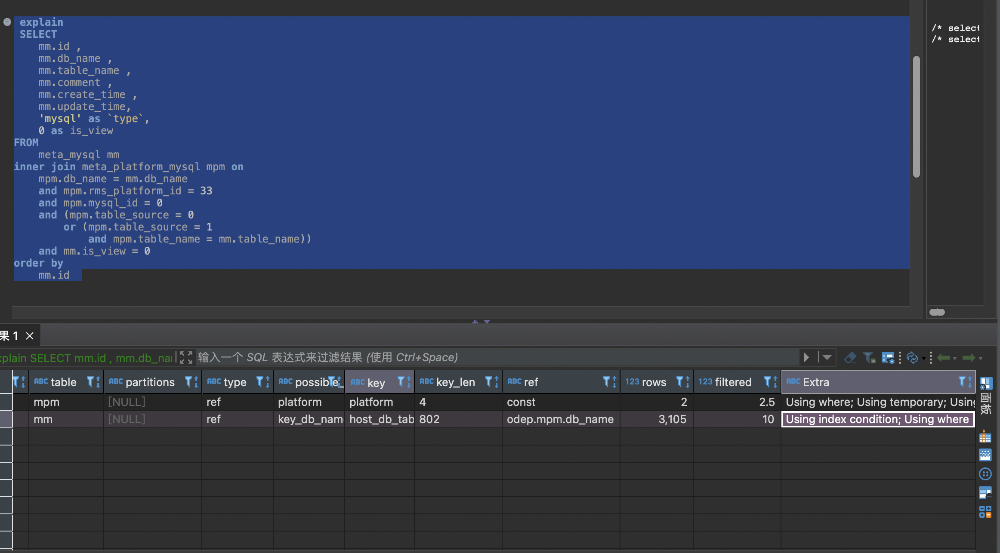

# 数据库100问（基于mysql）

## 1. 慢sql查询如何优化
   1. 使用慢查询日志、或```show processlist; ```定位慢查询sql
   2. 使用explain 查询sql是不是走了索引
   3. 没有走索引的需要优化sql让sql走索引
   4. 如果走了索引，查询很慢，则要考虑根据查询条件优化索引
## 2. 什么是索引
    索引是帮助数据库高效获取数据的排好序的数据结构
    索引的数据结构：
    1. 二叉树
    2. 红黑树
    3. Hash表
    4. B+Tree(目前最常用的索引结构)

## 3. 数据类型（mysql）
   1. 数值类型
```sql

   >   tinyint     1byte    -128 127
   >   smallint    2bytes   -32768 32767
   >   mediumint   3bytes
   >   int/integer 4byte
   >   bigint      8bytes
   >   float       4byte    
   >   double      8byte
   >   decimal（5,2）：总共五位，小数点后两位
```

   2. 时间和日期类型

   >  date 3bytes yyyy-mm-dd
   >  time 3byte  hh:mm:ss
   >  year
   >  datetime yyyy-mm-dd hh:mm:ss
   >  timestamp 时间戳


   3. 字符串类型 （单引号）
   >   varchar 变长字符串
   >   char 定长字符串  0-255 bytes
   >   TEXT


## 4. DDL、DML、DQL
### DDL
DDL： data definition language 数据定义语言
#### 数据库操作
> 查看所有数据库： ```sql show databases;```
> 创建数据库：```sql create database [if not exists] mydb1 [charset=utf8]```
> 切换或选择要操作的数据库： ```sql use mydb1;```
> 删除数据库： ```sql drop database [if exists] mydb1;```
> 修改数据库访问编码： ```sql alter database mydb1 character set utf8;````
#### 表操作
创建库：
```sql
 create table [if not exists] tablename(
   id int(10) [auto_increment] [comment '主键id'],
   name varchar(255) [not null] [comment '名称'],
   age int,
   birth date  
 )[];
 ```
查看表：
> ```sql show tables;```
查看表的创建语句
> ```sql show create table table1```
查看表结构
> ```sql desc table1;```

修改表结构
>  添加表列： ```sql alter table table1 add column1 varchar(20) [default null];```
>  修改列名： ```sql alter table table1 change `column1` `column2` varchar(30) [default null]; ```
>  删除列：   ```sql alter table table1 drop `column1`; ```
>  修改表名： ```sql rename table  `table1` to `table2`;```

### DML
DML: data manipulation language 数据操作语言
数据插入：
> 指定字段赋值： ```sql insert into table1(column1,column2) values(value1,value2),(value3,value4);```
> 全字段赋值： ```sql insert into table1 values(value1,value2,value3),(value4,value5,value6);```
数据修改：
> ```sql update table1 set column1=v1,column2=v2 [where column1 = v3];```
数据删除：
> ```sql delete from table1 [where column = v1];```
> ```sql truncate [table] table1;  删除表，然后重新创建表 ```


## 约束（mysql）constraint
创建表时为表中的某些列添加限制条件
### 主键约束 primary key
唯一标识表数据的每一行（可以多个列组合）
表只允许有一个主键
系统默认会再所在的列和列组合上创建对应的唯一索引
主键约束列不能为null
创建单列主键
```sql
 create table table1(
     id int(11) primary key,
     name varchar(20) not null
 );
 create table table1(
     id int(11) auto_increment,
     name varchar(20) not null,
     [constraint pk1] primary key(id)  
 );
 ```


创建多列主键 (主键参与列都不能为空)
```sql
 create table table1(
   name varchar(20) not null,
   age int(11) not null
   [constraint pk1] primary key(name,age)    
 );
``` 


修改表结构后添加主键
```sql
 alter table table1 add primary key(name,age);
```
删除主键约束
```sql
 alter table `table1` drop primary key; 
```

### 自增长约束 auto_increment
一个表只能有一个自增长约束
为主键自动赋值
```sql
create table table1(
     id int(11) auto_increment,
     name varchar(20) not null,
     [constraint pk1] primary key(id)  
 ) auto_increment = 100; --从100开始自增
 insert into table1(name) value('lisi');
 ```
修改的方式添加：

```sql
alter table table1 auto_increment = 200;
```

delete 删除数据auto_increment自增会保留
truncate 删除数据auto_increment自增长会从起始值开始

### 非空约束 not null
创建表时指定字段非空
修改字段时指定
```sql
 alter table table1 modify column1 varchar(20) not null;
 ```
删除非空约束
```sql
 alter table table1 modify column1 varchar(20)
``` 

### 唯一约束
**在mysql中NULL和任何值都不匹配、不相同,所以唯一约束可以允许多个NULL值出现,创建唯一约束时要保证约束列不能为NULL**

指所有记录中字段的值不能重复出现
创建
字段名后加上unique
```sql
 create table table1(
     id int(11) primary key,
     name varchar(20) unique not null  --列指定
 );
``` 

在所有字段的最后指定唯一约束的列
```sql
 create table table1(
     id int(11) primary key,
     name varchar(20)  not null,
     gender tinyint not null,
     UNIQUE KEY `uk1` (`name`,`gender`) 
 );
``` 

修改添加约束：
```sql
 alter table table1 add constraint uk1 unique(name,age);
``` 

删除约束
```sql
 alter table table1 drop index uk1;
``` 

### 默认值约束
给字段默认值
```sql
 create table table1(
     id int(11) primary key,
     name varchar(20) not null default 'unknow'  
 );
``` 

### 零填充约束
填充长度到字段的指定长度
```sql
 create table table1(
     id int(11) zerofill primary key, --整型zerofill默认长度是10
     name varchar(20) not null default 'unknow'  
 );
``` 

### 外键约束 约束多张表之间的关系
> 主表必须时存在于数据库中
> 从表的外键必须是主表的主键

创建
```sql
   create table table11(
     id int(11) primary key,
     name varchar(20)  not null,
     gender tinyint not null,
     UNIQUE KEY `uk1` (`name`,`gender`) 

 );
   --从表
 create table table2(
    id int(11) primary key,
    name varchar(30) not null,
    dept_id int(11) not null,
    constraint t1_pk foreign key(dept_id) references table1(id); --外键约束
 )
 ```
 修改方式创建
 ```sql
 alter table table2 add constraint t1_pk foreign key(dept_id) references table1(id) on delete cascade on update cascade; --级联删除级联更新
```
删除外键
```sql
alter table table2 drop foreign key ti_pk;
```

> 多对多的关系使用中间表来进行约束

### DQL 
data query language
#### 查询操作
```sql 
select 
      [all|disntinct] column1 as a1,
      [all|disntinct] column2 as a2,
from 
   table1|view1
[where [condition]]
group by [column1]
having expression
order by [column1] [asc|desc]
limit [0,100]
```

#### 关键字
> 去重某一列 `distinct` 去重所有列 `distinct *`
> 
> 查询区间 `between a and b`
> 
> `least（）` 查询最小值  (如果比较的值存在null，不会进行比较，直接返回nul)
> 
> `greatest（）` 查询最大值 (如果比较的值存在null，不会进行比较，直接返回nul)
> 
>  `ifnull(a,0)` 如果a的值不是null，返回a，如果是null，返回0
> 

#### 聚合函数
> count() 统一某一字段时，不统计null值行
> 
> sum() 不统计null值的行
> 
> min() 不统计null值的行
> 
> max() 不统计null值的行
> 
> avg() 平均值，不统计null值的行

#### 执行顺序(在前面执行的字句产生的结果才能在后面的字句中使用)由于sql的书写顺序与执行顺序的不一致，了解sql的执行顺序有助于写好sql
1. from table1 [left|right] join table2 先确定表
2. on  (join condition)  
3. where  (where condition) select 中指定的别名无法在where中使用，而from ... join ...指定的表别名可以使用
4. group by col1,col2  (当出现group by时，select查询的字段必须是group by的字段或聚合函数) 
5. having having_condition （可以使用select字句中的字段别名） 分组操作会执行聚合函数count(*) as c，avg(col3) as a,sum(col4) as s等，在having中可以使用聚合函数产生的别名字段
6. select col1,col2,count(*) as c，avg(col3) as a,sum(col4) as s.....
7. union [all] 求并集
8. order by col1 [desc|asc]排序
9. limit  100,10 

#### 分组
> `group by column1  column2 having condition` 分组查询的select字段只能是分组字段或者聚合函数
> `having` 是对`group by`的结果进行筛选

#### 分页
> `limit n` 显示默认的前n条
> `limit m,n` 从第m条开始，显示n条数据

查询并插入insert into ... select ....  *插入的字段名称必须与查询到的名称同名，且字段类型尽量保持一致*
```sql insert into table1(column1,column2) 
      select 
         column1,column2 
      from 
         table2
      where
         [condition] 
```         
#### 正则表达式
> `regexp ^a` 是否以a开头
> `regexp b$` 是否以b结尾 
> `regexp .a` `.`匹配任意单个字符（除了换行符）
> `regexp [xyz]`  []内任意一个字符是否在匹配对象中出现
> `regexp [^abc]` 匹配除了 [...] 中字符的所有字符,^在[]中出现表示取反的意思，其他地方表示以某某开头
> `'abc' regexp [^a] `  返回1
> `regexp (taa)* `  *匹配0个或多个taa，包括空字符串
> `regexp a+` a出现一次或多次
> `regexp a?` a出现0次或一次
> `regexp a|b` 匹配a或b
> `regexp ^(a|b)` 以a或b开头
> `regexp a{m}` 匹配m个a
> `regexp a{m,}` 匹配m个及多个a
> `regexp a{m,n}` 匹配m到n个a
> `regexp ^d(abc)` ()内的abc存在时匹配，普通字符匹配

#### 多表操作
多表关系
> `一对一`
> `一对多`
> `多对多`

交叉连接(笛卡尔积) 
> 两张表项乘
> 会产生大量冗余数据

```sql
select * from a,b;
```

内连接（两张表的交集）
[inner] join
```sql
-- 隐式内连接
select * from a,b where a.id = b.cid;   
-- 显式内连接
select * from a inner join b on a.id = b.cid; 
```
```sql
-- 分组、排序、join
select 
   t1.deptno as deptno,
   t1.name as name, 
   count(1) as count 
from dept3 t1 
inner join emp3 t2 
on t1.deptno = t2.deptId 
group by t1.deptno,t1.name 
having count >3  order by count desc; 
```


外连接
> left [outer] join
```sql
-- 右表没有对应的数据补null
select * from dept a left outer join emp b on a.deptno = b.dept_id;
```

> right [outer] join
```sql
--左表没有对应的数据补null
select * from dept a right outer join emp b on a.deptno = b.dept_id;
```

> full [outer] join (mysql 中使用的union,将查询的结果上下拼接，并去重)

```sql
select * from dept a left outer join emp b on a.deptno = b.dept_id
union --会自动去重
select * from dept a right outer join emp b on a.deptno = b.dept_id;
```
> union all 表示不去重
```sql
select * from dept a left outer join emp b on a.deptno = b.dept_id
union all
select * from dept a right outer join emp b on a.deptno = b.dept_id
```
子查询
select的嵌套查询
子查询返回结果类型
> 单行单列
```sql
   select
       * 
   from 
      emp3 
   where age = (
      select 
         max(age) 
      from emp3);
```

> 单行多列
```sql
   --多表查询实现
   select * from emp3 a join dept3 b  on a.deptid = b.deptno and b.name in ('aaaa','bbbbb');
   --子查询实现
   select 
      * 
   from emp3 a 
   where a.deptid in (
      select 
         deptno 
      from dept3 
      where name in ('aaaa','bbbbb'));
```

> 多行单列
```sql
   --多表查询实现
   select * from emp3 a join dept3 b on a.deptid = b.deptno and b.name = 'aaaa' and a.age <= 20;
   -- 子查询
   select * from emp3 a where deptid in (select deptno from dept3 where name = 'aaaa') and a.age <=20
```

> 多行多列
```sql
select * from (select * from dept3 where name = 'aaaa') t1 join (select * from emp3 where age <30) t2 on t1.deptno=t2.deptid
```
相关关键字
> all --集合中的所有元素
```sql
select * from table1 where age > all(select age from table2)  --大于子查询中的所有年龄
```
```sql
select * from emp3 where deptid <> all(select deptno form dept3); --不与集合中的任何值匹配
```
> any/some --集合中的任意值比较
```sql
select * from emp3 where age > any(select age from table2) --大于子查询中的任意一个人的年龄  
```
> in --是其中的任意一个
```sql
select * from emp3 where detpid in(select deptno from dept); 
```
> exists 存在数据满足并返回数据 (用in可以达到一样的效果)
```sql
select * from emp3 a where exists （ select * from emp3 b where a.deptid =b.deptno );
```

**多表关联查询的效率会比子查询高，尽量使用关联查询**
表自关联
> 自关联表必须取别名
```sql
select a.name as name ,b.name as manager from emp1 e1 left join emp2 e2 on e1.manager = e2.id;
```
## 5. mysql的函数
### 聚合函数
常见的
> count()、sum()  min() max() avg()
**group_concat()**
合并某一列
```sql
select group_concat(emp_name) from emp; --默认分隔符 ，
select group_concat(emp_name separator ';') from emp; --指定；分隔符
select department, group_concat(emp_name separator ';') from emp group by department; -- 先分组后拼接 
select department, group_concat(emp_name order by salary desc separator ';') from emp group by department; -- 先分组后按某顺序排序后拼接 
```
### 数学函数
> abs(x) 求绝对值
> ceil(x) 向上取整 ceil(1.4)= 2
> floor(x) 向下取整 floor(1.4) = 1
> greatest(a,b,c) 取列表最大值
> least(a,b,c) 取列表最小值
> max(column1) 要传列名，或与列名相关的表达式
> min(column1) 要传列名，或与列名相关的表达式
> mod(5,2) 取余
> power(2,3) 求2的3次方
> rand()*100 100以内的随机数
> round(3.433232，3) 四舍五入，保留3位小数
> truncate(x,y) 截取x的小数保留y位小数 
 ### 字符串函数
```sql
  select char_length('hello')/character_length('hello')  --查询字符串长度，一个汉字代表一个字符
  select length('你好') --length返回字节数
  select concat('hello ,','world'); --返回合并字符串
  select concat_ws('-','hello','world') --返回用分隔符合并的字符串
  select field('aaaa','aaaa','bbb','ccc') --=1  返回字符串在字符串列表中第一次出现的位置
  select ltrim('    hello') --去除字符串左边的空格
  select rtrim('world     ')--去除右端空格
  select trim('   hello world     ')--去除两端空格
  select mid('helloworld',2,3) --从第二个字符开始截取，截取长度为3
  select position('abc' in 'hello abc world')  --= 6 判断一个字符串在另一个字符串第一次出现的位置
  select replace('helloaaaworld','aaa','bbb') --将第一个字符串中的aaa替换成bbb
  select reverse('hello') =  --olleh 字符串反转
  select right('hello' ,3) --= llo 返回右边的几个字符
  select strcmp('hello','world') --= -1 比较两个字符串的大小
  select substr('hello',2,3)/substring('hello',2,3) --字符串截取,从第二个字符开始截取，截取三个
  select ucase('hello') --小写变大写
  select upper('hello') --将字符串转为大写
  select lcase('HELLO') --将字符串转为小写
  select lower('HELLO') --将字符串转为小写
```
### 日期函数
```sql
   select unix_timestamp(); --获取时间戳（ms值）
   select unix_timestamp('2022-01-01 08:08:08'); --字符串日期转时间戳
   select from_unix_time(unix_timestamp(),'%Y-%m-%d %H:%i:%s'); --时间戳毫秒值转为字符串格式
   select current_date()/curdate(); --获取当前年月日
   select current_time()/curtime(); --时分秒 
   select current_timestamp(); 获取年月日时分秒
   select date('2022-01-01 08:08:08'); --从日期字符串中获取年月日
   select datediff('2022-01-20','2022-01-02'); --获取日期之间的差值
   select timediff('08:08:08','08:07:08'); --获取时间差值，秒级
   select date_format('2022-1-20 8:8:8','%Y-%m-%d %H:%i:%s'); --日期格式化
   select str_to_date('2022-1-20 8:8:8','%Y-%m-%d %H:%i:%s')  --字符串转日期
   select date_sub('2022-01-20'，interval 2 day/second/month/year/minute)  = 2022-01-18 --将日期进行减法
   select date_add('2022-01-20'，interval 2 day/second/month/year/minute) = 2022-01-22 --将字符串日期进行假发
   select extract(hour/month/year/minute/second/day from '2022-01-01 08:08:08')--从日期中获取小时/天等
   select last_day('2022-01-20') --获取给定日期的所在月最后一天
   select makedate('2021',53) --2021-02-22 指定年份的某一天的日期
   select year/month/minute  ('2022-01-01 08:08:08') --获取各种级别时间
   select quarter('2022-01-20 08:08:08') --获取季度
   select monthname('2022-01-20 08:08:08') --获取月名称
   select dayofmonth('2022-01-20 08:08:08') --这个月的第几天
   select dayofweek('2022-01-20 08:08:08') --1是星期日，2是星期1
   select dayofyear('2022-01-20 08:08:08') --是一年的第几天
   select dayname('2022-01-20 08:08:08') --指定日期周几
   select week('2022-01-20 08:08:08') --获取指定日期是第几周，从0开始
   select weekday('2022-01-20 08:08:08') --是周几
   select yearweek('2022-01-20 08:08:08') --年份和第几周
```

### 控制流函数
if 逻辑判断

```sql 
select if(5>3,'大于','小于'); --类似于java中的三目运算符 
select ifnull('abc','0'); --如果是null，返回'0'
select isnull('abc'); --判断表达式是否为null
select nullif(12,12); --如果两个表达式一样，返回null,否则返回第一个表达式的值
```

case when语句
```sql
   select 
      *,
      case [column1]
         when column1=1 then 'hello'
         when column1=2 then 'world'
         when column1=5 then 'hello world'
         else
            'wrong'
      end as info
   from
      table1;      
```

### 窗口函数（mysql8.0之后添加的）
进行聚合的同时保留分组内的所有数据
**序号函数**
```sql
row_number()|rank()|dense_rank() over(
   partition by ...
   order by ...
)
```
```sql
   --对部门员工按薪资排序，并给出排名 
   --row_number()
   select 
      dname,
      ename,
      salary,
      row_number() over(partition by dname order by salary desc) as rn
    from 
      emp;  
   --rank():薪资相同时rank值相同，序号不连续
    select 
      dname,
      ename,
      salary,
      rank() over(partition by dname order by salary desc) as rn1
    from
      emp;  
    --dense_rank() 薪资相同时rank值相同，序号连续
    select 
      dname,
      ename,
      salary,
      dense_rank() over(partition by dname order by salary desc) as rn2 
   from
      emp; 
   -- 分组求topn
   select * from  (
      select 
            dname,
            ename,
            salary,
            row_number() over(partition by dname order by salary desc) as rn
      from
         emp      
   ) as t 
   where t.rn <= 3
   -- 全体排序，去掉partition by
   select 
      dname,
      ename,
      salary,
      row_number() over(order by salary desc) as rn
   from
      emp;   
```
**分布函数**
查询分组内小于等于当前rank值的行数/分组内总行数
```sql
   --cume_dist()
   select 
      dname,
      ename,
      salary
      cume_dist() over(partition by dname order by salary) as rn1,
      cume_dist() over(order by salary) as rn1
   from
      emp；   
   --percent_rank() 不常用
   select 
      dname,
      ename,
      salary
      percent_rank() over(partition by dname order by salary) as rn1
   from
      emp;
```

**前后函数**
返回位于当前行的前n行（lag（exp，n））或后 n行（lead（exp，n））的exp值
应用查询前一名同学和当前同学成绩的差值
```sql
   -- 
    select 
      dname,
      ename,
      salary,
      hirdate,
      lag(hirdate ,1,'2000-01-01') over(partition by dname order by hirdate) as time1, --排序后上一行的值，没有的补默认值2000-01-01
      lag(hirdate ,2) over(partition by dname order by hirdate) as time2  --排序后上2行的值，没有的补null
      --lack(hirdate ,1,'2000-01-01') over(partition by dname order by hirdate) as time1 --排序后下一行的值
   from
      emp;
```
**头尾函数**
返回第一个或最后一个的表达式值
场景，戒指到当前，按日期排序查询的第一个入职和最后一个入职员工的薪资
```sql
   select
      dname,
      ename,
      salary,
      first_value(salary) over (partition by dname order by hiredate) as fisrt,
      last_value(salary) over (partition by dname order by hiredate) as last
    from
      emp;  
```
**其他**
nth_value(exp,n)
返回窗口中第n个exp的值
场景：截止到当前薪资，显示每个员工薪资中排第二或第三的薪资
```sql
    select
      dname,
      ename,
      salary,
      nth_value(salary,2) over (partition by dname  order by hiredate) as v2,
      nth_value(salary,3) over (partition by dname order by hiredate) as v3
    from
      emp;  
```  
ntile()
将分区中的有序数据分为n个等级，记录等级数
场景，将每个部门员工按照入职日期分成3组

```sql
 select
      dname,
      ename,
      salary,
      ntile(3) over (partition by dname order by hiredate) as v1

    from
      emp; 
```


## 6. 视图view
数据库中只存储视图定义，视图中的数据还是存储在原来的物理表中
> 简化代码,将常用的查询结果集封装成视图
> 保证数据安全

**创建**
```sql
create [or replace] [algorithm = { undifiend|merge|temptable}]
   view view_name[(column_list)]
   as select_statement
[with [cascade|local] check option]   
```   
```sql
create or replace 
view view1_emp
as
select ename,job from emp;

show full tables; --查询视图和表

select * from view1_emp;
```
**修改**
```sql
alter view view1_emp 
as
select a.deptno,b.dname,a.loc.b.ename from dept a,emp b where a.deptno = b.deptno 
```
**更新视图数据（实际上是更新原表数据）**
sql中有聚合函数、有distinct字段、有group by having不能更新、有union、union all 、join不能更新、from字句中有视图不能更新、包含子查询不能更新
**一般情况下只将视图作为虚拟表，不要通过视图更新数据**
**重命名**
```sql
rename table view1_emp to view2_emp;
```
**删除视图**
```sql
drop view if exists view2_emp;
```

## 7.存储过程（mysql5.0之后的版本）
> 一组sql的语句集
> sql语言的代码封装与重用

### 创建
```sql
--删除
drop  procedure if exists proc01;
delimiter $$
create procedure proc01()
begin
   select empno,ename from emp;
end $$
delimiter ; --将分隔符恢复到默认   
```
### 调用
```sql
call proc01();
```

### 使用变量
```sql
delimiter $$
create procedure proc02()
begin
   declare var_name01 varchar(20) default 'qqq'; --定义
   set var_name01  = 'lisi'; --赋值
   select var_name01; --使用
end  $$
delimiter ; 
```

```sql
delimiter $$
create procedure proc03()
begin
   declare var_name01 varchar(20) default 'qqq'; --定义
   select  ename into var_name01 from emp where empno = 1001;
   set var_name01  = 'lisi'; --赋值
   select var_name01; --使用
end  $$
delimiter ; 
```
### 使用用户变量
全局有效，不需要声明
```sql
delimiter $$
create procedure proc04()
begin
   set @var_name01  = 'lisi'; --赋值
   select  @var_name01;
   select var_name01; --使用
end  $$
delimiter ; 
select @var_name01; --可在外部使用
```
### 系统变量
全局变量：mysql启动时服务器给的默认值my.ini
会话变量：mysql将当前所有的全局变量复制一份作为会话变量
全局变量操作
```sql
show global variables; --查看所有全局变量
show @@global.auto_increment_increment;
set global sort_buffer_size = 40000;
set @@global.sort_buffer_size = 40000;
```
会话变量操作
```sql
show session variables; --查看所有全局变量
show @@session.auto_increment_increment;
set session sort_buffer_size = 40000;
set @@session.sort_buffer_size = 40000;
```
### 存储过程传参in
入参
```sql
demilimter $$
create procedure proc06(in param_empno int)
begin
   select * from emp where empno = param_empno
end $$
demiliter ;
call proc06(1001);
```

### 存储过程传参out
出参
```sql
demilimter $$
create procedure proc07(in param_empno int，out out_ename varchar(20))
begin
   select ename into out_ename from emp where empno = param_empno
end $$
demiliter ;
call proc07(1001,@o_ename);
select @o_ename;
```
### 存储过程传参inout
可修改参数并传出
```sql
demlimiter $$
create procedure proc08(inout num int)
begin 
   set num = num * 10;
end $$
delimiter ;
set @inout_num = 2;
call proc08(@inout_num);
select @inout_2num;


delimiter $$
create procedure proc09(inout inout_ename varchar(30),inout sal int)
begin 
   select concat_ws('_',deptno,ename) into inout_ename from emp where emp.ename = inout_ename;
   set sal = sal*12;
end $$
delimiter ;
set @inout_name = 'lisi';
set @inout_sal = 3000;
call proc09(@inout_name,@inout_sal);
select @inout_name;
select @inout_sal;
```
### 流程控制 if elseif then else end if
```sql
delimiter $$
create procedure proc10(in socre int)
begin
 if score <60 
   then select 'not pass';
 elseif score >=60 and score <80
   then  select 'pass';
 elseif score >=80 and score <90
   then select 'great pass';
 elseif score >=90 and score <=100
   then select 'full pass' ;
 else
   then select 'error';
  end if;      
end $$
delimiter ; 

set @score = 55;
call proc10(80);
```
```sql
delimiter $$
create procedure proc11(in in_ename varchar(30))
begin
declare var_sal decimal(7,2);
declare var_result varchar(20);
select 
   sal into var_sal,
where ename = in_ename;
if var_sal<10000
   then set var_result = 'shiyongxinzi';
elseif var_sal<20000
   then set var_result = 'zhuanzhengxinzi';
else
   set var_result = 'creatorxinzi';
 end if;
select var_result;     
end $$
delimiter ; 
set @name = 'guanyu';
call proc11(@name);
```

### 流程控制 case when end case
```sql
delimiter $$
create procedure proc12(in pay_type int)
begin
   case pay_type
      when 1 then select 'weixinzifu';
      when 2 then select 'zifubaozifu';
      when 3 then select 'yinhangkazifu';
      else select 'other';
   end case;   
end
delimiter $$;
call proc12(1);
```
```sql
delimiter $$
create procedure proc13(in in_ename varchar(30))
begin
declare var_sal decimal(7,2);
declare var_result varchar(20);
select 
   sal into var_sal,
where ename = in_ename;
case
   when var_sal<10000
      then set var_result = 'shiyongxinzi';
   when  var_sal<20000
      then set var_result = 'zhuanzhengxinzi';
   else
      set var_result = 'creatorxinzi';
 end case;
select var_result;     
end $$
delimiter ; 
set @name = 'guanyu';
call proc13(@name);
```
### 流程控制--循环 while、repeat
```sql
--while 循环 leave 跳出循环
--向表中添加数据
delimiter $$
create procedure proc14(in insert_count int)
begin
   declare i int default 1;
   lable: while i <= insert_count
      insert into user(username,password) values(concat('user-',i),'123456');
      if i = 5
         then leave lebel; --跳出标签位置的循环
      end if;  
      set i = i+1;   
   end while label;
end $$
delimiter ; 
call proc14(10);
```
```sql
--while 循环 iterate 跳过本次循环继续进行下一次循环
--向表中添加数据
delimiter $$
create procedure proc15(in insert_count int)
begin
   declare i int default 1;
   lable: while i <= insert_count
      insert into user(username,password) values(concat('user-',i),'123456');
      set i = i+1; 
      if i = 5
         then iterate lebel; --跳出标签位置的循环
      end if;  
   end while label;
end $$
delimiter ; 
call proc14(10);
```

**repeat until**
```sql
--repeat 循环 iterate 跳过本次循环继续进行下一次循环
--向表中添加数据
delimiter $$
create procedure proc15(in insert_count int)
begin
   declare i int default 1;
   lable: repeat i <= insert_count
      insert into user(username,password) values(concat('user-',i),'123456');
      set i = i+1; 
      until i > insert_count --跳出循环，不要加分号 
   end repeat label;
   select 'repeat end';
end $$
delimiter ; 
call proc15(10);
``` 
**loop**
```sql
delimiter $$
create procedure proc16(in insert_count int)
begin
   declare i int default 1;
   lable: loop i <= insert_count
      insert into user(username,password) values(concat('user-',i),'123456');
      set i = i+1; 
      if i > insert_count --跳出循环
         then leave label;
      end if;    
   end loop label;
   select 'repeat end';
end $$
delimiter ; 
call proc16(10);
```
**游标cursor**
对查询结果集进行额外处理
```sql
drop procedure if exists proc16;
delimiter $$
create procedure proc16(in in_dname varchar(30))
   declare var_empno int;
   declare var_ename varchar(50);
   declare var_sal decimal(7,2);
--声明游标
   declare mycursor cursor for
      select empno,ename,sal,from dept a,emp b 
      where a.deptno = b.deptno and a.dname = in_dname;
 --打开游标
 open mycursor;
--通过游标获取数据
fetch mycursor into var_empno,var_ename,var_sal;
l1:loop --loop 没有推出，会报错
select var_empno,var_ename,var_sal;
end loop l1;
--关闭游标
close mycursor;
begin
end $$
delimter ;

call proc16('sales');
```
**异常处理handler句柄**
对存储过程的错误异常处理

```sql
drop procedure if exists proc16
delimiter $$
create procedure proc17(in in_dname varchar(30))
   declare var_empno int;
   declare var_ename varchar(50);
   declare var_sal decimal(7,2);
   --句柄的操作
   --定义异常标记值
   declare flag int default 1;
  
   --触发条件
   

--声明游标
   declare mycursor cursor for
      select empno,ename,sal,from dept a,emp b 
      where a.deptno = b.deptno and a.dname = in_dname;
   --定义异常处理句柄，异常处理完成后，剩余代码是否执行（continue/exit）
   declare continue handler for NOT FOUND set flag = 0   
   --打开游标
   open mycursor;
   --通过游标获取数据
   fetch mycursor into var_empno,var_ename,var_sal;
   l1:loop --loop 没有推出，会报错
   if flag =1
      then 
         select var_empno,var_ename,var_sal;
   else 
      leave l1;
   end if;         
   end loop l1;
   --关闭游标
   close mycursor;
begin
end $$
delimter ;
call proc17('sales');
```
使用场景：可以通过存储过程创建下个月的每张表

## 8.存储函数
创建存储函数
```sql
drop function if exists my_function1;
--无参数存储函数
delimiter $$
create function my_function1() returns int
begin 
   declare cnt int default 0;
   select count(*) into cnt from emp;
   return cnt;
end $$
delimiter ;

--调用
select my_function1();

--有参数存储函数
drop function if exists my_function2;
--无参数存储函数
delimiter $$
create function my_function2(in param_empno int) returns varchar(50)
begin 
   declare out_empname varchar(50);
   select ename into out_empname  from emp where empno = param_empno;
   return out_empname;
end $$
delimiter ;

--调用
select my_function2(1001);
```
## 9. 触发器
> 特殊的存储过程，对代码进行封装。
> 当表中的数据发生变更时（insert/update/delete），会自动触发触发器的调用,不需要手动调用
> 触发器可以作为日志记录工具来使用
> mysql只支持行级触发
> 定义什么条件触发
> 什么时候触发
> 触发频率
> 不能对本表进行触发操作
> 尽量少用触发器
> 对增删改频繁的表不要使用触发器
**查看触发器**
```sql
show triggers;
```

**创建触发器**
```sql
--单条语句触发
create trigger my_trigger1 after|before insert|update|delete
on user
for each row
insert into user_logs values(null,now(),'new user');
--多条语句触发
create trigger my_trigger2 after|before insert|update|delete
on user
for each row
delimiter $$
begin
   insert into user_logs values(null,now(),'new user');
   insert into user_logs values(null,now(),'new user');
end $$
delimiter ;
```

**new old**
在触发器内部获取更新前后的数据
```sql
--insert
drop trigger if exists my_trigger3;
create trigger my_trigger3 after insert
on user
for each row
insert into user_logs values(null,now(),concat_ws('_','new user:',NEW.id,NEW.name,NEW.password));

--update
drop trigger if exists my_trigger4;
create trigger my_trigger4 after update
on user
for each row
insert into user_logs values(null,now(),concat_ws('_','update user,old data:',OLD.id,OLD.name,OLD.password));
--update
drop trigger if exists my_trigger5;
create trigger my_trigger5 after update
on user
for each row
insert into user_logs values(null,now(),concat_ws('_','update user,new data:',NEW.id,NEW.name,NEW.password));
--delete
drop trigger if exists my_trigger6;
create trigger my_trigger6 after delete
on user
for each row
insert into user_logs values(null,now(),concat_ws('_','delete user,old data:',OLD.id,OLD.name,OLD.password));
```


## 10. mysql的索引
> 通过某种算法构建某种数据结构，提供在某一列中快速找到某一行数据的功能

### 分类
按数据结构
> hash索引 ：根据索引列为每一列的值生成一个hash算法（极端情况下会产生哈希冲突）
> b+tree索引：生成树型结构的数据，通过数值大小进行排序

按功能
> 单列索引 ：普通索引、唯一索引、主键索引 --对表中某一列创建索引
> 组合索引 ：
> 全文索引
> 空间索引

### 单列索引-普通索引
```sql
create table student(
   id int primary key,
   card_id varchar(30),
   gender varchar(20),
   age int,
   birth date,
   score double,
   phone_num varchar(11)，
   index index_name（`name`） --建表时创建普通索引，允许值重复
);
create index index_gender on student(gender); --单独创建普通索引
alter table student add index index_age(age); --修改表结构的方式创建索引
--查看表的所有索引
show index from sutdent;
--删除索引
drop index index_gender on student;
alter table student drop index index_age;
```
### 单列索引-唯一索引 ，列必须唯一，且不能为空值
```sql
create table student2(
   id int primary key,
   name varchar(30) not null,
   card_id varchar(30),
   gender varchar(20),
   age int,
   birth date,
   score double,
   phone_num varchar(11)，
   unique index index_name（`name`） --建表时创建唯一索引
);
alter table student2 add unique index index_age(age);
create unique index_gender on student2(gender);
drop unique index index_gender on student2; --删除
alter table student2 drop index index_age; --删除
```
### 单列索引-主键索引 
主键列唯一且不能为空，主键列会创建主键索引

### 组合索引--使用表中多个字段添加索引
```sql
create index index_phone_name on student(phone_num,name);
create unique index u_index_card_name on student(card_id,name); --按最左原则进行匹配，查询条件中必须有card_id才能进行索引匹配，如果直接使用name进行条件过滤，是不会进行索引匹配的
select * from student where name = 'lisi'; --不走索引，因为无法匹配card_id
select * from student where card_id = '1002032';--走索引，使用card_id进行匹配
select * from student where name = 'lisi' and card_id = '1002032'; --mysql会优化查询条件顺序，走索引，使用完整的索引列进行匹配
```

### 全文索引 fulltext
> 不需要使用where语句进行参数匹配，数据量大时使用全文索引比like快
> 5.6 之后的版本MyISAM、InnoDB支持全文索引
> 只有数据类型为char、varchar、text的字段才能使用全文索引
> 表中存在大量数据时再创建全文索引的效率高
> 使用时需要修改全文索引最小查询长度（如果为3，则查询3个及3个以上的字符进行匹配） 查看字段设置show variables like '%ft%'；

```sql
create table article(
   id in primary key auto_increment,
   title varchar(255) not null,
   content varchar(1024),
   writing_date date
);
create fulltext index index_content on article(content);--插入数据后创建，会提高创建的效率
select * from article where match(content) aginst('you');
```

### 空间索引--
> 对空间数据类型结构支持
> 索引字段不能为空

### 索引的原理
> 索引以文件的形式存储在磁盘上
> 索引的查找过程中会产生IO
> 索引的结构组织要尽量减少查找过程中的磁盘IO

**hash算法**
> 通过字段的值计算哈希值，定位数据非常快
> 不能进行范围查找，因为散列表的值时无序的，无法进行大小的比较

**二叉树**
> 分为左子树、右子树，根节点，左子树的值比根节点小，右子树的值比根节点大
> 有可能产生不平衡，树的层级太深，极端情况下可能产生类似于链表的结构，导致查询的io次数很多
> 查询范围也会比较麻烦

**平衡二叉树**
> 左子树和右子树都是平衡二叉树
> 左子树比中间小，右子树比中间大
> 左子树和右子树的深度之差绝对值小于等于1
> 插入需要旋转
> 查询范围时，需要回旋，查询效率较低
> 存放数据量过大的情况下，树的高度会很高，查询效率会很慢

**Btree树（平衡的多路查找树）**
mysql默认情况下就是用的b+tree
> 分为b-tree、b+tree

b-tree（以非叶子结点指针数量为3(max.degree为3)为例，一个节点最多存储两个数据值），叶子结点和非叶子结点都有数据
> 一个节点最多存储两个数据，
> 每个非叶子节点由2个key和3个指针组成
> 所有叶子节点具有相同的深度，等于树高h。
> 添加数据时，如果被添加的节点存储数据量大于等于3，节点进行分裂，则将中间的值向上提升为父节点，两边进行分裂
> 一个节点存在三个指针，左边的指向比节点中小的子节点，中间的指向夹在当前节点两个值中间的数值节点，右边的指向比右边值大的子节点
> 查找值时，使用指针进行遍历，根据值的比较快速定位到对应的节点中的值
> 查找范围时也能很快定位，不需要进行旋转遍历
> 节点的最大深度越大，树的高度越低，进行磁盘io的次数越少

b+tree(所有的数据都是在叶子结点上)
> 构建树的过程与b-tree一致
> 当结点上的数据大于3个时，将中间结点向上提升，但底层的叶子结点依然包含中间结点的数据，且将叶子结点使用双向链表进行连接
> 最底层的叶子节点使用双向链表进行链接，存储了索引上的所有数据（方便范围查找），由于底层的叶子结点具有相同的深度，所以可以方便的创建双向链表
> 叶子结点在磁盘上存放在连续的空间上，进一步提高查找速度

在MyISAM中，叶子结点除了存储索引列的值以外，还存储了真实数据存放的地址，查找时先查找到地址，再通过地址取数据（回表）
在InnoDB中，叶子结点存放的是数据，比MyISAM效率会高一点，但索引结构占用硬盘空间更大

**索引的优缺点**
*优点*
> 大大加快数据查询速度
> 使用分组和排序进行数据查询时，可以显著减少查询时分组和排序的时间
> 创建唯一索引能保证数据库表中每一行数据的唯一性
> 在实现数据的参考完整性方面，可以加速表和表之间的连接
*缺点*
> 创建索引和维护索引需要消耗时间
> 索引要占用磁盘空间
> 对数据的频繁增删改，索引需要进行动态维护，降低了维护速度

**索引创建原则**
> 更新频繁的列不应设置索引
> 数据量小的表不用索引
> 重复数据多的字段不应该设置索引（如性别，各种有穷枚举）
> 首先应该考虑where和order by 涉及的列上建立索引

## 11.mysql存储引擎
> 数据存储的底层软件组织
> 不同存储引擎提供不同的存储方式、索引技巧和锁粒度不同
> 需要根据具体的业务需求选择不同的存储引擎

查看存储引擎

```sql
show engines;
```
**MyISAM**
mysql 5.5之前的默认的引擎，不支持事物，不支持外键
查询快

**InnoDB**
目前版本mysql的默认引擎
支持事物
支持外键

**为表指定引擎**
```sql
show varibables like `%default_storage_engine%`; --查看当前的存储引擎
create table1(id int,name varchar(20)) engine = MyISAM; --创建时指定引擎
alter table table1 engine = InnoDB; --修改存储引擎
```
## 12.事务transaction
> mysql InnoDB支持事务
> 事务用来维护数据库的完整性，保证sql要么全部执行，要么全部不执行


**事务操作**
```sql
set autocommit = 0;--取消数据库的自动提交
begin;--开启事务
update account set money = money -200 where id = 1002;
update account set money = money + 200 where id = 1003;
commit; --提交事务
rollback;
set autocommit = 1;--恢复自动提交
```
**事务特性** ACID
> 原子性 事务是一个不可分割的整体，事务内的sql要么全部执行，要么全部不执行
> 一致性 系统从一个正确状态迁移到另一个状态，结果保证完全一致
> 隔离性 每个事物对象对其他事物的操作独享互相分离，事务提交钱对其他事务不可见
> 持久性 事务一旦提交，则其结果是永久的

**事务的隔离级别**
isolate：将一个事务与其他事务隔离开
隔离级别：
> read uncommitted 读未提交，一个事务能读取到另一个为提交事务的数据（脏读）
> read committed 读已提交，一个事务要等到另一个事务提交后才能读取到相关的数据，可避免脏读，会造成不可重复读
> repeatable read 可重复度 （mysql默认级别），造成幻读，mysql的InnoDB可以解决幻读问题
> serializable 序列化串行

*不可重复读：A事务在没有提交事务期间读取B事务操作的数据是不同的（也就是B事务事务开启前和事务提交后的数据是不同的），针对数据update的情况*
*幻读：针对多条数据的情况，一次事务中前后读取到的数据量发生了变化，A事务开启事务执行delete操作，B事务执行插入操作然后提交，此时A事务查询数据总条数发现数据量和删除前的一样，和预期不一样，针对数据delete，insert的情况*
操作
```sql
show variables like `%isloation%`;
set autocommit = 0;
set session transaction isolation level read uncommitted;--设置隔离级别为读未提交，引起脏读
set session transaction isolation level read committed; --引起不可重复读
set session transaction isolation level repeatable read; --引起幻读
```
```sql
show variables like `%isloation%`;
set autocommit = 0;

```


## 12 mysql锁机制
锁是计算机协调多个进程或线程并发访问资源的机制
锁分类
> 表锁，锁定整个表 MyISAM使用，不会出现死锁，查询效率高
> 行锁，操作时锁定当前行 InnoDB使用，开销大，可能出现死锁，锁粒度小，发生锁冲突小

操作分类
> 读锁
> 写锁
**MyISAM引擎锁操作**
```sql
   --指定表引擎为MyISAM
   lock table tb_book read; --加读锁，只能读，不能修改，可重复加锁

   unlock tables; --释放锁

   lock table tb_book write; --独享锁，仅加锁的session能读写，当 其他session访问时不允许读也不允许写
   unlock tables; --释放锁
```
**InnoDB行锁**
开销大，加锁慢，粒度小，发生冲突概率低
InnoDb支持事务，采取行锁
> 共享锁，多个事务对同一数据共享一把锁，都能访问数据，但不能修改数据
> 排他锁 不能与其他锁并存，如果一个事务获取了一行数据的排他锁，其他事务不能再回去该行数据的其他锁，只有获取锁的事物可读可写
> InnoDB对insert，update,delete 默认加上排他锁

## 13. mysql日志
分类
> 错误日志 查看：```sqlshow variables like 'log_error%'```  存放错误信息
> 二进制日志 mysql8.0之前需要 在my.ini 添加 log_bin = mysqlbin(二进制文件名前缀),重启服务器
   * statement格式 记录sql
   * row 记录数据变更信息
   * mix 混合格式
   * 查看binlog日志格式 ```sql show variables like ‘binlog_format’;```
   * 查询指定的binlog 日志 ```sql show binlog events in 'binlog.10000' from 10 limit 1,3;```
> 查询日志
   * 查看是否开启 show variables like 'general_log';
   * set global general_log = 1; 开启查询日志

> 慢查询日志
   * 是否开启 ```sql show variables like '%slow_query_log%';```
   * 临时开启 ```sql set global slow_query_log = 1;```
   * 限制慢查询超时时间 ```sql show variables likes 'long_query_time%';set gobal long_query_time = 10; --限制为10s```
  
## 14. mysql 优化
整体优化方案
> 设计上优化（库表关系优化）
> 查询上优化
> 索引上优化
> 存储上优化

**查看服务器状态信息**

```sql
   show session status like 'Com______'; --当前会话的增删改查、事务提交次数
   show global status like 'Com_______'; --查看全局的增删改查、事务提交次数
   show status like 'Innodb_rows%' --查看针对InnoDB的统计
```

**定位低效执行的sql**

 * 开启慢查询日志，通过慢查询日志进行定位慢查询sql

 * 定位低效执行的sql： 
   ```sql
      show processlist; --查询客户端连接服务器的线程执行状态信息
   ```
**explain分析执行计划**
```sql
explain 
 explain
 SELECT
	mm.id ,
	mm.db_name ,
	mm.table_name ,
	mm.comment ,
	mm.create_time ,
	mm.update_time,
	'mysql' as `type`,
	0 as is_view
FROM
	meta_mysql mm
inner join meta_platform_mysql mpm on
	mpm.db_name = mm.db_name
	and mpm.rms_platform_id = 33
	and mpm.mysql_id = 0
	and (mpm.table_source = 0
		or (mpm.table_source = 1
			and mpm.table_name = mm.table_name))
	and mm.is_view = 0
order by
	mm.id  
```


> id： select 查询的序号，表加载顺序,id值越大，加载越优先
> select_type: 查询类型 
   * simple 不包含子查询和union
   * primary 主查询，子查询的最外层查询
   * subquery 子查询
   * union sql语句中出现了union关键字
   * union result 使用union关键字
   * derived 在from中包含子查询（衍生）
  
> table： 查询的表

> type： 表连接类型 查询效率 system>const>eq_ref>ref>range>index>all
   * all 全表扫描
   * null 不访问任何表任何索引直接返回结果 ```sql select now()```
   * system 查询系统表，少量数据，不需要进行磁盘io，msyql5.7以上的版本访问系统表是all
   * const 查询条件是主键索引或唯一索引，且判断条件是常量 ```where id =1```
   * ref 非主键非唯一索引等值扫描,查询条件是非唯一索引 前表的每一行对应后表只有一行被扫描，join查询，且命中的左表普通索引（普通索引列），且用等值比较 (如果不是一对一的关系，则是all)
   * eq_ref 主键索引(primary key)或者非空唯一索引(unique not null)等值扫描,前表的每一行对应后表只有一行被扫描，join查询，且命中的左表主键索引（主键列），且用等值比较 (如果不是一对一的关系，则是all)       ```a join b on a.id = b.pid```
   * range 范围查询
   * index 扫描索引列的全部数据
 
> possible keys 也能用到的索引
> key 实际用到的索引
> key_len 索引字段长度（字节）指用到的索引列的字段长度（如果索引列为 int+varchar(20)+int,用了前两个，则长度为24 ）
> row 扫描行的数量
> extra 执行情况的说明和描述 
   * （Using where）不走索引
   * using filesort 说明mysql会对数据使用一个外部的索引排序，而不是按照索引顺序进行读取，称为文件排序，效率低. *MySQL中无法利用索引完成的排序操作称为“文件排序”*
   * using temporary 需要建立临时表暂存结果，常见于order by 和group by，效率低
   * using index sql需要返回的所有列数据均在一颗索引树上，避免访问表的数据行，效率可以

**show profile分析** mysql 5.0.37之后保本支持
```sql
select @@have_profiling;
set profiling = 1;--打开profile支持
select ...
select ...
select ....
show profiles; --查看以上sql执行的耗时情况
show profile for query 20; --查询某一条sql的执行耗时状态
show profile cpu for query 20; --查询cpu资源消耗情况
```
**trace分析优化器执行计划**
```sql
set optimizer_trace = "ebable = on" ,end_markers_in_json=on;
set optimizer_trace_max_mem_size = 10000000;
select * from information_schma.optimizer_trace \G;
```

**索引优化**
索引优化能解决大多数mysql的性能优化问题
> 避免索引失效 --当使用组合索引时，保证索引的全值匹配（至少要保证最左原则）
> 最左前缀匹配，保证组合索引最左边的字段能匹配
> 组合列索引时，当使用范围查询时，范围查询之后不能在使用其他匹配条件，其他匹配条件不会走索引
> 查询条件等号左侧不能做运算，否则索引失效
> 字符串索引时，如果不加单引号索引会失效
> 查询列尽量用名称覆盖，尽量使用覆盖索引（字段都是索引列），避免使用`*`号 （尽量让查询能从索引树中拿到所有的列数据，而直接使用`*`需要从磁盘中读取原表数据---*回表*）
> 组合列索引时，用or分割开的条件，如果or前的条件列没有索引，而后面的列没有索引，则涉及的索引都不会被用到
> 以%开头的like模糊查询索引失效，当select字段是最左前缀规则下的索引列时（不使用`*`号），则以%开头的like还是可以走索引的
> 如果mysql认为频繁使用索引列比全表更慢，则不会使用索引列（索引中出现大量的重复值时会出现这种情况）
> is NULL,is not null 有时索引有效，有时索引失效
> in 走索引， not in 索引失效（使用主键索引列匹配in 和not in都能走索引）
> 避免使用大量重复数据的列作为索引列
> 单列和复合索引，尽量使用复合索引
   *复合索引 name+status+address相当于name，name+status,name+status+address三个索引*

*回表*
mysql中的索引是根据索引列的值进行排序的，所以索引节点中存储了参与索引列的值，当一次select查询中所查询的列存在非索引的字段，mysql在索引中找不到对应列的数据，这时需要查找原始的表数据，这个过程叫回表。
回表查询回消耗一定的时间，所以在设计索引或编写sql时，应该尽量保证查询列都在索引中，避免回表带来的时间消耗
**sql优化**
> 大批量插入数据
   * InnoDB下通过load infile 插入数据时，主键顺序插入可以提高插入效率
   * ```sql set global local_infile = 1;```
   * ```sql load data local infile 'dxxxx' into table tb_user fields terminated by ',' lines terminated by '\n';```
   * 插入时关闭唯一索引关闭唯一索引校验可以提交插入效率
   * ```sql set unique_checks = '1';set unique_checks = '1';```

> insert 优化
   * 将多次插入使用values(...),(...),(...)
   * 关闭自动提交事务，开启事务，批量插入，批量提交
   * 保证插入数据的主键有序

> order by优化
   * 避免using filesort排序（select不要使用*，不要出现非索引字段），使用Using index排序
   * 避免多个排序字段时排序方式不同，都用升序asc或降序desc
   * 多个排序字段尽量和组合索引字段顺序一致
   * 设置max_length_for_sort_data的大小和sort_buffer_size的大小，优先使用一次扫描

> 优化子查询
   * 多表查询的效率高于子查询
   * 子查询会形成临时表，需要两个步骤实现查询

> limit 查询优化
   * 在索引上进行排序，根据索引排序，然后再与原来的表进行关联查询  
   * ```sql selectv * from tn_user a,(select id from tb_user order by id limit 100000,10) b where a.id = b.id;```
   * 将limit的查询转化为自增的主键的范围查询
   * ```sql select * from tb_user where id >9000000 limit 10; ```

## 15. jdbc 操作mysql

## 16. sql注入
> 不使用prepareStatement时，使用拼接的方式改变原来sql的逻辑，导致与原来sql不同的意图 
 
```sql 
select * from user
where username='aaa' and password ='bbb' or 1=1 --拼接的字符串
```
> 使用PrepareStatement,使用占位符的形式进行参数的填充，对sql进行预编译


## MVCC- Multi-Version Concurrency Control  多版本并发控制

* 事务版本号
事务每次开启前，都会从数据库获得一个自增长的事务ID，可以从事务ID判断事务的执行先后顺序。这就是事务版本号。
* 隐式字段
对于InnoDB存储引擎，每一行记录都有两个隐藏列trx_id、roll_pointer，如果表中没有主键和非NULL唯一键时，则还会有第三个隐藏的主键列row_id。
* undo log
undo log，回滚日志，用于记录数据被修改前的信息。在表记录修改之前，会先把数据拷贝到undo log里，如果事务回滚，即可以通过undo log来还原数据。
可以这样认为，当delete一条记录时，undo log 中会记录一条对应的insert记录，当update一条记录时，它记录一条对应相反的update记录。
作用:
事务回滚时，保证原子性和一致性。
用于MVCC快照读。
* 版本链
多个事务并行操作某一行数据时，不同事务对该行数据的修改会产生多个版本，然后通过回滚指针（roll_pointer），连成一个链表，这个链表就称为版本链。
* 快照读和当前读
快照读： 读取的是记录数据的可见版本（有旧的版本）。不加锁,普通的select语句都是快照读
当前读：读取的是记录数据的最新版本，显式加锁的都是当前读，如：
```sql
select * from core_user where id > 2 for update;
select * from account where id>2 lock in share mode;
```
* Read View
它就是事务执行SQL语句时，产生的读视图。实际上在innodb中，每个SQL语句执行前都会得到一个Read View。
它主要是用来做可见性判断的，即判断当前事务可见哪个版本的数据

MVVC查询流程：通过 Read View+ Undo Log 实现，Undo Log 保存了历史快照，Read View可见性规则帮助判断当前版本的数据是否可见。
> 获取事务自己的版本号，即事务ID
> 获取Read View
> 查询得到的数据，然后Read View中的事务版本号进行比较。
> 如果不符合Read View的可见性规则， 即就需要Undo log中历史快照;
> 最后返回符合规则的数据
在读已提交（RC）隔离级别下，同一个事务里面，每一次查询都会产生一个新的Read View副本，这样就可能造成同一个事务里前后读取数据可能不一致的问题（不可重复读并发问题）。
在可重复读（RR）隔离级别下，一个事务里只会获取一次read view，都是副本共用的，从而保证每次查询的数据都是一样的。
mysql可重复读的的隔离级别下并不能完全解决幻读

[mvvc参考文档](https://juejin.cn/post/7016165148020703246)


